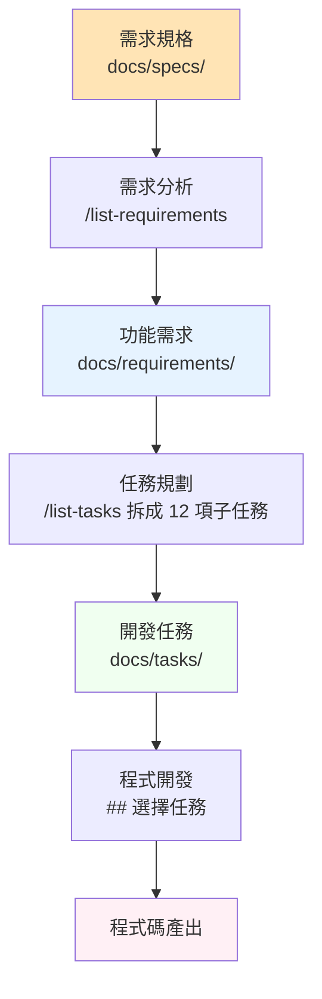
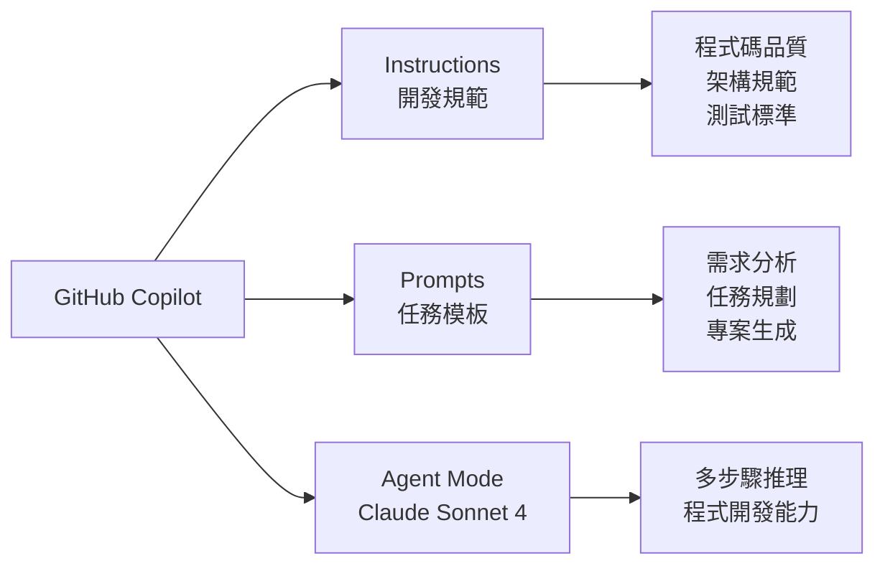

# GitHub Copilot Spring Boot 開發實驗室 - 程式庫架構說明

## 專案概述

這是一個教學導向的 Spring Boot 開發實驗室專案，旨在展示如何使用 GitHub Copilot 進行結構化的軟體開發流程。專案採用**需求分析 → 任務規劃 → 程式開發**三階段開發方法論，以 TinyURL 短網址服務作為實作範例。

## 程式庫架構階層

### 根目錄檔案

```
├── README.md                 # 🔷 主要文件：實驗室操作流程說明
├── docker-compose.yml        # 🐳 容器編排：PostgreSQL + Redis 開發環境
├── Notions.md                # 📚 架構文件：本檔案，說明程式庫結構
└── data/                     # 💾 資料持久化：容器資料存放目錄
    ├── postgres/             # PostgreSQL 資料庫檔案
    └── redis/                # Redis 快取檔案
```

### 核心組態目錄 `.github/`

#### AI 助手指令檔案 `.github/instructions/`
規範程式碼品質與開發標準的指示檔案，每個檔案都會在開發過程中被自動載入：

```
.github/instructions/
├── document.instructions.md      # 📄 文件撰寫規範
├── git.instructions.md          # 🔧 Git 提交與分支規範
├── review.instructions.md       # 🔍 程式碼審查指南
├── springboot-spec.instructions.md  # 🌱 Spring Boot 架構規範
└── tech-stack.instructions.md   # 🛠️ 技術棧與效能規範
```

**目的說明**：
- **document.instructions.md**：定義技術文件撰寫原則，強調解釋「為什麼」而非「是什麼」，確保 README、API 文件品質
- **git.instructions.md**：規範 Git commit 格式（Conventional Commits）與 PR 流程，確保版本控制品質
- **review.instructions.md**：提供 AI 開發產出的評估框架，包含程式碼品質、測試覆蓋率等檢核點
- **springboot-spec.instructions.md**：定義 Clean Architecture 目錄結構與 Spring Boot 最佳實踐
- **tech-stack.instructions.md**：規範技術選型（Java 17、Spring Boot 3.x、PostgreSQL、Redis）與效能優化原則

#### AI 提示檔案 `.github/prompts/`
預定義的 AI 指令模板，透過快捷鍵觸發特定開發任務：

```
.github/prompts/
├── list-requirements.prompt.md  # 📋 需求分析提示：產生功能需求清單
├── list-tasks.prompt.md         # 🎯 任務規劃提示：拆解開發任務
└── springboot-copilot-generator.prompt.md  # 🏗️ 專案生成提示
```

**目的說明**：
- **list-requirements.prompt.md**：系統分析師角色，從規格文件產生使用者導向的功能需求
- **list-tasks.prompt.md**：軟體架構師角色，將需求拆解為具體開發任務，遵循環境建置→專案初始化→核心功能的順序
- **springboot-copilot-generator.prompt.md**：Spring Boot 專案結構生成器

#### 主要指令檔案 `.github/copilot-instructions.md`
整合性的 AI 助手指令檔案，定義專案的核心開發流程與架構規範。

### 文件目錄 `docs/`

#### 規格文件 `docs/specs/`
業務需求與系統規格的原始文件：

```
docs/specs/
└── tinyurl-requirements.md      # 🔸 需求規格：TinyURL 服務的業務需求定義
```

**目的**：定義 TinyURL 短網址服務的核心功能（短網址生成、重導向服務），作為後續需求分析的輸入來源。

#### 功能需求 `docs/requirements/`
從規格文件分析產生的功能導向需求清單：

```
docs/requirements/
├── 00-index.md               # 📑 需求索引：功能需求總覽表
├── 01-url-shortening.md      # 🔗 功能需求：短網址生成
└── 02-url-redirection.md     # ↪️ 功能需求：重導向服務
```

**目的說明**：
- **00-index.md**：提供系統架構概念與功能關聯性說明
- **01-url-shortening.md**：詳細定義短網址生成的使用者場景、驗收標準與成功條件
- **02-url-redirection.md**：詳細定義重導向服務的使用者場景與技術要求

#### 開發任務 `docs/tasks/`
從需求分析產生的具體開發任務清單：

```
docs/tasks/
├── 00-index.md                    # 📊 任務索引：開發任務總覽表
├── 01-setup-docker.md             # 🏗️ 環境建置：Docker 容器環境
├── 02-init-project.md             # 🌱 專案初始化：Spring Boot 專案結構
├── 03-database-design.md          # 🗄️ 資料庫設計：URL 映射表與 Liquibase
├── 04-domain-model.md             # 🏛️ 架構設計：領域模型與 Repository 介面
├── 05-url-shortening.md           # 🎯 核心功能：短網址生成服務實作
├── 06-url-redirection.md          # 🎯 核心功能：重導向服務實作
├── 07-persistence-layer.md        # 🗄️ 資料存取：JPA Entity 與資料映射
├── 08-redis-cache.md              # 🚀 效能優化：Redis 快取整合
├── 09-rest-controllers.md         # 🌐 API 設計：REST 控制器與 OpenAPI
├── 10-exception-handling.md       # ⚠️ 例外處理：全域例外處理機制
├── 11-monitoring-docs.md          # 📊 監控文件：Actuator 與 SpringDoc 整合
└── 12-integration-deployment.md   # 🧩 整合部署：整合測試與容器化部署
```

**階段分類**：
- **第一階段（任務 01-03）**：基礎環境建立
- **第二階段（任務 04-06）**：核心業務邏輯
- **第三階段（任務 07-09）**：資料存取與 API
- **第四階段（任務 10-12）**：監控、例外處理與部署

#### 工作記錄 `docs/works/`
任務執行過程中的工作記錄與產出追蹤：

```
docs/works/
└── setup-docker.md              # 📝 執行記錄：Docker 環境建置過程
```

### 輔助檔案目錄

#### 圖片資源 `imgs/`
文件中使用的螢幕截圖與說明圖片：

```
imgs/
├── agent-mode.png               # 🖼️ AI 模式設定說明
├── auto-instructions-*.png     # 🖼️ 自動指示檔案產生流程
├── dev-docker-*.png            # 🖼️ Docker 開發環境操作
├── init-project-*.png          # 🖼️ 專案初始化流程
├── instructions-*.png          # 🖼️ 指示檔案建立流程
├── list-tasks-*.png            # 🖼️ 任務清單產生流程
├── prompt-file-*.png           # 🖼️ 提示檔案建立流程
└── tinyurl-requirements.png    # 🖼️ 需求文件範例
```

#### 容器配置 `docker/`
Docker 容器的額外配置檔案：

```
docker/
├── postgres/init/               # 🗄️ PostgreSQL 初始化腳本
└── redis/redis.conf            # 🚀 Redis 組態設定
```

## 開發流程架構

### 三階段開發方法論



### AI 助手配置架構



## 核心設計原則

### Clean Architecture 導向
- **領域模型無框架依賴**：domain 層不直接依賴 Spring 註解
- **依賴反轉**：透過 ports 與 adapters 模式實現介面層分離
- **測試驅動**：每個業務功能同步完成單元測試

### 文件即程式碼
- **活文件**：文件與程式碼同步維護，確保一致性
- **階層化文件**：從規格→需求→任務→實作的完整追溯鏈
- **自動產生**：API 文件透過 OpenAPI 註解自動產生

### 容器化優先
- **Docker Compose**：統一開發環境，降低環境差異
- **服務分離**：資料庫、快取、應用程式服務獨立容器
- **持久化資料**：透過 volume 確保開發資料不遺失

## 使用指南

### 初次使用
1. 設定 AI 模式：`Agent` + `Claude Sonnet 4`
2. 載入 Instructions 檔案到 GitHub Copilot
3. 建立 Prompts 檔案供快捷鍵使用
4. 執行 `/list-requirements` 分析需求
5. 執行 `/list-tasks 拆成 12 項子任務` 規劃任務
6. 使用 `##` 選擇任務逐一開發

### 品質檢核
- **程式碼品質**：遵循 Google Java Style 與 Clean Architecture
- **測試覆蓋**：每個功能包含正向與負向測試案例
- **文件同步**：API 文件、README、架構決策記錄保持更新
- **效能考量**：避免 N+1 查詢、合理使用快取、建立適當索引

## 技術棧總覽

### 核心技術
- **Java 17 LTS** + **Spring Boot 3.x**
- **PostgreSQL** (主要資料庫) + **Redis** (快取)
- **Maven** (建置工具) + **Docker** (容器化)

### 開發工具
- **JUnit 5** + **Mockito** (測試框架)
- **Testcontainers** (整合測試)
- **SpringDoc** (API 文件)
- **Liquibase** (資料庫版控)

### 監控與觀測
- **Spring Boot Actuator** (健康檢查)
- **Micrometer** + **Prometheus** (指標收集)
- **SLF4J** + **Logback** (日誌系統)

---

*此文件隨專案演進持續更新，最後更新：2025年9月15日*