# 建立專案資料夾
建立空資料夾，並使用 vscode 開啟

# 放入需求文件
1. 建立 `docs/specs` 資料夾
2. 在資料夾內建立需求文件 `tinyurl-requirements.md`  
    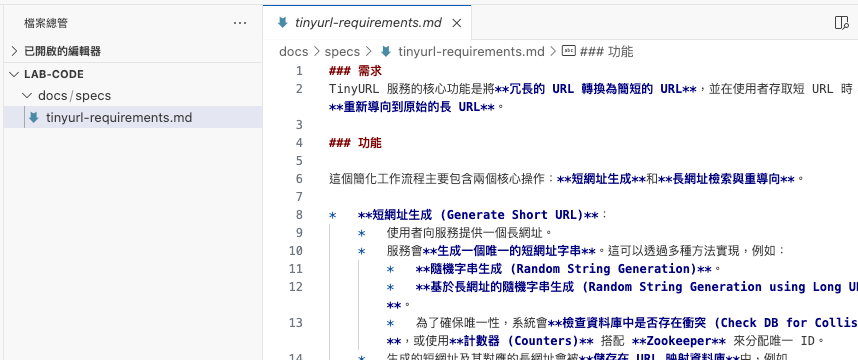
    - 內容參考：[tinyurl-requirements.md](templates/docs/specs/tinyurl-requirements.md)

# 基本設定
## 設定模式與模型
> 💡 如果是寫程式的話，Claude Sonnet 模型目前算是表現比較好的選擇之一

- 選擇 `Agent` + `Claude Sonnet 4`

## 手動建立指示 (instructions)
> 💡 可以把團隊的開發規範加入，這樣 AI 每次回覆時都會參考

1. 點選 `設定 > 指示`  
  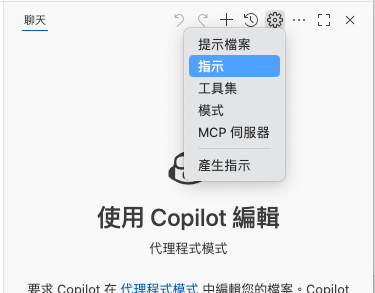  
2. 點選 `新的指示檔案...`  
  
3. 點選 `.github/instructions`  
  
4. 輸入 `development-guidelines` 並按下 enter  
  
5. 就會在 `.github/instructions` 資料夾下，建立 `development-guidelines.instructions.md`  
  
6. 調整內容，並儲存  
   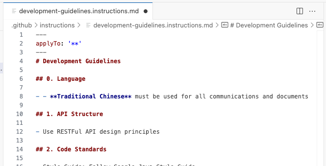  
    - 內容參考：[development-guidelines.instructions.md](templates/.github/instructions/development-guidelines.instructions.md)

## 自動建立提示檔案 (instructions)
> 💡 讓 AI 讀取整個專案，自動生成 instructions
1. 點選 `設定 > 指示`  
  
2. 點選 `產生提示...`  
  
3. AI 會分析整個專案並生成或更新 `.github/copilot-instructions.md`  
  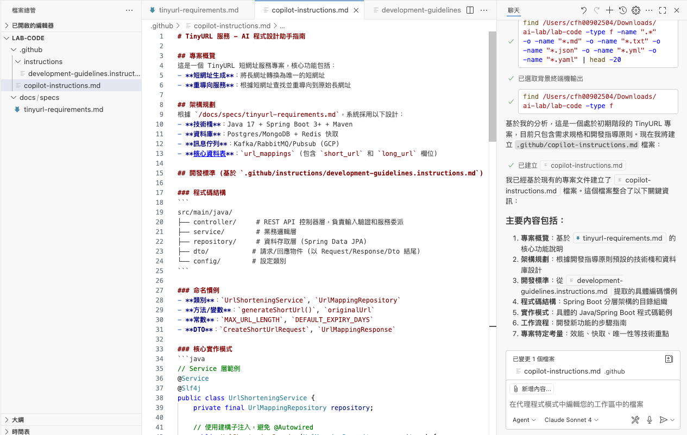

## 建立提示檔案 (Prompt)
> 💡 建立常用的 Prompt，就可以透過快捷鍵使用

1. 點選 `設定 > 提示檔案`  
  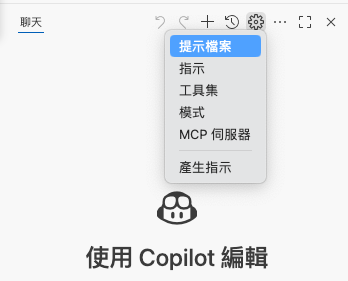
2. 點選 `新增指示檔案...`  
  
3. 點選 `.github/prompts`  
  
4. 輸入 `list-tasks` 並按下 enter  
  
5. 就會在 `.github/instructions` 資料夾下，建立 `list-tasks.prompts.md`  
  
6. 調整內容，並儲存  
  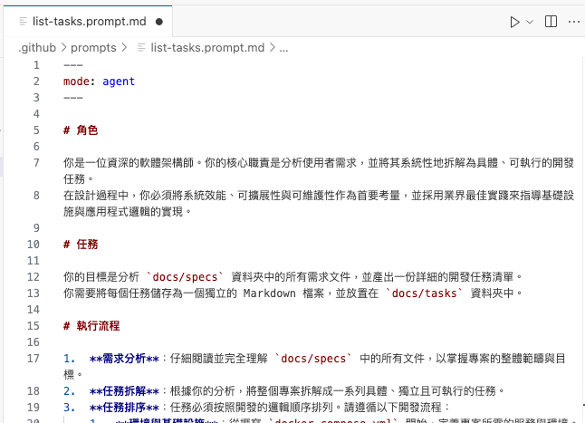
    - 內容參考：[list-tasks.prompt.md](templates/.github/prompts/list-tasks.prompt.md)

# 產生工作項目
1. 在聊天視窗輸入 `/`，可以看到剛剛建立的 Prompt  
  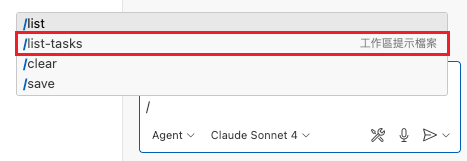
2. 選擇 `/list-tasks`，並按下 enter 或傳送  
  
3. AI 就會跟據 Prompt 的說明，拆解工作任務並將結果寫入 `docs/tasks` 資料夾 (這步驟工作比較多，需要等比較久)  
  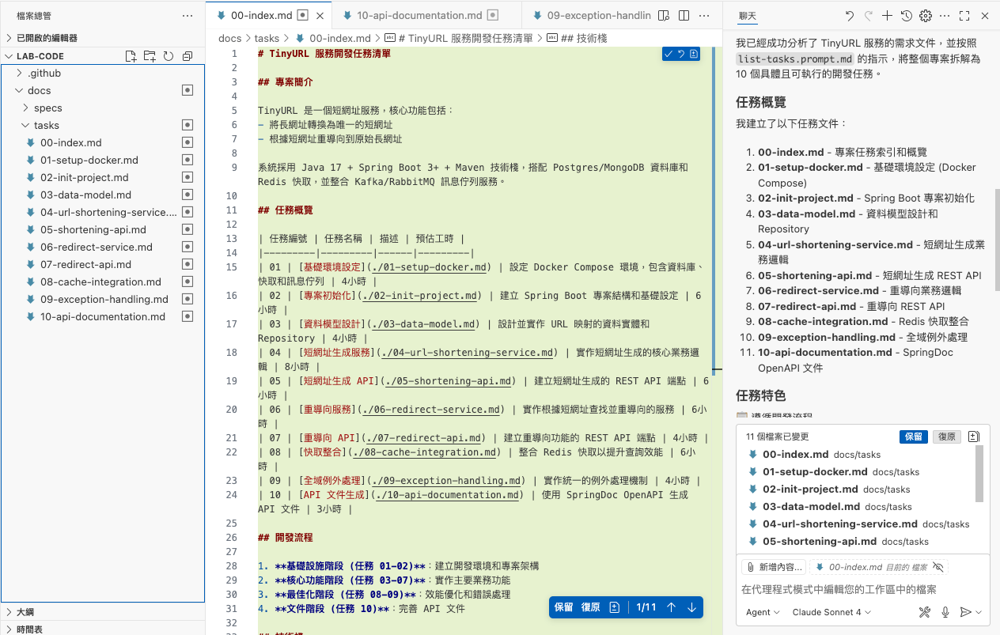

# 開發
> 💡 不建議一次處理太多任務，因為 AI 可能會抓不清重點，導致回覆品質下降  
>    當任務內容很多時，可以運用 `##` 選擇子章節，分批執行

## 建立 docker compose
1. 點開建立 docker compose 的任務  
  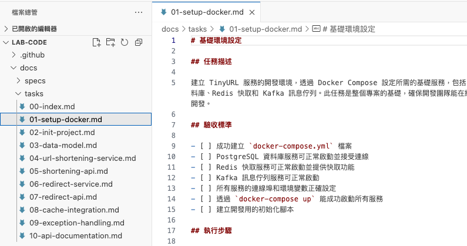
2. 在聊天視窗輸入 `##`，可以選擇已經開啟的 markdown 檔案中的章節  
  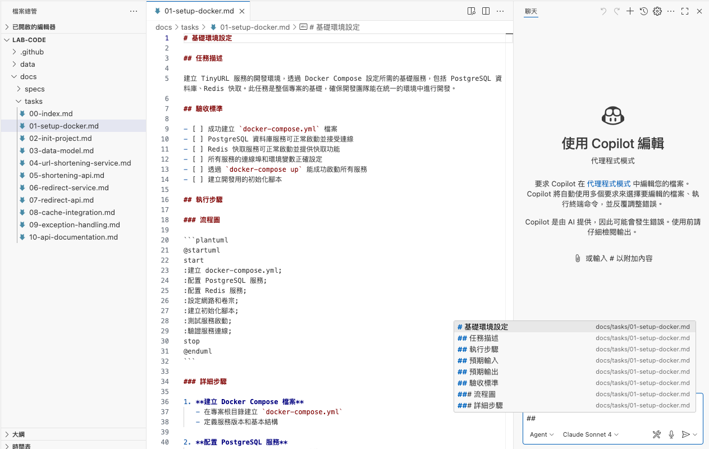
3. 選擇要執行的章節，並按下 enter 或傳送  
  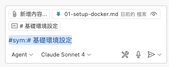
4. AI 會根據章節內容，產生 docker compose 的內容，並且將服務啟動  
  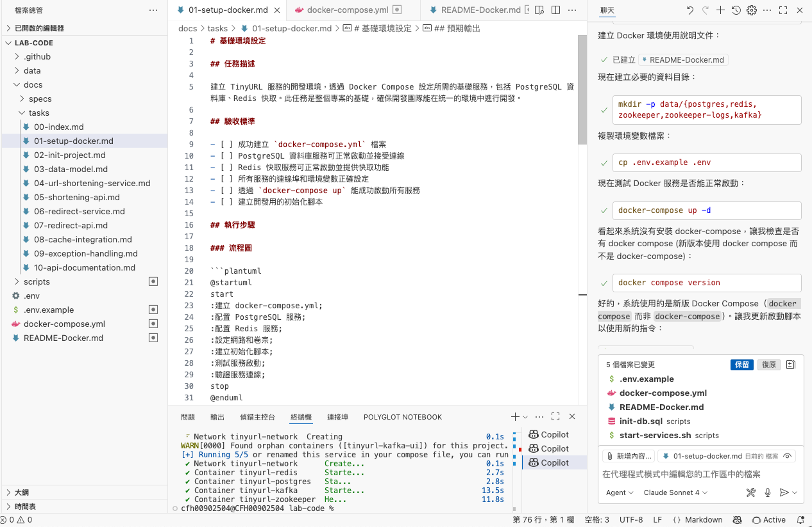

## 建立專案
1. 點開建立專案的任務，選擇章節，並按下 enter 或傳送  
  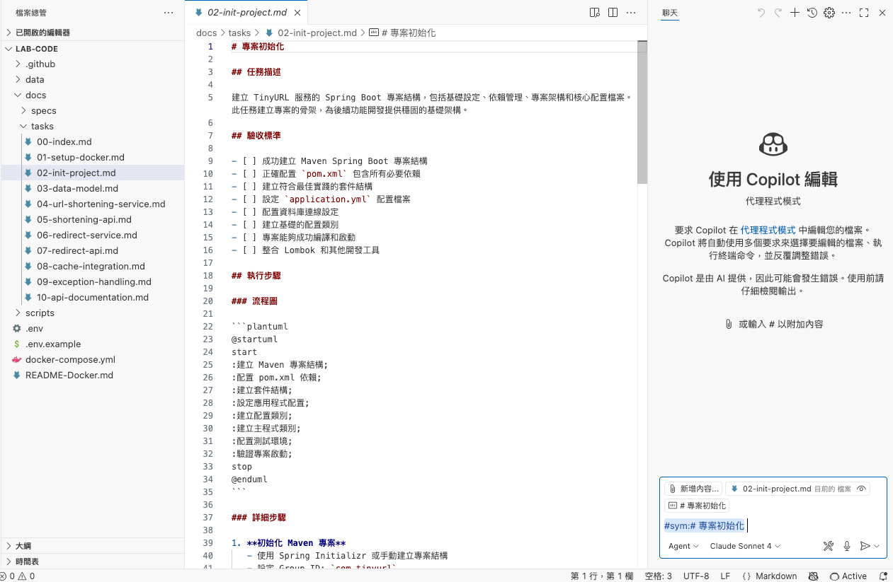
2. AI 就會建立出 Spring Boot 專案  
  
3. 嘗試使用 IDE 啟動服務，或是在聊天視窗輸入 `啟動服務` 並送出，確認程式可以正常運作

## Keep Going...
依照上面的步驟，一步一步將任務完成，就可以完成功能囉～
