# LAB 流程說明 - 既有專案版本

## 整體流程圖

```mermaid
flowchart TD
    subgraph Phase1 ["階段一：初始化階段"]
        direction TB
        A[專案現況分析] --> A1[分析既有程式碼結構]
        A1 --> A2[產生技術棧規範]
        A2 --> A3[產生開發規範]
    end

    subgraph Phase2 ["階段二：需求分析與任務計劃"]
        direction TB
        B[取得需求相關資源] --> B1[收集需求文件]
        B1 --> B2[收集設計稿]
        B2 --> B3[收集使用者故事]
        B3 --> C[建立需求流程提示詞]

        C --> D[執行提示詞建立需求設計書]
        D --> D1{檢視流程步驟是否符合需求}
        D1 -->|需要調整| D2[調整與優化]
        D2 --> D3[執行 list-requirements]
        D1 -->|符合需求| D3

        D3 --> E[建立任務計劃提示詞]
        E --> E1{檢視需求設計書}
        E1 -->|需要調整| E2[調整與優化]
        E2 --> E3[執行 list-tasks 指令]
        E1 -->|符合需求| E3

        E3 --> F[執行實作任務]
        F --> F1{確認任務計劃是否符合需求}
        F1 -->|需要調整| F2[調整與優化]
        F2 --> F3[依序執行任務]
        F1 -->|符合需求| F3

        F3 --> G[檢視實作任務狀況]
        G --> G1{確認執行任務是否符合需求}
        G1 -->|需要修正| G2[優化和修正]
        G2 --> G3[建立執行後紀錄]
        G1 -->|符合需求| G3

        G3 --> H[測試與驗收]
        H --> H1[執行測試案例]
        H1 --> H2{確認功能符合需求}
        H2 -->|需要修正| H3[修正與優化]
        H3 --> H4[完成最終驗收]
        H2 -->|符合需求| H4
    end

    subgraph Phase3 ["階段三：專案評估與總結"]
        direction TB
        I[產出評估報告] --> I1[建立前後端評估流程]
        I1 --> I2[執行評估流程提示詞]
        I2 --> I3[彙整關鍵決策與變更]
        I3 --> I4[評估專案成果與改進方向]
    end

    Phase1 --> Phase2
    Phase2 --> Phase3

    classDef phase1Color fill:#e1f5fe,stroke:#01579b,stroke-width:2px
    classDef phase2Color fill:#e8f5e8,stroke:#1b5e20,stroke-width:2px
    classDef phase3Color fill:#fce4ec,stroke:#880e4f,stroke-width:2px

    class Phase1 phase1Color
    class Phase2 phase2Color
    class Phase3 phase3Color
```

## 設計流程

### 階段一：初始化階段

0. **專案現況分析**
   - 分析既有程式碼結構與文件
     - 輸入內容
       - 包含主程式碼、測試程式碼、架構文件、需求文件等
     - 預期產生：
       - 專案開發框架與技術棧規範 (instructions)
       - 開發風格與最佳實務規範 (instructions)
       - 其他開發規範

---

### 階段二：需求分析與任務計劃

1. **取得需求相關資源**：
   - 收集現有需求文件與新需求說明
     - Figma 設計稿
     - 需求文件
     - 其他相關資源
     - 使用者故事
     -
2. **建立需求流程提示詞 (Prompts)**：

   - 包含開發設計流程步驟 (SD - 簡易版本)

3. **執行提示詞建立需求設計書 (Prompts)**：

   - 檢視 3. 建立的流程步驟是否符合需求
   - 如有需要，進行調整與優化
   - 將 3. 修正後版本加入 context
   - 執行 `prompts/list-requirements` (SD - 詳細版本)

4. **建立任務計劃 提示詞 (Prompts)**：

- 可自行決定產出開發任務項目 (或讓 AI 自行決定)
- 檢視 4. 建立的需求設計書
- 如有需要，進行調整與優化
- 將 4. 修正後版本加入 context
- 執行 `prompts/list-tasks` 指令

5. **執行實作任務**

- 確認 5. 建立的任務計劃是否符合需求
- 如有需要，進行調整與優化
- 依序分別執行 5. 所產生的任務

6. **檢視實作任務狀況**

- 確認 6. 所執行的任務是否符合需求
- 進行優化和修正並建立執行後紀錄

7. **測試與驗收**

- 執行測試案例，確認系統功能符合需求
- 如有需要，進行修正與優化
- 完成最終驗收，確保系統達到預期目標

---

### 階段三：專案評估與總結

8.  **產出評估報告 (AI Evaluate)**

- 建立前後端評估流程
- 執行評估流程提示詞
- 彙整整個開發過程中的關鍵決策與變更
- 評估專案成果與未來改進方向
