# LAB 流程說明

> 個項目的細節，請查看下面章節

1. **專案初始化**：建立專案資料夾
2. **需求準備**：加入需求文件
3. **AI 環境設定**：設定模式與模型 (`Agent` + `Claude Sonnet 4`)
4. **Instructions、Prompt 設定**：加入指示 (Instructions)、提示檔案 (Prompt)
5. **需求分析**：使用 `/list-requirements` 指令，分析文件產生需求項目
6. **任務規劃**：使用 `/list-tasks 拆成 12 項子任務` 指令，產生開發工作任務
7. **程式開發**：使用 `##` 選擇工作任務，依序實現任務

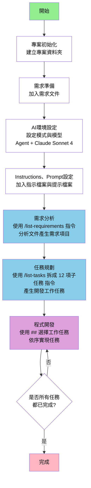
```mermaid
flowchart TD
    A[開始] --> B[專案初始化<br/>建立專案資料夾]
    B --> C[需求準備<br/>加入需求文件]
    C --> D[AI環境設定<br/>設定模式與模型<br/>Agent + Claude Sonnet 4]
    D --> E[Instructions、Prompt設定<br/>加入指示檔案與提示檔案]
    E --> F[需求分析<br/>使用 /list-requirements 指令<br/>分析文件產生需求項目]
    F --> G[任務規劃<br/>使用 /list-tasks 拆成 12 項子任務 指令<br/>產生開發工作任務]
    G --> H[程式開發<br/>使用 ## 選擇工作任務<br/>依序實現任務]
    H --> I{是否所有任務<br/>都已完成?}
    I -->|否| H
    I -->|是| J[完成]

    style A fill:#90EE90,color:#000000
    style B fill:#ffffff,color:#000000
    style C fill:#ffffff,color:#000000
    style D fill:#ffffff,color:#000000
    style E fill:#ffffff,color:#000000
    style F fill:#87CEEB,color:#000000
    style G fill:#87CEEB,color:#000000
    style H fill:#DDA0DD,color:#000000
    style I fill:#ffffff,color:#000000
    style J fill:#FFB6C1,color:#000000
```

# 建立專案資料夾

建立空資料夾，並使用 vscode 開啟

# 放入需求文件

1. 建立 `docs/specs` 資料夾
2. 在資料夾內建立需求文件 `tinyurl-requirements.md`  
   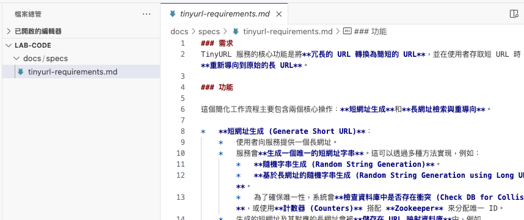
   - 內容參考：[tinyurl-requirements.md](templates/docs/specs/tinyurl-requirements.md)

# 基本設定

## 設定模式與模型

> 💡 如果是寫程式的話，Claude Sonnet 模型目前算是表現比較好的選擇之一

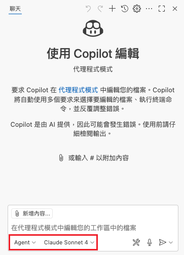

- 選擇 `Agent` + `Claude Sonnet 4`

## 手動建立指示 (Instructions)

> 💡 可以把團隊的開發規範加入，這樣 AI 每次回覆時都會參考

1. 點選 `設定 > 指示`  
   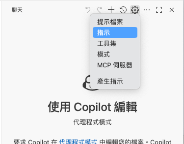
2. 點選 `新的指示檔案...`  
   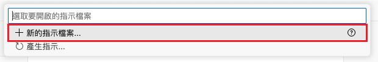
3. 點選 `.github/instructions`  
   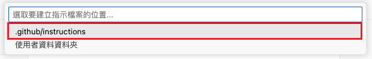
4. 輸入檔名(例如：`development-guidelines`) 並按下 enter  
   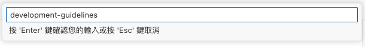
5. 就會在 `.github/instructions` 資料夾下，建立 `development-guidelines.instructions.md`  
   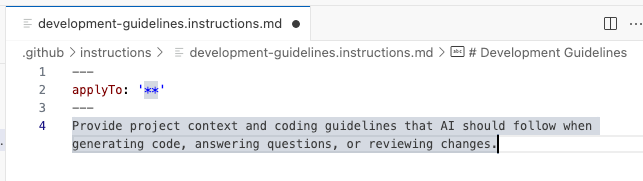
6. 調整內容，並儲存  
   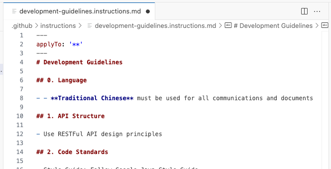  
   - 📝 LAB 時．請使用教材提供的 Instructions：
     - [document.instructions.md](.github/instructions/document.instructions.md)
     - [git.instructions.md](.github/instructions/git.instructions.md)
     - [springboot-spec.instructions.md](.github/instructions/springboot-spec.instructions.md)
     - [tech-stack.instructions.md](.github/instructions/tech-stack.instructions.md)

## 自動建立提示檔案 (instructions)

> 💡 讓 AI 讀取整個專案，自動生成 instructions

1. 點選 `設定 > 指示`  
   
2. 點選 `產生提示...`  
   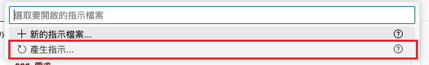
3. AI 會分析整個專案並生成或更新 `.github/copilot-instructions.md`  
   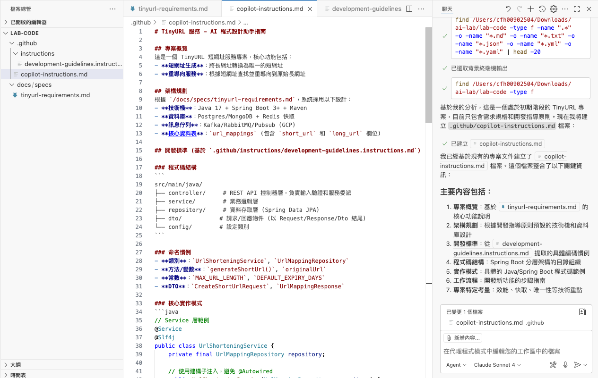

## 建立提示檔案 (Prompt)

> 💡 建立常用的 Prompt，就可以透過快捷鍵使用

1. 點選 `設定 > 提示檔案`  
   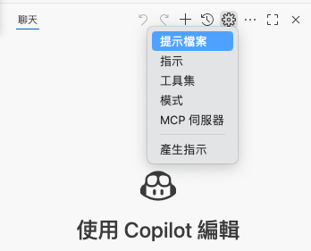
2. 點選 `新增指示檔案...`  
   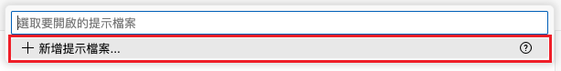
3. 點選 `.github/prompts`  
   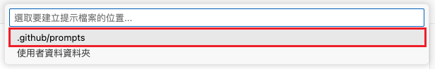
4. 輸入檔名(例如：`list-tasks`) 並按下 enter  
   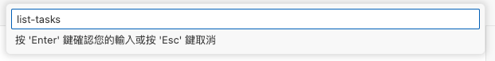
5. 就會在 `.github/instructions` 資料夾下，建立 `list-tasks.prompts.md`  
   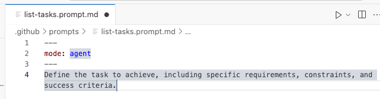
6. 調整內容，並儲存  
   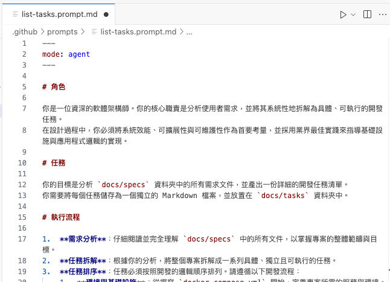
   - 📝 LAB 時．請使用教材提供的 Prompt：
     - [list-requirements.prompt.md](.github/prompts/list-requirements.prompt.md)
     - [list-tasks.prompt.md](.github/prompts/list-tasks.prompt.md)

# 產生工作項目

> 💡LAB 操作流程：
>
> 1. 使用 `/list-requirements` 指令，分析文件產生需求項目 (模擬 SA 工作)  
> 2. 使用 `/list-tasks 拆成 12 項子任務` 指令，產生開發工作任務 (模擬 SD 工作)  
>    (為了讓 LAB 時，大家的進度一致，所以才多加上 `拆成 12 項子任務` 的指示)

1. 在聊天視窗輸入 `/`，可以看到剛剛建立的 Prompt  
   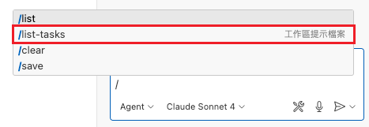
2. 選擇 `/list-tasks`，並按下 enter 或傳送  
   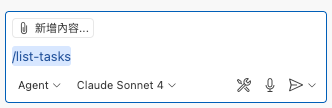
3. AI 就會跟據 Prompt 的說明，拆解工作任務並將結果寫入 `docs/tasks` 資料夾 (這步驟工作比較多，需要等比較久)  
   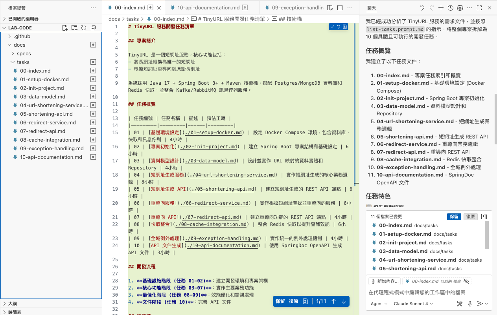

# 開發

> 💡 不建議一次處理太多任務，因為 AI 可能會抓不清重點，導致回覆品質下降  
> 當任務內容很多時，可以運用 `##` 選擇子章節，分批執行

## 建立 docker compose

1. 點開建立 docker compose 的任務  
   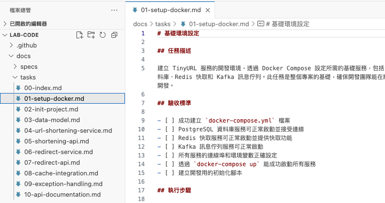
2. 在聊天視窗輸入 `##`，可以選擇已經開啟的 markdown 檔案中的章節  
   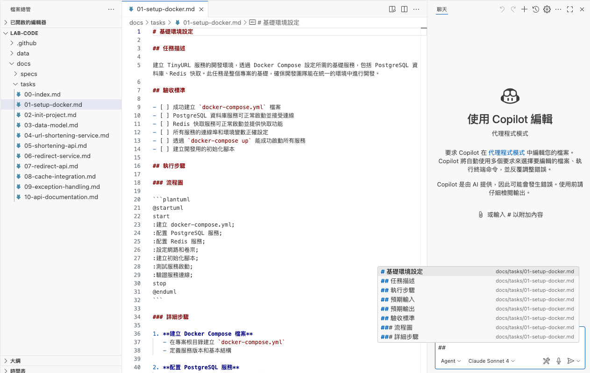
3. 選擇要執行的章節，並按下 enter 或傳送  
   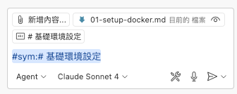
4. AI 會根據章節內容，產生 docker compose 的內容，並且將服務啟動  
   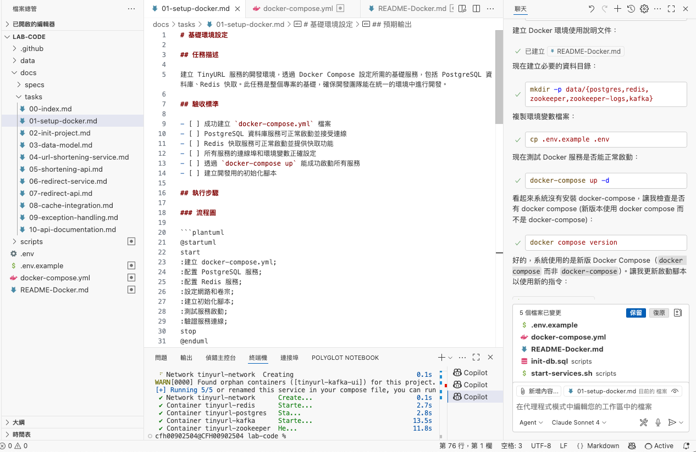

## 建立專案

1. 點開建立專案的任務，選擇章節，並按下 enter 或傳送  
   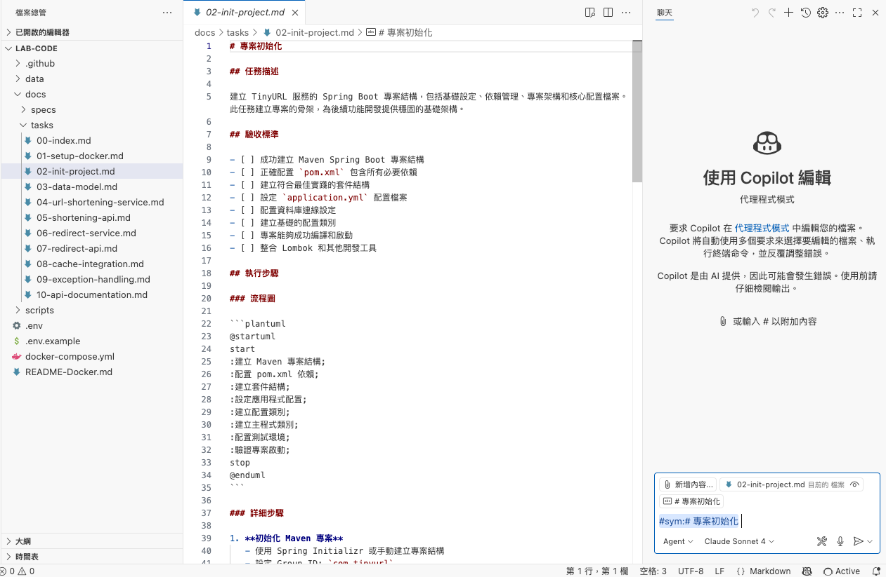
2. AI 就會建立出 Spring Boot 專案  
   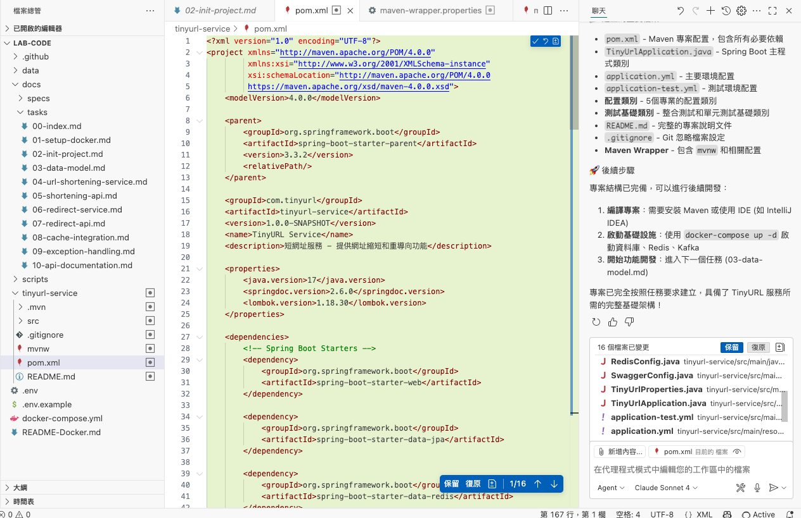
3. 嘗試使用 IDE 啟動服務，或是在聊天視窗輸入 `啟動服務` 並送出，確認程式可以正常運作

## Keep Going...

依照上面的步驟，一步一步將任務完成，就可以完成功能囉～

---
## 提供既有專案設計流程

- [既有專案留設計流程說明](./README-Existed.md)