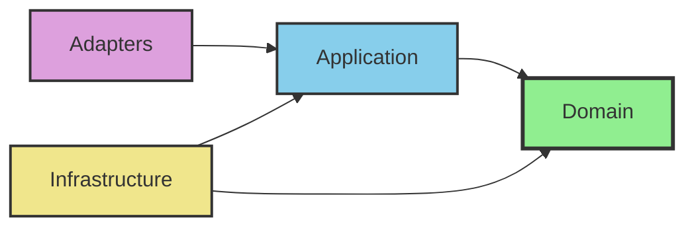

# TinyURL Clean Architecture 架構說明

## 架構概覽

本專案採用 Clean Architecture 四層架構設計，確保依賴方向向內，業務邏輯與技術細節分離。

```
┌─────────────────────────────────────────────────────────────┐
│                        Adapters 層                          │
│  ┌─────────────────────────────────────────────────────┐    │
│  │                  Application 層                     │    │
│  │  ┌─────────────────────────────────────────────┐    │    │
│  │  │                Domain 層                    │    │    │
│  │  │  ├── model/     (聚合根、實體、值對象)       │    │    │
│  │  │  ├── repository/ (Repository 介面)          │    │    │
│  │  │  ├── service/   (領域服務)                  │    │    │
│  │  │  └── exception/ (領域異常)                  │    │    │
│  │  └─────────────────────────────────────────────┘    │    │
│  │  ├── usecase/   (使用案例實作)                      │    │
│  │  ├── port/in/   (輸入 Port 介面)                    │    │
│  │  ├── port/out/  (輸出 Port 介面)                    │    │
│  │  └── dto/       (應用層 DTO)                        │    │
│  └─────────────────────────────────────────────────────┘    │
│  ├── web/       (REST API Controllers)                      │
│  ├── messaging/ (訊息佇列適配器)                            │
│  └── scheduler/ (排程任務適配器)                            │
└─────────────────────────────────────────────────────────────┘
┌─────────────────────────────────────────────────────────────┐
│                    Infrastructure 層                        │
│  ├── persistence/ (資料持久化實作)                         │
│  ├── cache/       (快取實作)                               │
│  ├── config/      (Spring 組態)                            │
│  ├── openapi/     (API 文件組態)                           │
│  └── observability/ (監控與健康檢查)                       │
└─────────────────────────────────────────────────────────────┘
```

## 各層職責

### 1. Domain 層 (核心)
- **職責**: 純粹的業務邏輯與領域模型
- **約束**: 不可依賴任何外部框架，只能使用 Java 標準庫
- **包含**:
  - `model/`: 聚合根、實體、值對象
  - `repository/`: Repository 介面定義
  - `service/`: 領域服務
  - `exception/`: 領域異常

### 2. Application 層
- **職責**: 協調領域物件執行使用案例
- **約束**: 只能依賴 Domain 層
- **包含**:
  - `usecase/`: Use Case 實作
  - `port/in/`: 輸入 Port 介面 (Commands/Queries)
  - `port/out/`: 輸出 Port 介面 (Repository/External Services)
  - `dto/`: 應用層資料傳輸對象

### 3. Adapters 層
- **職責**: 外部介面的適配實作
- **約束**: 依賴 Application 層
- **包含**:
  - `web/`: REST API Controllers 與 Web DTOs
  - `messaging/`: 訊息佇列適配器
  - `scheduler/`: 排程任務適配器

### 4. Infrastructure 層
- **職責**: 技術實作與外部系統整合
- **約束**: 依賴 Application 與 Domain 層
- **包含**:
  - `persistence/`: 資料持久化 (JPA)
  - `cache/`: 快取實作 (Redis)
  - `config/`: Spring 組態類別
  - `openapi/`: OpenAPI/Swagger 組態
  - `observability/`: 監控指標與健康檢查

## 依賴規則

// ...existing code...

## 依賴規則



// ...existing code...

### 依賴方向
- **向內依賴**: 外層可以依賴內層，內層不可依賴外層
- **介面在內層**: 介面定義在內層，實作在外層
- **依賴反轉**: 透過 Port 介面實現依賴反轉

## TinyURL 特定元件

### Domain 層
- `Url` 聚合根: 管理長網址與短網址的映射
- `ShortCode` 值對象: 短網址代碼
- `UrlRepository` 介面: 資料存取抽象

### Application 層
- `CreateShortUrlUseCase`: 建立短網址
- `GetLongUrlUseCase`: 查詢原始網址
- `RedirectUseCase`: 處理重定向
- `CreateShortUrlCommand`: 建立短網址指令
- `GetLongUrlQuery`: 查詢原始網址

### Adapters 層
- `UrlController`: REST API 端點
- `CreateShortUrlRequest/Response`: Web API DTO

### Infrastructure 層
- `UrlEntity`: JPA 實體
- `JpaUrlRepository`: JPA Repository 實作
- `RedisUrlCache`: Redis 快取實作

## 測試策略

### 單元測試
- **Domain 層**: 純粹的單元測試，無需模擬
- **Application 層**: 模擬 Port 介面進行測試
- **Adapters 層**: 模擬 Application 層進行測試
- **Infrastructure 層**: 整合測試與契約測試

### 整合測試
- **API 測試**: 測試完整的 HTTP 請求流程
- **Repository 測試**: 測試資料存取層
- **End-to-End 測試**: 測試完整業務流程

## 開發指導原則

1. **依賴方向**: 嚴格遵循依賴向內的規則
2. **介面隔離**: 定義細粒度的介面
3. **單一職責**: 每個類別只有一個變更理由
4. **開放封閉**: 對擴展開放，對修改封閉
5. **依賴反轉**: 依賴抽象而非具體實作

## 檔案命名規範

- **介面**: 使用動詞片語，如 `CreateShortUrl`
- **實作**: 添加實作技術前綴，如 `JpaUrlRepository`
- **DTO**: 明確用途，如 `CreateShortUrlRequest`
- **異常**: 明確異常類型，如 `UrlNotFoundException`

## 後續開發步驟

1. 實作 Domain 模型與 Repository 介面
2. 定義 Application 層的 Port 介面
3. 實作 Use Cases
4. 建立 Web 適配器
5. 實作 Infrastructure 層
6. 撰寫測試
7. 整合監控與可觀測性

---

此架構提供了清晰的分層結構，確保業務邏輯與技術實作的分離，便於測試、維護和擴展。
