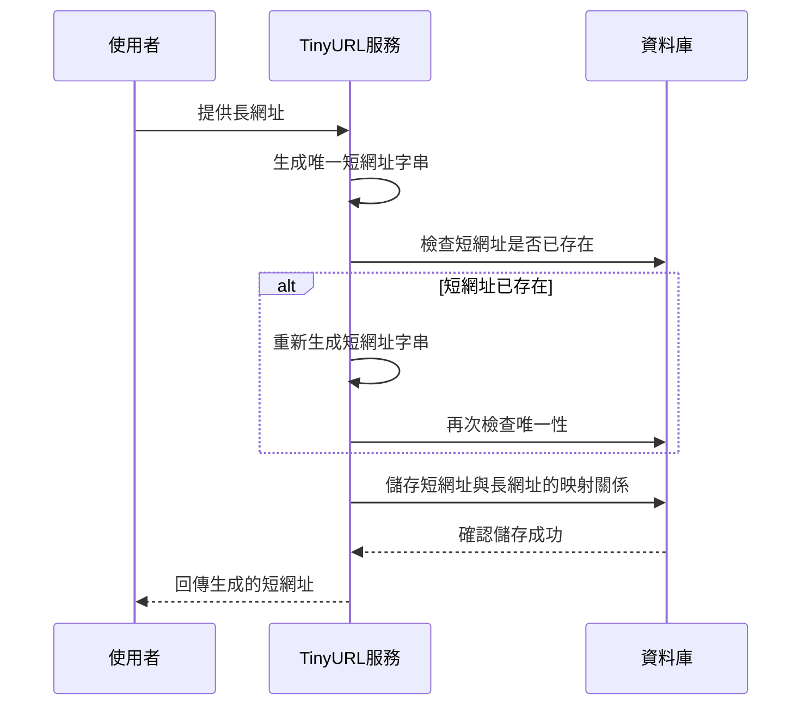

# 短網址生成

## 功能描述

使用者提供一個長網址，系統會生成一個唯一的短網址並建立對應關係。這個功能解決了使用者在分享長網址時不美觀、容易出錯的問題，特別適用於社群媒體分享、簡訊傳送或需要追蹤點擊量的行銷場景。

### 使用者操作流程

## 驗收標準

1. **當使用者提供有效的長網址時**，我應該能收到一個唯一的短網址，**以達成快速分享的目標**
2. **當使用者提供相同的長網址時**，我應該能收到相同的短網址，**以達成一致性體驗**
3. **當系統生成短網址時**，該短網址應該在資料庫中是唯一的，**以達成避免衝突的目標**
4. **當使用者提供無效或格式錯誤的網址時**，我應該能收到明確的錯誤訊息，**以達成輸入驗證的目標**
5. **當系統儲存映射關係時**，我應該能確保資料持久化成功，**以達成資料完整性的目標**

## 前置條件

- 使用者需要提供一個有效的 HTTP/HTTPS 網址
- TinyURL 服務必須正常運行
- 資料庫連線必須可用

## 成功場景

- 系統回傳格式為 `https://tiny.url/{短網址ID}` 的短網址
- 短網址與長網址的映射關係成功儲存在資料庫中
- 系統記錄建立時間戳記供後續追蹤使用
- 使用者可以立即使用生成的短網址進行分享