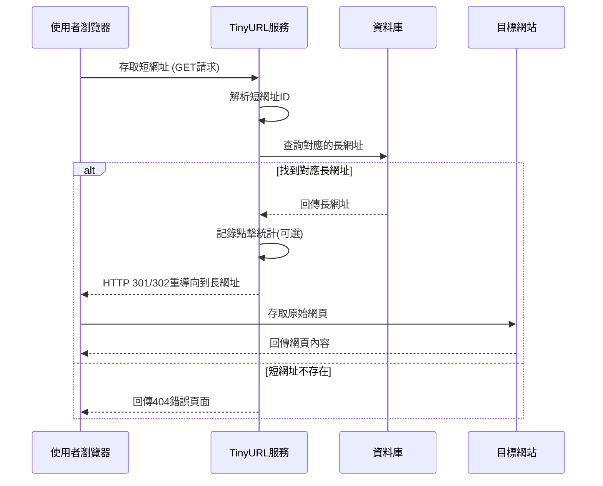

# 重導向服務

## 功能描述

當使用者存取短網址時，系統會查找對應的長網址並執行 HTTP 重導向。這個功能是 TinyURL 服務的核心價值實現，讓使用者能夠透過短網址無縫存取原始內容，同時為系統提供點擊追蹤和分析的機會。

### 重導向操作流程

## 驗收標準

1. **當使用者存取有效的短網址時**，我應該能被自動重導向到對應的長網址，**以達成無縫存取原始內容的目標**
2. **當使用者存取不存在的短網址時**，我應該能看到友善的404錯誤頁面，**以達成良好使用者體驗的目標**
3. **當系統執行重導向時**，我應該能在瀏覽器位址列看到最終的長網址，**以達成透明化重導向的目標**
4. **當重導向發生時**，系統應該能在合理時間內(< 500ms)完成查詢和重導向，**以達成效能要求的目標**
5. **當多個使用者同時存取相同短網址時**，所有使用者都應該能成功重導向，**以達成高併發處理的目標**

## 前置條件

- 短網址必須已經透過「短網址生成」功能建立
- TinyURL 服務與資料庫連線正常
- 目標長網址的網站必須可以存取(非必要，但影響使用者最終體驗)

## 成功場景

- 使用者瀏覽器收到 HTTP 301(永久重導向)或 302(暫時重導向)狀態碼
- 瀏覽器自動跳轉到原始長網址並載入內容
- 系統可選擇性地記錄點擊統計資料(時間、IP、使用者代理等)
- 整個重導向過程對使用者而言是即時且順暢的