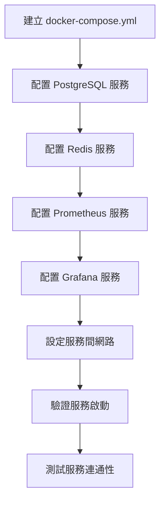

# 01 - 設置 Docker 開發環境

## 任務核取方塊
- [ ] 建立 docker-compose.yml 檔案
- [ ] 配置 PostgreSQL 服務
- [ ] 配置 Redis 服務
- [ ] 配置 Prometheus 監控服務
- [ ] 配置 Grafana 視覺化服務
- [ ] 驗證所有服務可正常啟動

## 任務描述

建立完整的 Docker Compose 開發環境，為 TinyURL 服務提供所需的基礎設施服務。這個環境將包含資料庫、快取、監控與視覺化工具，確保開發團隊有一致的本地開發環境。

選擇 Docker Compose 的原因：
- 簡化本地開發環境設置
- 確保所有開發者使用相同的服務版本
- 支援一鍵式環境啟動與清理
- 模擬生產環境的服務依賴關係

## 驗收標準

1. Docker Compose 可成功啟動所有服務
2. PostgreSQL 資料庫可正常連線（預設資料庫：tinyurl_db）
3. Redis 快取服務可正常連線
4. Prometheus 可訪問 http://localhost:9090
5. Grafana 可訪問 http://localhost:3000
6. 所有服務的健康檢查通過
7. 提供服務清理與重置的說明文件

## 執行步驟



### 詳細步驟

1. **建立基本檔案結構**
   ```bash
   mkdir -p docker/config/{prometheus,grafana}
   touch docker-compose.yml
   touch .env.example
   ```

2. **配置 PostgreSQL 服務**
   - 使用 PostgreSQL 15 版本
   - 設定預設資料庫名稱為 `tinyurl_db`
   - 配置環境變數覆蓋機制
   - 持久化資料存儲

3. **配置 Redis 服務**
   - 使用 Redis 7 Alpine 版本
   - 啟用持久化儲存
   - 設定記憶體限制

4. **配置 Prometheus 服務**
   - 建立 prometheus.yml 配置檔
   - 設定抓取 Spring Boot Actuator 端點
   - 配置抓取間隔與目標服務

5. **配置 Grafana 服務**
   - 設定預設帳密
   - 配置 Prometheus 資料源
   - 準備匯入 Spring Boot 儀表板

6. **網路與 Volume 配置**
   - 建立 bridge 網路供服務間通訊
   - 配置具名 Volume 進行資料持久化

## 預期輸入

- 專案根目錄
- Docker 與 Docker Compose 已安裝的開發環境

## 預期輸出

1. **docker-compose.yml** - 主要服務編排檔案
2. **.env.example** - 環境變數範例檔案
3. **docker/config/prometheus/prometheus.yml** - Prometheus 配置
4. **docker/config/grafana/** - Grafana 配置目錄
5. **README-docker.md** - Docker 環境使用說明

### 服務清單

| 服務名稱   | 埠號 | 用途                |
| ---------- | ---- | ------------------- |
| postgres   | 5432 | 主要資料庫          |
| redis      | 6379 | 快取與 Session 存儲 |
| prometheus | 9090 | 指標收集與監控      |
| grafana    | 3000 | 監控視覺化儀表板    |

### 環境變數

```bash
# 資料庫
DB_HOST=postgres
DB_PORT=5432
DB_NAME=tinyurl_db
DB_USERNAME=tinyurl_user
DB_PASSWORD=tinyurl_pass

# Redis
REDIS_HOST=redis
REDIS_PORT=6379

# 監控
PROMETHEUS_PORT=9090
GRAFANA_PORT=3000
GRAFANA_ADMIN_USER=admin
GRAFANA_ADMIN_PASSWORD=admin123
```
