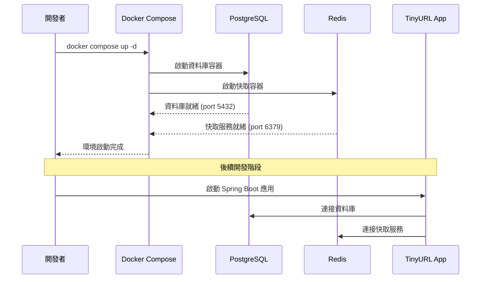

# Docker 環境設定

## 任務狀態
✅ 已完成

## 任務描述

建立專案的 Docker 容器化環境，包含 PostgreSQL 資料庫、Redis 快取服務與開發所需的基礎設施。這個環境將作為整個開發流程的基礎，確保所有開發人員都能在一致的環境中工作，並支援後續的開發與測試任務。

Docker 環境需要支援容器的持續運行，讓開發者可以在不重複建置環境的情況下進行程式開發與測試。同時需要提供清楚的啟動與停止指令，方便團隊協作開發。

## 執行步驟

### 容器環境架構圖



### 具體執行步驟

1. **建立 docker-compose.yml 檔案**
   - 定義 PostgreSQL 服務配置 (版本 15+)
   - 定義 Redis 服務配置 (版本 7+)
   - 設定網路與持久化儲存

2. **建立環境變數檔案**
   - 建立 `.env.example` 範本檔案
   - 設定資料庫連線參數
   - 設定 Redis 連線參數

3. **建立 Docker 相關配置檔案**
   - 設定 PostgreSQL 初始化腳本目錄
   - 設定資料持久化 Volume 映射

4. **測試環境啟動**
   - 執行容器啟動指令
   - 驗證服務連線可用性
   - 測試環境停止與重啟功能

## 預期輸入

- 專案根目錄路徑
- 基本的 TinyURL 專案需求理解

## 預期輸出

### 必要檔案
- `docker-compose.yml` - 主要的容器編排檔案
- `.env.example` - 環境變數範本檔案
- `README.md` - 包含 Docker 環境操作指令的說明文件

### 容器服務
- **PostgreSQL 容器**
  - 版本: PostgreSQL 15+
  - 連接埠: 5432
  - 預設資料庫: tinyurl
  - 資料持久化: `./data/postgres`

- **Redis 容器**
  - 版本: Redis 7+
  - 連接埠: 6379
  - 資料持久化: `./data/redis`

### 環境變數支援
```bash
# 資料庫配置
DB_HOST=localhost
DB_PORT=5432
DB_NAME=tinyurl
DB_USERNAME=tinyurl_user
DB_PASSWORD=tinyurl_password

# Redis 配置
REDIS_HOST=localhost
REDIS_PORT=6379
REDIS_PASSWORD=

# 應用配置
APP_PORT=8080
MANAGEMENT_PORT=8081
```

### 操作指令
```bash
# 啟動所有服務
docker compose up -d

# 查看服務狀態
docker compose ps

# 查看服務日誌
docker compose logs -f

# 停止所有服務
docker compose down

# 停止並清除資料
docker compose down -v
```

這個環境建立完成後，開發團隊就能在統一的基礎設施上進行後續的應用程式開發作業。