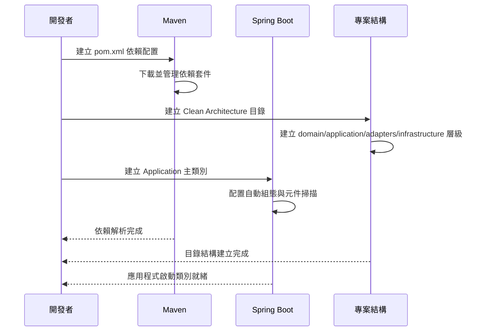

# Spring Boot 專案初始化

## 任務狀態
❌ 未完成

## 任務描述

建立 TinyURL 專案的基本結構，包含 Maven 配置、依賴管理、Clean Architecture 目錄結構，以及基本的 Spring Boot 應用程式啟動類別。這個任務將建立整個專案的骨架，為後續的業務邏輯開發提供穩固的基礎架構。

專案採用 Clean Architecture 設計原則，確保業務邏輯與技術細節的分離，提升程式碼的可測試性與可維護性。同時配置必要的 Spring Boot starter 依賴，支援 Web、資料存取、快取與監控等功能需求。

## 執行步驟

### 專案結構架構圖



### 具體執行步驟

1. **建立 Maven 專案結構**
   - 建立標準的 Maven 目錄結構
   - 配置 `pom.xml` 包含必要依賴
   - 設定 Java 17 與 Spring Boot 3.x 版本

2. **建立 Clean Architecture 目錄結構**
   - 建立四個主要分層目錄
   - 設定適當的 package 命名規範
   - 建立各層級的 package-info.java 說明檔

3. **配置 Spring Boot 主應用程式**
   - 建立 TinyUrlApplication 主類別
   - 配置基本的應用程式屬性
   - 設定開發與生產環境的 profile

4. **建立基礎配置檔案**
   - 設定 application.yml 配置檔案
   - 建立不同環境的 profile 配置
   - 配置日誌與健康檢查設定

## 預期輸入

- Docker 環境已經建立完成
- 基本的專案需求與技術棧理解

## 預期輸出

### Maven 專案配置
- `pom.xml` - 包含所有必要依賴的 Maven 配置檔案
- `mvnw`, `mvnw.cmd` - Maven Wrapper 執行檔
- `.mvn/wrapper/` - Maven Wrapper 配置目錄

### Clean Architecture 目錄結構
```
src/main/java/com/example/tinyurl/
├── domain/                      # 純領域模型（無框架依賴）
│   ├── model/                   # Aggregate/Entity/ValueObject
│   ├── repository/              # 介面（如 UrlRepository）
│   ├── service/                 # Domain Service（必要時）
│   └── event/                   # Domain Events（如 UrlCreated）
├── application/                 # Use Cases 與 Ports
│   ├── usecase/                 # Interactors（Create/Get/List）
│   ├── port/
│   │   ├── in/                  # Commands/Queries Port（input）
│   │   └── out/                 # Repository/Cache/MQ Port（output）
│   └── dto/                     # Use case 輸入/輸出 DTO（非 Web DTO）
├── adapters/                    # 介面層（依賴 application 的 port）
│   ├── web/                     # REST Controller + Web 專用 DTO/Mappers
│   ├── messaging/               # Kafka/RabbitMQ Pub/Sub（可選）
│   └── scheduler/               # 排程（可選）
└── infrastructure/              # 技術細節（Spring/I/O/組態）
    ├── persistence/
    │   └── jpa/                 # JPA Entity/Repository 實作、mapping
    ├── cache/
    │   └── redis/               # Redis 快取實作、序列化
    ├── config/                  # Spring 組態（Beans/Security/Observability）
    ├── openapi/                 # SpringDoc 設定
    └── observability/           # Micrometer/Actuator 設定
```

### Spring Boot 主應用程式
- `TinyUrlApplication.java` - Spring Boot 主啟動類別
- 基本的元件掃描配置
- 應用程式啟動與停止的生命週期管理

### 配置檔案
- `application.yml` - 主要配置檔案
- `application-dev.yml` - 開發環境配置
- `application-prod.yml` - 生產環境配置
- `logback-spring.xml` - 日誌配置檔案

### 依賴管理
主要依賴套件包含：
- Spring Boot Web Starter (REST API)
- Spring Boot Data JPA (資料存取)
- Spring Boot Data Redis (快取)
- Spring Boot Actuator (監控)
- SpringDoc OpenAPI (API 文件)
- PostgreSQL Driver (資料庫驅動)
- Liquibase (資料庫版控)
- Lombok (程式碼簡化)
- JUnit 5 + Mockito (測試框架)
- Testcontainers (整合測試)

### 環境變數支援
配置檔案支援以下環境變數：
```yaml
server:
  port: ${APP_PORT:8080}

spring:
  datasource:
    url: jdbc:postgresql://${DB_HOST:localhost}:${DB_PORT:5432}/${DB_NAME:tinyurl}
    username: ${DB_USERNAME:tinyurl_user}
    password: ${DB_PASSWORD:tinyurl_password}

  data:
    redis:
      host: ${REDIS_HOST:localhost}
      port: ${REDIS_PORT:6379}
      password: ${REDIS_PASSWORD:}

management:
  server:
    port: ${MANAGEMENT_PORT:8081}
  endpoints:
    web:
      exposure:
        include: ${MANAGEMENT_ENDPOINTS_WEB_EXPOSURE_INCLUDE:health,info,prometheus}

logging:
  config: classpath:logback-spring.xml
  level:
    com.example.tinyurl: ${LOG_LEVEL:INFO}
```

完成這個任務後，專案將具備完整的基礎架構，可以開始進行業務邏輯的開發作業。