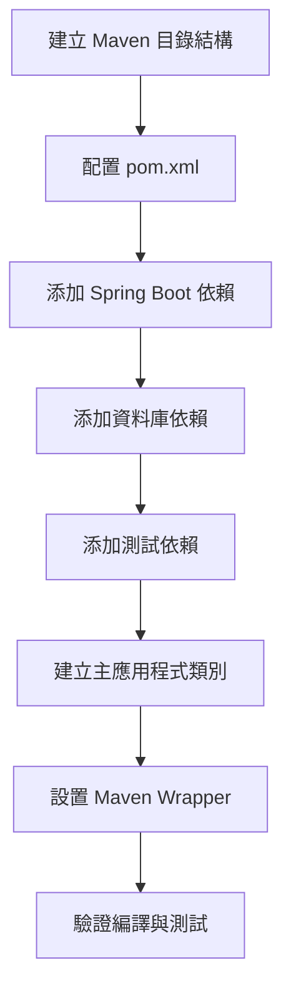

# 02 - 建立 Spring Boot 專案骨架

## 任務核取方塊
- [ ] 建立 Maven 專案結構
- [ ] 配置 pom.xml 依賴管理
- [ ] 建立主要應用程式類別
- [ ] 配置 Maven Wrapper
- [ ] 驗證專案可正常編譯

## 任務描述

使用 Maven 建立 Spring Boot 3.x 專案骨架，配置必要的依賴項目與建置工具。這個任務將建立專案的基礎結構，確保所有必要的 Spring Boot、測試、監控與資料庫相關依賴都正確配置。

採用 Maven 的原因：
- 業界標準的 Java 建置工具
- 良好的依賴管理與版本控制
- 與 Spring Boot 整合度高
- 支援多模組專案擴展

## 驗收標準

1. Maven 專案結構正確建立
2. pom.xml 包含所有必要依賴（Spring Boot 3.x、PostgreSQL、Redis、Testcontainers 等）
3. 主要應用程式類別可正常啟動
4. Maven Wrapper 配置完成
5. `./mvnw clean compile` 執行成功
6. `./mvnw test` 執行成功（包含基本測試）
7. 所有依賴版本明確指定，無衝突

## 執行步驟



### 詳細步驟

1. **建立標準 Maven 目錄結構**
   ```
   src/
   ├── main/
   │   ├── java/com/example/tinyurl/
   │   └── resources/
   └── test/
       ├── java/com/example/tinyurl/
       └── resources/
   ```

2. **配置 pom.xml 基礎資訊**
   - groupId: com.example
   - artifactId: tinyurl-api
   - version: 1.0.0-SNAPSHOT
   - Java 17 編譯目標

3. **添加 Spring Boot 核心依賴**
   - spring-boot-starter-web
   - spring-boot-starter-data-jpa
   - spring-boot-starter-data-redis
   - spring-boot-starter-actuator
   - spring-boot-starter-validation

4. **添加資料庫與快取依賴**
   - postgresql (runtime)
   - flyway-core
   - jedis

5. **添加文件與工具依賴**
   - springdoc-openapi-starter-webmvc-ui
   - lombok
   - micrometer-registry-prometheus

6. **添加測試依賴**
   - spring-boot-starter-test
   - testcontainers-junit-jupiter
   - testcontainers-postgresql
   - testcontainers-redis

7. **配置建置外掛**
   - spring-boot-maven-plugin
   - maven-compiler-plugin (Java 17)
   - maven-surefire-plugin

8. **建立主應用程式類別**
   - TinyUrlApplication.java
   - 標記 @SpringBootApplication
   - 包含 main 方法

## 預期輸入

- 專案根目錄
- Java 17 開發環境
- Maven 3.8+ 或使用 Maven Wrapper

## 預期輸出

### 1. 專案結構
```
shorturlapi-lab/
├── pom.xml
├── mvnw
├── mvnw.cmd
├── .mvn/wrapper/
├── src/
│   ├── main/
│   │   ├── java/com/example/tinyurl/
│   │   │   └── TinyUrlApplication.java
│   │   └── resources/
│   │       └── application.yml
│   └── test/
│       ├── java/com/example/tinyurl/
│       │   └── TinyUrlApplicationTest.java
│       └── resources/
└── target/ (編譯後產生)
```

### 2. 主要檔案

**pom.xml** - 包含以下核心依賴：
```xml
<parent>
    <groupId>org.springframework.boot</groupId>
    <artifactId>spring-boot-starter-parent</artifactId>
    <version>3.2.0</version>
</parent>
```

**TinyUrlApplication.java** - 應用程式進入點
**TinyUrlApplicationTest.java** - 基本整合測試

### 3. 驗證指令

```bash
# 編譯專案
./mvnw clean compile

# 執行測試
./mvnw test

# 打包應用程式
./mvnw package

# 執行應用程式
./mvnw spring-boot:run
```

### 4. 依賴版本管理

| 依賴           | 版本    | 用途       |
| -------------- | ------- | ---------- |
| Spring Boot    | 3.2.0   | 核心框架   |
| PostgreSQL     | 42.6.0  | 資料庫驅動 |
| Testcontainers | 1.19.3  | 整合測試   |
| SpringDoc      | 2.2.0   | API 文件   |
| Lombok         | 1.18.30 | 程式碼簡化 |
