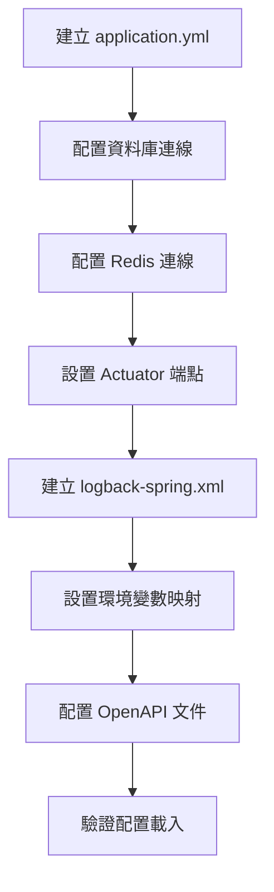

# 03 - 配置應用程式組態與環境變數

## 任務核取方塊
- [ ] 建立 application.yml 配置檔
- [ ] 設置資料庫連線配置
- [ ] 設置 Redis 連線配置
- [ ] 配置 Spring Boot Actuator
- [ ] 建立 logback-spring.xml 日誌配置
- [ ] 設置環境變數覆蓋機制
- [ ] 驗證配置載入正常

## 任務描述

建立應用程式的核心配置檔案，包含資料庫連線、快取配置、日誌設定與監控端點。所有配置都必須支援環境變數覆蓋，以確保在不同環境（開發、測試、生產）中的彈性部署。

採用 YAML 格式的原因：
- 結構化配置，易讀易維護
- 支援 Spring Boot Profile 切換
- 良好的層次結構表達
- 支援複雜的配置物件映射

## 驗收標準

1. application.yml 正確配置所有必要項目
2. 資料庫連線配置支援環境變數覆蓋
3. Redis 連線配置正常運作
4. Spring Boot Actuator 端點可訪問
5. 日誌配置支援 console 與 JSON 兩種格式
6. 所有敏感資訊可透過環境變數注入
7. OpenAPI 文件端點正常運作
8. 應用程式可在 Docker Compose 環境中正常啟動

## 執行步驟



### 詳細步驟

1. **建立基本 application.yml 結構**
   - 設定應用程式基本資訊
   - 配置 server 埠號
   - 設置 spring 核心配置

2. **配置資料庫連線**
   - JPA/Hibernate 配置
   - 連線池設定（HikariCP）
   - Flyway 資料庫遷移配置
   - 環境變數覆蓋設定

3. **配置 Redis 連線**
   - Jedis 連線池配置
   - 序列化設定
   - 逾時與重試機制

4. **設置 Spring Boot Actuator**
   - 健康檢查端點
   - Prometheus metrics 端點
   - 自訂 management 埠（可選）
   - 安全性配置

5. **建立日誌配置**
   - Console 格式（開發環境）
   - JSON 格式（生產環境）
   - 日誌等級配置
   - 檔案輸出設定

6. **環境變數映射**
   - 建立 .env.example
   - 設定預設值
   - 敏感資訊保護

7. **OpenAPI 配置**
   - API 文件資訊
   - 伺服器 URL 設定
   - 安全性 schema

## 預期輸入

- Spring Boot 專案骨架
- Docker Compose 環境
- Maven 依賴已正確配置

## 預期輸出

### 1. 配置檔案

**src/main/resources/application.yml**
```yaml
spring:
  application:
    name: tinyurl-api
  datasource:
    url: jdbc:postgresql://${DB_HOST:localhost}:${DB_PORT:5432}/${DB_NAME:tinyurl_db}
    username: ${DB_USERNAME:tinyurl_user}
    password: ${DB_PASSWORD:tinyurl_pass}

  data:
    redis:
      host: ${REDIS_HOST:localhost}
      port: ${REDIS_PORT:6379}

  jpa:
    hibernate:
      ddl-auto: validate
    show-sql: ${SHOW_SQL:false}

  flyway:
    enabled: true
    locations: classpath:db/migration

management:
  endpoints:
    web:
      exposure:
        include: health,prometheus,info
  endpoint:
    health:
      show-details: always

server:
  port: ${SERVER_PORT:8080}

logging:
  level:
    com.example.tinyurl: ${LOG_LEVEL:INFO}
    org.springframework.web: ${WEB_LOG_LEVEL:WARN}
```

**src/main/resources/logback-spring.xml**
- Console Appender（彩色輸出）
- JSON Appender（結構化日誌）
- 檔案 Appender（選用）
- Profile 條件配置

### 2. 環境變數檔案

**.env.example**
```bash
# 應用程式
SERVER_PORT=8080
LOG_LEVEL=INFO
LOG_FORMAT=console

# 資料庫
DB_HOST=localhost
DB_PORT=5432
DB_NAME=tinyurl_db
DB_USERNAME=tinyurl_user
DB_PASSWORD=tinyurl_pass

# Redis
REDIS_HOST=localhost
REDIS_PORT=6379

# 監控
MANAGEMENT_PORT=8080
SHOW_SQL=false
```

### 3. 配置驗證項目

| 配置項目           | 驗證方式                      |
| ------------------ | ----------------------------- |
| 資料庫連線         | 啟動時連線測試                |
| Redis 連線         | 健康檢查端點                  |
| Actuator 端點      | HTTP GET /actuator/health     |
| Prometheus Metrics | HTTP GET /actuator/prometheus |
| OpenAPI 文件       | HTTP GET /swagger-ui.html     |
| 日誌格式           | 檢查控制台輸出                |

### 4. Profile 支援

- **default**: 本地開發環境
- **docker**: Docker Compose 環境
- **test**: 測試環境（使用 Testcontainers）
- **prod**: 生產環境（JSON 日誌、效能優化）

### 5. 健康檢查配置

```yaml
management:
  health:
    redis:
      enabled: true
    db:
      enabled: true
    diskspace:
      enabled: true
```
