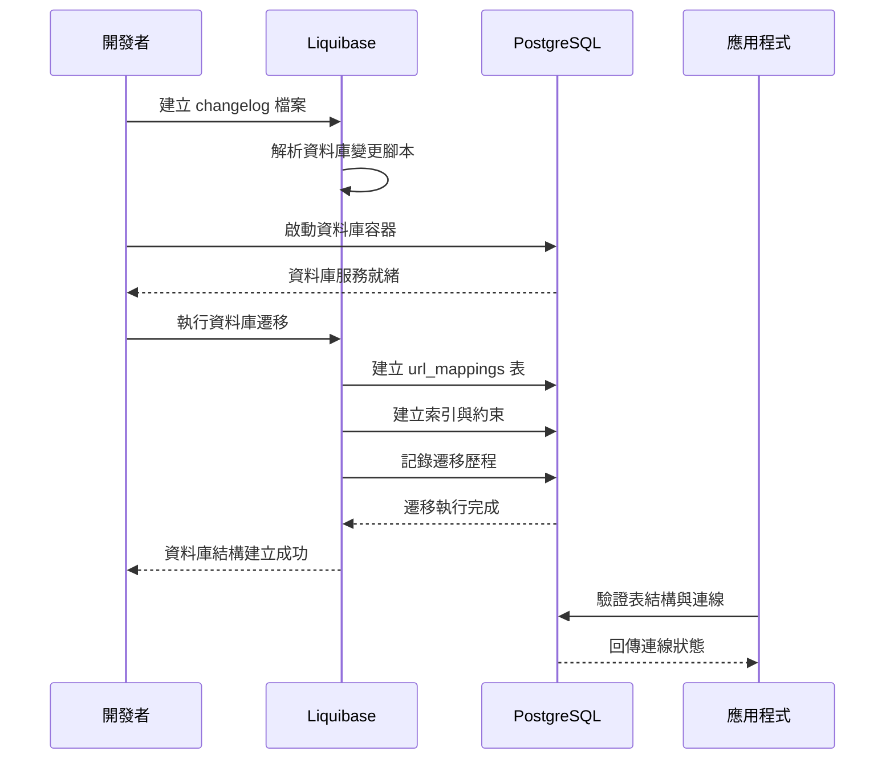

# 資料庫設計與遷移

## 任務狀態
❌ 未完成

## 任務描述

設計 TinyURL 服務的資料庫結構，建立 URL 映射表以儲存短網址與長網址的對應關係。使用 Liquibase 進行資料庫版本控制，確保資料結構的變更可以安全且一致地部署到不同環境中。

資料庫設計需要考慮高併發存取、查詢效能最佳化，以及資料完整性約束。同時建立適當的索引策略，支援快速的短網址查詢與長網址檢索作業。

## 需求來源

此任務基於以下需求文件：
- [短網址生成功能](../requirements/01-url-shortening.md) - 需要儲存長網址與短網址的映射關係
- [重導向服務功能](../requirements/02-url-redirection.md) - 需要快速查詢短網址對應的長網址

## 執行步驟

### 資料庫設計流程圖



### 具體執行步驟

1. **設計資料表結構**
   - 分析 URL 映射的資料需求
   - 設計主要實體表與欄位定義
   - 規劃索引策略與效能最佳化

2. **建立 Liquibase changelog**
   - 建立主要的 changelog 檔案
   - 撰寫資料表建立腳本
   - 定義約束條件與索引

3. **配置資料庫遷移**
   - 整合 Liquibase 到 Spring Boot
   - 設定遷移檔案路徑與命名規範
   - 配置不同環境的遷移策略

4. **驗證資料庫結構**
   - 執行遷移腳本測試
   - 驗證表結構與約束條件
   - 測試索引效能與查詢最佳化

## 測試情境

### 正向測試案例
1. **資料庫遷移成功**
   - 執行 Liquibase 遷移腳本
   - 驗證所有表格都正確建立
   - 確認索引與約束條件都已設定

2. **資料完整性驗證**
   - 插入測試資料驗證欄位約束
   - 測試唯一性約束正常運作
   - 驗證外鍵關聯性正確建立

### 反向測試案例
1. **重複遷移處理**
   - 多次執行相同遷移腳本
   - 驗證 Liquibase 能正確識別已執行的變更
   - 確保不會產生重複的表格或約束

2. **約束違反處理**
   - 嘗試插入違反唯一性約束的資料
   - 測試必填欄位的 NOT NULL 約束
   - 驗證資料長度限制正常運作

## 預期輸入

- Spring Boot 專案結構已建立
- Docker PostgreSQL 容器正常運行
- Liquibase 依賴已加入 pom.xml

## 預期輸出

### Liquibase 配置檔案
- `src/main/resources/db/changelog/db.changelog-master.xml` - 主要 changelog 檔案
- `src/main/resources/db/changelog/changeset/001-create-url-mappings-table.xml` - 建立表格的變更檔

### 資料表結構

#### url_mappings 表格
```sql
CREATE TABLE url_mappings (
    id                  BIGSERIAL PRIMARY KEY,
    short_url_id       VARCHAR(10) NOT NULL UNIQUE,
    original_url       TEXT NOT NULL,
    created_at         TIMESTAMP WITH TIME ZONE NOT NULL DEFAULT CURRENT_TIMESTAMP,
    expires_at         TIMESTAMP WITH TIME ZONE,
    click_count        BIGINT NOT NULL DEFAULT 0,
    is_active          BOOLEAN NOT NULL DEFAULT TRUE,
    created_by_ip      INET,
    user_agent         TEXT
);

-- 建立索引以提升查詢效能
CREATE UNIQUE INDEX idx_url_mappings_short_url_id ON url_mappings(short_url_id);
CREATE INDEX idx_url_mappings_original_url_hash ON url_mappings(MD5(original_url));
CREATE INDEX idx_url_mappings_created_at ON url_mappings(created_at);
CREATE INDEX idx_url_mappings_active_short_id ON url_mappings(short_url_id, is_active) WHERE is_active = true;

-- 建立部分索引以最佳化查詢效能
CREATE INDEX idx_url_mappings_active_not_expired
    ON url_mappings(short_url_id)
    WHERE is_active = true AND (expires_at IS NULL OR expires_at > CURRENT_TIMESTAMP);
```

### 欄位說明
- `id`: 主鍵，使用 BIGSERIAL 自動遞增
- `short_url_id`: 短網址識別碼，10字元限制，唯一性約束
- `original_url`: 原始長網址，使用 TEXT 支援長網址
- `created_at`: 建立時間戳記，包含時區資訊
- `expires_at`: 到期時間，可為空表示永不到期
- `click_count`: 點擊計數器，預設為0
- `is_active`: 啟用狀態，軟性刪除標記
- `created_by_ip`: 建立者 IP 位址，用於追蹤與分析
- `user_agent`: 使用者代理字串，用於統計分析

### 索引策略說明
1. **主要查詢索引**: `short_url_id` 唯一索引，支援快速重導向查詢
2. **重複檢查索引**: `original_url` MD5 雜湊索引，支援重複網址檢查
3. **時間範圍索引**: `created_at` 索引，支援時間範圍查詢與統計
4. **複合功能索引**: 結合 `short_url_id` 與 `is_active` 的複合索引
5. **效能最佳化索引**: 部分索引僅包含有效且未過期的記錄

### Spring Boot 整合配置

在 `application.yml` 中加入 Liquibase 配置：
```yaml
spring:
  liquibase:
    change-log: classpath:db/changelog/db.changelog-master.xml
    enabled: true
    drop-first: false
    contexts: ${LIQUIBASE_CONTEXTS:default}
    default-schema: ${DB_SCHEMA:public}
```

完成這個任務後，資料庫結構將完全就緒，可以支援 TinyURL 服務的所有核心功能，並具備良好的效能表現與擴展性。