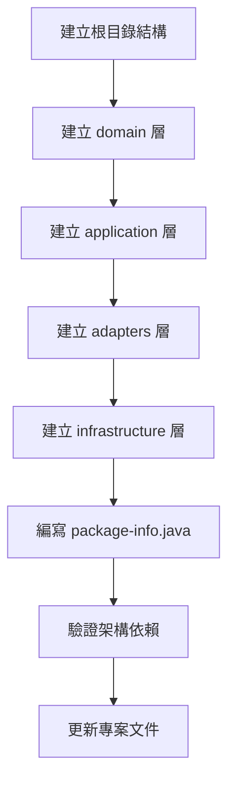
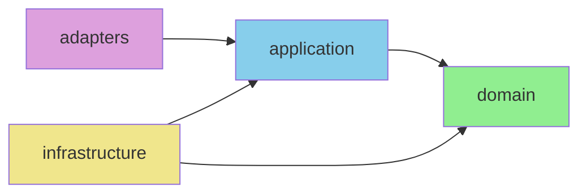

# 04 - 建立 Clean Architecture 目錄結構

## 任務核取方塊
- [ ] 建立 domain 層目錄結構
- [ ] 建立 application 層目錄結構
- [ ] 建立 adapters 層目錄結構
- [ ] 建立 infrastructure 層目錄結構
- [ ] 建立各層的 package-info.java
- [ ] 驗證依賴方向正確性

## 任務描述

根據 Clean Architecture 原則建立四層架構的目錄結構，確保各層職責清晰分離，依賴方向符合架構要求。這個結構將為 TinyURL 服務提供可維護、可測試且可擴展的程式碼組織。

採用 Clean Architecture 的原因：
- 清晰的責任分離，易於理解與維護
- 領域邏輯與技術細節解耦
- 便於單元測試與模擬測試
- 支援技術棧替換而不影響業務邏輯
- 符合 SOLID 原則與依賴反轉

## 驗收標準

1. 四層目錄結構正確建立
2. 每個目錄都有對應的 package-info.java 說明文件
3. 依賴方向符合 Clean Architecture 要求（向內依賴）
4. domain 層完全無外部框架依賴
5. 各層職責界線清晰明確
6. 目錄命名遵循 Java 套件命名慣例
7. 專案結構文件更新完成

## 執行步驟



### 詳細步驟

1. **建立根目錄結構**
   ```
   src/main/java/com/example/tinyurl/
   ├── domain/
   ├── application/
   ├── adapters/
   └── infrastructure/
   ```

2. **Domain 層目錄結構**
   ```
   domain/
   ├── model/           # 聚合根、實體、值對象
   ├── repository/      # Repository 介面
   ├── service/         # Domain Service（必要時）
   └── exception/       # 領域異常
   ```

3. **Application 層目錄結構**
   ```
   application/
   ├── usecase/         # Use Case 實作
   ├── port/
   │   ├── in/          # 輸入 Port（Commands/Queries）
   │   └── out/         # 輸出 Port（Repository/External）
   └── dto/             # Use Case 輸入/輸出 DTO
   ```

4. **Adapters 層目錄結構**
   ```
   adapters/
   ├── web/             # REST Controllers & Web DTOs
   │   ├── controller/
   │   ├── dto/
   │   └── mapper/
   ├── messaging/       # 訊息佇列（選用）
   └── scheduler/       # 排程任務（選用）
   ```

5. **Infrastructure 層目錄結構**
   ```
   infrastructure/
   ├── persistence/
   │   ├── jpa/         # JPA Entity & Repository 實作
   │   └── mapper/      # Domain ↔ Entity 映射
   ├── cache/
   │   └── redis/       # Redis 快取實作
   ├── config/          # Spring Configuration
   ├── openapi/         # OpenAPI 配置
   └── observability/   # Metrics & Health Indicators
   ```

6. **編寫 package-info.java**
   - 每個主要套件都要有說明文件
   - 描述該層的職責與約束
   - 說明依賴關係與架構原則

## 預期輸入

- Spring Boot 專案基礎結構
- pom.xml 已配置完成
- 主應用程式類別已建立

## 預期輸出

### 1. 完整目錄結構

```
src/main/java/com/example/tinyurl/
├── TinyUrlApplication.java
├── domain/
│   ├── model/
│   ├── repository/
│   ├── service/
│   ├── exception/
│   └── package-info.java
├── application/
│   ├── usecase/
│   ├── port/
│   │   ├── in/
│   │   └── out/
│   ├── dto/
│   └── package-info.java
├── adapters/
│   ├── web/
│   │   ├── controller/
│   │   ├── dto/
│   │   └── mapper/
│   ├── messaging/
│   ├── scheduler/
│   └── package-info.java
└── infrastructure/
    ├── persistence/
    │   ├── jpa/
    │   └── mapper/
    ├── cache/
    │   └── redis/
    ├── config/
    ├── openapi/
    ├── observability/
    └── package-info.java
```

### 2. Package-info.java 範例

**domain/package-info.java**
```java
/**
 * 領域層 - 包含純粹的業務邏輯與領域模型
 *
 * 職責：
 * - 定義領域實體、值對象與聚合根
 * - 實作業務規則與領域邏輯
 * - 定義 Repository 介面（不含實作）
 *
 * 約束：
 * - 不可依賴任何外部框架
 * - 不可依賴其他架構層
 * - 只能使用 Java 標準庫
 */
package com.example.tinyurl.domain;
```

### 3. 架構依賴關係



### 4. 各層職責說明

| 層級           | 職責                 | 依賴規則                 |
| -------------- | -------------------- | ------------------------ |
| Domain         | 業務邏輯、領域模型   | 無外部依賴               |
| Application    | Use Cases、Port 定義 | 只依賴 Domain            |
| Adapters       | 外部介面適配         | 依賴 Application         |
| Infrastructure | 技術實作細節         | 依賴 Application、Domain |

### 5. 檔案模板

每個目錄都會包含：
- **package-info.java**: 套件說明與架構約束
- **.gitkeep**: 保持空目錄在版本控制中
- **README.md**: 該層的詳細說明與使用範例

### 6. 架構驗證規則

- Domain 層不可 import Spring 或其他框架
- Application 層只能 import Domain 層
- Infrastructure 實作必須實作 Application 層的 Port
- Web DTO 與 Domain Model 分離
