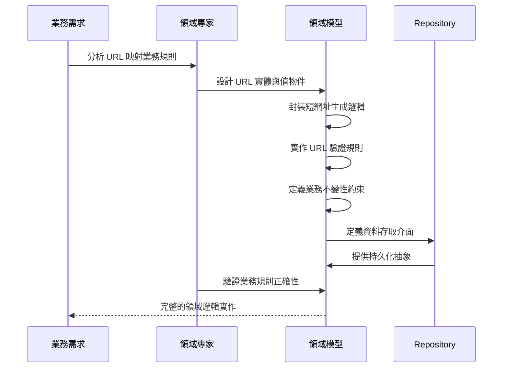

# 領域模型設計

## 任務狀態
❌ 未完成

## 任務描述

實作 TinyURL 服務的核心領域模型，包含 URL 實體、值物件、領域服務與 Repository 介面。這個任務專注於建立純粹的業務邏輯層，不依賴任何框架或技術細節，確保領域知識的封裝與業務規則的正確實作。

領域模型將包含 URL 映射的核心概念、短網址生成策略、URL 驗證邏輯，以及相關的業務不變性約束。透過 Clean Architecture 的設計原則，讓領域層成為整個應用程式的穩定核心。

## 需求來源

此任務基於以下需求文件：
- [短網址生成功能](../requirements/01-url-shortening.md) - 需要實作短網址生成的業務邏輯
- [重導向服務功能](../requirements/02-url-redirection.md) - 需要實作 URL 查詢與狀態管理邏輯

## 執行步驟

### 領域模型設計流程圖



### 具體執行步驟

1. **設計核心實體模型**
   - 建立 UrlMapping 聚合根實體
   - 設計 ShortUrlId 與 OriginalUrl 值物件
   - 實作實體的業務方法與不變性約束

2. **實作領域服務**
   - 建立 ShortUrlGeneratorService 短網址生成服務
   - 實作 UrlValidationService URL 驗證服務
   - 設計 UrlMappingDomainService 聚合業務邏輯

3. **定義 Repository 介面**
   - 設計 UrlMappingRepository 資料存取介面
   - 定義查詢方法與持久化操作
   - 保持介面的領域導向設計

4. **建立領域事件**
   - 設計 UrlMappingCreated 領域事件
   - 實作 UrlAccessed 點擊事件
   - 建立事件發布機制的抽象

## 測試情境

### 正向測試案例
1. **短網址生成成功**
   - 提供有效的長網址
   - 驗證短網址生成邏輯正確
   - 確認生成的短網址符合格式要求

2. **URL 映射建立成功**
   - 建立新的 UrlMapping 實體
   - 驗證所有必要欄位都正確設定
   - 確認業務不變性約束都滿足

3. **URL 驗證通過**
   - 測試有效的 HTTP/HTTPS 網址
   - 驗證 URL 格式檢查邏輯
   - 確認支援的網址類型都能通過驗證

### 反向測試案例
1. **無效 URL 處理**
   - 提供格式錯誤的網址
   - 測試空字串或 null 值處理
   - 驗證不支援的協議類型拒絕

2. **短網址衝突處理**
   - 測試重複短網址識別碼的情況
   - 驗證衝突檢測機制
   - 確認重新生成邏輯正確運作

3. **業務規則違反**
   - 測試超出長度限制的網址
   - 驗證必填欄位的約束檢查
   - 確認非法字元的處理邏輯

## 預期輸入

- 資料庫設計與遷移已完成
- Clean Architecture 目錄結構已建立
- Spring Boot 專案基礎結構就緒

## 預期輸出

### 領域實體 (Domain Entities)

#### UrlMapping 聚合根
```java
// src/main/java/com/example/tinyurl/domain/model/UrlMapping.java
/**
 * URL 映射聚合根實體
 * 封裝短網址與長網址的映射關係，以及相關的業務邏輯
 */
public class UrlMapping {
    private UrlMappingId id;
    private ShortUrlId shortUrlId;
    private OriginalUrl originalUrl;
    private LocalDateTime createdAt;
    private LocalDateTime expiresAt;
    private ClickCount clickCount;
    private boolean active;
    private IpAddress createdByIp;
    private UserAgent userAgent;

    // 業務方法
    public void incrementClickCount();
    public boolean isExpired();
    public void deactivate();
    public boolean isAccessible();
}
```

### 值物件 (Value Objects)

#### ShortUrlId 值物件
```java
// src/main/java/com/example/tinyurl/domain/model/ShortUrlId.java
/**
 * 短網址識別碼值物件
 * 封裝短網址 ID 的格式驗證與生成邏輯
 */
public record ShortUrlId(String value) {
    private static final int SHORT_URL_LENGTH = 8;
    private static final String ALLOWED_CHARACTERS = "abcdefghijklmnopqrstuvwxyzABCDEFGHIJKLMNOPQRSTUVWXYZ0123456789";

    public ShortUrlId {
        validateFormat(value);
    }

    private void validateFormat(String value);
    public static ShortUrlId generate();
}
```

#### OriginalUrl 值物件
```java
// src/main/java/com/example/tinyurl/domain/model/OriginalUrl.java
/**
 * 原始網址值物件
 * 封裝網址的驗證邏輯與正規化處理
 */
public record OriginalUrl(String value) {
    private static final int MAX_URL_LENGTH = 2048;
    private static final Set<String> ALLOWED_SCHEMES = Set.of("http", "https");

    public OriginalUrl {
        validateUrl(value);
    }

    private void validateUrl(String url);
    public String getNormalizedUrl();
    public String getDomain();
}
```

### 領域服務 (Domain Services)

#### ShortUrlGeneratorService
```java
// src/main/java/com/example/tinyurl/domain/service/ShortUrlGeneratorService.java
/**
 * 短網址生成領域服務
 * 負責生成唯一的短網址識別碼
 */
@Component
public class ShortUrlGeneratorService {
    public ShortUrlId generateUniqueShortUrl(UrlMappingRepository repository);
    public ShortUrlId generateFromOriginalUrl(OriginalUrl originalUrl);
    private boolean isShortUrlAvailable(ShortUrlId shortUrlId, UrlMappingRepository repository);
}
```

#### UrlValidationService
```java
// src/main/java/com/example/tinyurl/domain/service/UrlValidationService.java
/**
 * URL 驗證領域服務
 * 提供各種 URL 驗證邏輯
 */
@Component
public class UrlValidationService {
    public boolean isValidUrl(String url);
    public boolean isSupportedScheme(String url);
    public boolean isReachable(String url);
    public OriginalUrl normalizeUrl(String rawUrl);
}
```

### Repository 介面 (Repository Interfaces)

#### UrlMappingRepository
```java
// src/main/java/com/example/tinyurl/domain/repository/UrlMappingRepository.java
/**
 * URL 映射 Repository 介面
 * 定義資料存取的領域契約
 */
public interface UrlMappingRepository {
    UrlMappingId save(UrlMapping urlMapping);
    Optional<UrlMapping> findByShortUrlId(ShortUrlId shortUrlId);
    Optional<UrlMapping> findByOriginalUrl(OriginalUrl originalUrl);
    boolean existsByShortUrlId(ShortUrlId shortUrlId);
    void delete(UrlMappingId id);

    // 查詢方法
    List<UrlMapping> findRecentCreated(int limit);
    List<UrlMapping> findExpiredMappings();
    long countActiveMapping();
}
```

### 領域事件 (Domain Events)

#### UrlMappingCreated 事件
```java
// src/main/java/com/example/tinyurl/domain/event/UrlMappingCreated.java
/**
 * URL 映射建立領域事件
 */
public record UrlMappingCreated(
    UrlMappingId urlMappingId,
    ShortUrlId shortUrlId,
    OriginalUrl originalUrl,
    LocalDateTime createdAt,
    IpAddress createdByIp
) implements DomainEvent {
}
```

#### UrlAccessed 事件
```java
// src/main/java/com/example/tinyurl/domain/event/UrlAccessed.java
/**
 * URL 存取領域事件
 */
public record UrlAccessed(
    ShortUrlId shortUrlId,
    IpAddress accessedFromIp,
    UserAgent userAgent,
    LocalDateTime accessedAt
) implements DomainEvent {
}
```

### 領域例外 (Domain Exceptions)

```java
// src/main/java/com/example/tinyurl/domain/exception/
public class InvalidUrlException extends DomainException { }
public class ShortUrlNotFoundException extends DomainException { }
public class ShortUrlCollisionException extends DomainException { }
public class ExpiredUrlException extends DomainException { }
```

### 包說明檔案 (Package Documentation)

每個 package 包含 `package-info.java` 檔案，說明該套件的職責與設計原則：

```java
// src/main/java/com/example/tinyurl/domain/package-info.java
/**
 * TinyURL 領域層
 *
 * 本套件包含 TinyURL 服務的核心業務邏輯，遵循 Clean Architecture 原則：
 * - 不依賴任何外部框架或技術細節
 * - 封裝所有業務規則與領域知識
 * - 提供穩定的領域 API 供應用層使用
 *
 * 主要組件：
 * - model: 領域實體與值物件
 * - service: 領域服務
 * - repository: 資料存取介面
 * - event: 領域事件定義
 * - exception: 領域例外
 */
package com.example.tinyurl.domain;
```

完成這個任務後，TinyURL 服務將擁有一個強健且可測試的領域核心，為後續的應用層與基礎設施層實作提供穩定的基礎。