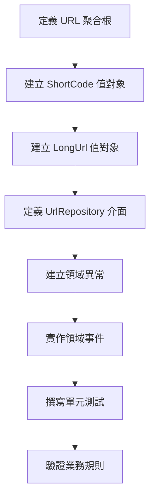

# 05 - 實作領域模型與儲存庫介面

## 任務核取方塊
- [ ] 建立 URL 聚合根
- [ ] 建立 ShortCode 值對象
- [ ] 建立 LongUrl 值對象
- [ ] 建立領域事件（選用）
- [ ] 建立 UrlRepository 介面
- [ ] 建立領域異常類別
- [ ] 撰寫領域模型單元測試

## 任務描述

實作 TinyURL 服務的核心領域模型，包含 URL 聚合根、相關值對象與 Repository 介面。這個層級完全不依賴任何外部框架，專注於業務邏輯的正確表達與封裝。

領域模型設計原則：
- 聚合根負責維護業務不變量
- 值對象提供類型安全與驗證
- Repository 介面定義持久化契約
- 領域事件支援異步處理（如統計、通知）

## 驗收標準

1. URL 聚合根正確實作業務規則
2. ShortCode 與 LongUrl 值對象提供驗證邏輯
3. UrlRepository 介面定義完整的持久化操作
4. 領域異常類別覆蓋所有業務錯誤情況
5. 所有領域對象都是不可變的（Immutable）
6. 單元測試覆蓋所有業務邏輯
7. 無任何外部框架依賴

## 執行步驟



### 詳細步驟

1. **設計 URL 聚合根**
   - 包含短網址碼、長網址、建立時間、存取統計
   - 實作業務邏輯：URL 驗證、存取次數追蹤
   - 提供工廠方法建立新 URL 映射

2. **建立 ShortCode 值對象**
   - Base62 編碼驗證（a-z, A-Z, 0-9）
   - 長度限制（6-8 字符）
   - 不可變性與相等性比較

3. **建立 LongUrl 值對象**
   - URL 格式驗證
   - 長度限制（避免過長 URL）
   - 協議檢查（HTTP/HTTPS）

4. **定義 Repository 介面**
   - 儲存與查詢方法
   - 唯一性檢查
   - 統計查詢介面

5. **建立領域異常**
   - InvalidUrlException
   - ShortCodeAlreadyExistsException
   - UrlNotFoundException

6. **實作領域事件**
   - UrlCreatedEvent
   - UrlAccessedEvent

## 預期輸入

- Clean Architecture 目錄結構
- 領域需求分析結果
- 業務規則定義

## 預期輸出

### 1. URL 聚合根

**domain/model/Url.java**
```java
public class Url {
    private final ShortCode shortCode;
    private final LongUrl longUrl;
    private final LocalDateTime createdAt;
    private final LocalDateTime accessedAt;
    private final int accessCount;

    // 工廠方法
    public static Url create(LongUrl longUrl, ShortCode shortCode) {
        // 業務邏輯與驗證
    }

    // 業務方法
    public Url recordAccess() {
        // 記錄存取並返回新實例
    }

    public boolean isExpired(Duration ttl) {
        // 檢查是否過期
    }
}
```

### 2. 值對象

**domain/model/ShortCode.java**
```java
public record ShortCode(String value) {
    private static final Pattern VALID_PATTERN =
        Pattern.compile("^[a-zA-Z0-9]{6,8}$");

    public ShortCode {
        if (!isValid(value)) {
            throw new InvalidShortCodeException(value);
        }
    }

    private boolean isValid(String value) {
        return value != null && VALID_PATTERN.matcher(value).matches();
    }
}
```

**domain/model/LongUrl.java**
```java
public record LongUrl(String value) {
    private static final int MAX_LENGTH = 2048;

    public LongUrl {
        if (!isValid(value)) {
            throw new InvalidUrlException(value);
        }
    }

    private boolean isValid(String value) {
        // URL 格式驗證邏輯
    }
}
```

### 3. Repository 介面

**domain/repository/UrlRepository.java**
```java
public interface UrlRepository {
    Optional<Url> findByShortCode(ShortCode shortCode);

    Optional<Url> findByLongUrl(LongUrl longUrl);

    void save(Url url);

    boolean existsByShortCode(ShortCode shortCode);

    long countByCreatedAtAfter(LocalDateTime since);

    List<Url> findTopAccessedUrls(int limit);
}
```

### 4. 領域異常

**domain/exception/DomainException.java**
```java
public abstract class DomainException extends RuntimeException {
    protected DomainException(String message) {
        super(message);
    }

    protected DomainException(String message, Throwable cause) {
        super(message, cause);
    }
}
```

**domain/exception/InvalidUrlException.java**
**domain/exception/ShortCodeAlreadyExistsException.java**
**domain/exception/UrlNotFoundException.java**

### 5. 領域事件

**domain/event/UrlCreatedEvent.java**
```java
public record UrlCreatedEvent(
    ShortCode shortCode,
    LongUrl longUrl,
    LocalDateTime createdAt
) implements DomainEvent {
}
```

**domain/event/UrlAccessedEvent.java**
```java
public record UrlAccessedEvent(
    ShortCode shortCode,
    LocalDateTime accessedAt,
    int totalAccessCount
) implements DomainEvent {
}
```

### 6. 單元測試

**domain/model/UrlTest.java**
- 測試 URL 建立邏輯
- 測試存取追蹤功能
- 測試過期檢查
- 測試業務不變量

**domain/model/ShortCodeTest.java**
- 測試有效/無效格式
- 測試邊界條件
- 測試相等性比較

**domain/model/LongUrlTest.java**
- 測試 URL 格式驗證
- 測試長度限制
- 測試協議檢查

### 7. 業務規則彙總

| 業務規則     | 實作位置           | 驗證方式        |
| ------------ | ------------------ | --------------- |
| 短網址格式   | ShortCode          | Pattern 驗證    |
| 長網址有效性 | LongUrl            | URL 解析驗證    |
| 唯一性約束   | Url.create()       | Repository 檢查 |
| 存取追蹤     | Url.recordAccess() | 不可變更新      |
| 過期檢查     | Url.isExpired()    | 時間比較        |
