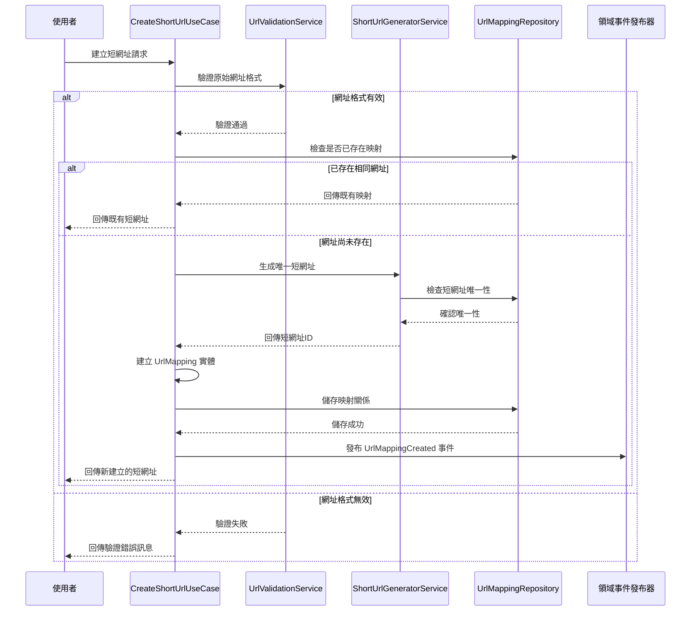

# 短網址生成服務

## 任務狀態
❌ 未完成

## 任務描述

實作短網址生成的應用層邏輯，包含 Use Case 實作、輸入輸出 Port 定義，以及完整的單元測試覆蓋。這個服務負責協調領域模型與外部介面，處理短網址生成的完整業務流程，包含重複檢查、唯一性驗證與錯誤處理。

本任務將實作 CreateShortUrlUseCase，整合 URL 驗證、短網址生成、持久化儲存等多個步驟，確保生成的短網址符合業務需求且具有良好的使用者體驗。

## 需求來源

此任務基於以下需求文件：
- [短網址生成功能](../requirements/01-url-shortening.md) - 實作核心的短網址生成業務流程

## 執行步驟

### 短網址生成流程圖



### 具體執行步驟

1. **建立輸入輸出 Port 介面**
   - 定義 CreateShortUrlCommand 輸入命令
   - 建立 ShortUrlResponse 輸出回應
   - 設計 CreateShortUrlUseCase 介面契約

2. **實作 Use Case 主要邏輯**
   - 建立 CreateShortUrlInteractor 實作類別
   - 整合領域服務與 Repository 操作
   - 實作完整的業務流程控制

3. **設計輸出 Port 抽象**
   - 定義 UrlMappingOutputPort 介面
   - 建立領域事件發布的抽象介面
   - 設計快取操作的輸出 Port

4. **撰寫完整的單元測試**
   - 測試正向流程與邊界條件
   - 模擬各種錯誤情境與例外處理
   - 驗證領域事件的正確發布

## 測試情境

### 正向測試案例
1. **首次建立短網址成功**
   - 提供全新的有效長網址
   - 驗證短網址生成成功
   - 確認映射關係正確儲存
   - 檢查領域事件正確發布

2. **重複網址處理**
   - 提供已存在的長網址
   - 驗證回傳既有的短網址
   - 確認不會建立重複的映射記錄
   - 檢查不會重複發布建立事件

3. **URL 正規化處理**
   - 提供帶有查詢參數的網址
   - 測試 URL 正規化邏輯
   - 驗證標準化後的映射建立

### 反向測試案例
1. **無效網址處理**
   - 提供格式錯誤的網址
   - 測試空字串或 null 輸入
   - 驗證不支援的協議處理
   - 確認適當的錯誤訊息回傳

2. **短網址生成衝突**
   - 模擬短網址生成衝突情況
   - 測試重新生成機制
   - 驗證衝突解決的正確性

3. **資料庫操作失敗**
   - 模擬 Repository 儲存失敗
   - 測試例外情況的錯誤處理
   - 驗證事務回滾機制

4. **併發存取處理**
   - 模擬多個使用者同時建立相同網址
   - 測試併發衝突的處理機制
   - 驗證資料一致性保證

## 預期輸入

- 領域模型設計已完成
- Repository 介面已定義
- 領域服務實作已就緒

## 預期輸出

### 輸入 Port 介面

#### CreateShortUrlCommand
```java
// src/main/java/com/example/tinyurl/application/port/in/CreateShortUrlCommand.java
/**
 * 建立短網址命令
 * 封裝建立短網址所需的輸入參數
 */
public record CreateShortUrlCommand(
    @NotBlank(message = "原始網址不能為空")
    String originalUrl,

    @Valid
    OptionalExpirationTime expirationTime,

    @Valid
    RequestMetadata requestMetadata
) {

    /**
     * 建立命令的工廠方法
     */
    public static CreateShortUrlCommand of(String originalUrl, String clientIp, String userAgent) {
        return new CreateShortUrlCommand(
            originalUrl,
            OptionalExpirationTime.never(),
            RequestMetadata.of(clientIp, userAgent)
        );
    }
}
```

#### CreateShortUrlUseCase 介面
```java
// src/main/java/com/example/tinyurl/application/port/in/CreateShortUrlUseCase.java
/**
 * 建立短網址使用案例介面
 * 定義短網址生成的主要業務契約
 */
public interface CreateShortUrlUseCase {

    /**
     * 建立短網址
     *
     * @param command 建立短網址的命令
     * @return 短網址回應，包含生成的短網址資訊
     * @throws InvalidUrlException 當原始網址格式無效時
     * @throws UrlProcessingException 當網址處理過程發生錯誤時
     */
    ShortUrlResponse createShortUrl(CreateShortUrlCommand command);
}
```

### 輸出資料模型

#### ShortUrlResponse
```java
// src/main/java/com/example/tinyurl/application/dto/ShortUrlResponse.java
/**
 * 短網址回應資料傳輸物件
 * 包含建立或查詢到的短網址相關資訊
 */
public record ShortUrlResponse(
    String shortUrlId,
    String shortUrl,
    String originalUrl,
    LocalDateTime createdAt,
    Optional<LocalDateTime> expiresAt,
    boolean isNew,
    long clickCount
) {

    /**
     * 從領域實體建立回應物件
     */
    public static ShortUrlResponse from(UrlMapping urlMapping, String baseUrl, boolean isNew) {
        return new ShortUrlResponse(
            urlMapping.getShortUrlId().value(),
            baseUrl + "/" + urlMapping.getShortUrlId().value(),
            urlMapping.getOriginalUrl().value(),
            urlMapping.getCreatedAt(),
            Optional.ofNullable(urlMapping.getExpiresAt()),
            isNew,
            urlMapping.getClickCount().value()
        );
    }
}
```

### 輸出 Port 介面

#### UrlMappingOutputPort
```java
// src/main/java/com/example/tinyurl/application/port/out/UrlMappingOutputPort.java
/**
 * URL 映射輸出 Port
 * 定義與外部儲存系統的互動介面
 */
public interface UrlMappingOutputPort {
    UrlMappingId saveUrlMapping(UrlMapping urlMapping);
    Optional<UrlMapping> findByShortUrlId(ShortUrlId shortUrlId);
    Optional<UrlMapping> findByOriginalUrl(OriginalUrl originalUrl);
    boolean existsByShortUrlId(ShortUrlId shortUrlId);
}
```

#### DomainEventPublisher
```java
// src/main/java/com/example/tinyurl/application/port/out/DomainEventPublisher.java
/**
 * 領域事件發布器介面
 * 定義領域事件發布的抽象契約
 */
public interface DomainEventPublisher {
    void publish(DomainEvent event);
    void publishAll(List<DomainEvent> events);
}
```

### Use Case 實作

#### CreateShortUrlInteractor
```java
// src/main/java/com/example/tinyurl/application/usecase/CreateShortUrlInteractor.java
/**
 * 建立短網址互動器
 * 實作建立短網址的完整業務流程
 */
@Service
@Transactional
@Slf4j
public class CreateShortUrlInteractor implements CreateShortUrlUseCase {

    private final UrlValidationService urlValidationService;
    private final ShortUrlGeneratorService shortUrlGeneratorService;
    private final UrlMappingOutputPort urlMappingOutputPort;
    private final DomainEventPublisher domainEventPublisher;

    @Value("${app.short-url.base-url}")
    private String baseUrl;

    public CreateShortUrlInteractor(
            UrlValidationService urlValidationService,
            ShortUrlGeneratorService shortUrlGeneratorService,
            UrlMappingOutputPort urlMappingOutputPort,
            DomainEventPublisher domainEventPublisher) {
        this.urlValidationService = urlValidationService;
        this.shortUrlGeneratorService = shortUrlGeneratorService;
        this.urlMappingOutputPort = urlMappingOutputPort;
        this.domainEventPublisher = domainEventPublisher;
    }

    @Override
    public ShortUrlResponse createShortUrl(CreateShortUrlCommand command) {
        log.info("開始處理短網址建立請求: {}", command.originalUrl());

        // 1. 驗證與正規化 URL
        OriginalUrl originalUrl = validateAndNormalizeUrl(command.originalUrl());

        // 2. 檢查是否已存在相同的映射
        Optional<UrlMapping> existingMapping = urlMappingOutputPort.findByOriginalUrl(originalUrl);
        if (existingMapping.isPresent()) {
            log.info("找到既有的 URL 映射: {}", existingMapping.get().getShortUrlId());
            return ShortUrlResponse.from(existingMapping.get(), baseUrl, false);
        }

        // 3. 生成唯一的短網址
        ShortUrlId shortUrlId = generateUniqueShortUrl();

        // 4. 建立 URL 映射實體
        UrlMapping urlMapping = createUrlMapping(shortUrlId, originalUrl, command);

        // 5. 儲存映射關係
        UrlMappingId savedId = urlMappingOutputPort.saveUrlMapping(urlMapping);
        log.info("成功儲存 URL 映射，ID: {}", savedId);

        // 6. 發布領域事件
        publishUrlMappingCreatedEvent(urlMapping, command.requestMetadata());

        log.info("短網址建立完成: {} -> {}", originalUrl.value(), shortUrlId.value());
        return ShortUrlResponse.from(urlMapping, baseUrl, true);
    }

    private OriginalUrl validateAndNormalizeUrl(String rawUrl) {
        if (!urlValidationService.isValidUrl(rawUrl)) {
            throw new InvalidUrlException("無效的網址格式: " + rawUrl);
        }
        return urlValidationService.normalizeUrl(rawUrl);
    }

    private ShortUrlId generateUniqueShortUrl() {
        return shortUrlGeneratorService.generateUniqueShortUrl(
            shortUrlId -> urlMappingOutputPort.existsByShortUrlId(shortUrlId)
        );
    }

    private UrlMapping createUrlMapping(ShortUrlId shortUrlId, OriginalUrl originalUrl,
                                      CreateShortUrlCommand command) {
        return UrlMapping.builder()
            .shortUrlId(shortUrlId)
            .originalUrl(originalUrl)
            .createdAt(LocalDateTime.now())
            .expiresAt(command.expirationTime().toLocalDateTime())
            .clickCount(ClickCount.zero())
            .active(true)
            .createdByIp(IpAddress.from(command.requestMetadata().clientIp()))
            .userAgent(UserAgent.from(command.requestMetadata().userAgent()))
            .build();
    }

    private void publishUrlMappingCreatedEvent(UrlMapping urlMapping, RequestMetadata metadata) {
        UrlMappingCreated event = new UrlMappingCreated(
            urlMapping.getId(),
            urlMapping.getShortUrlId(),
            urlMapping.getOriginalUrl(),
            urlMapping.getCreatedAt(),
            IpAddress.from(metadata.clientIp())
        );
        domainEventPublisher.publish(event);
        log.debug("已發布 UrlMappingCreated 事件: {}", event);
    }
}
```

### 單元測試

#### CreateShortUrlInteractorTest
```java
// src/test/java/com/example/tinyurl/application/usecase/CreateShortUrlInteractorTest.java
/**
 * CreateShortUrlInteractor 單元測試
 * 涵蓋所有業務場景與邊界條件
 */
@ExtendWith(MockitoExtension.class)
@DisplayName("建立短網址互動器測試")
class CreateShortUrlInteractorTest {

    @Mock private UrlValidationService urlValidationService;
    @Mock private ShortUrlGeneratorService shortUrlGeneratorService;
    @Mock private UrlMappingOutputPort urlMappingOutputPort;
    @Mock private DomainEventPublisher domainEventPublisher;

    @InjectMocks private CreateShortUrlInteractor useCase;

    private static final String VALID_URL = "https://www.example.com";
    private static final String BASE_URL = "https://tiny.url";

    @BeforeEach
    void setUp() {
        ReflectionTestUtils.setField(useCase, "baseUrl", BASE_URL);
    }

    @Test
    @DisplayName("首次建立短網址 - 成功情境")
    void createShortUrl_FirstTime_Success() {
        // Given
        CreateShortUrlCommand command = CreateShortUrlCommand.of(VALID_URL, "192.168.1.1", "Mozilla/5.0");
        OriginalUrl originalUrl = OriginalUrl.of(VALID_URL);
        ShortUrlId shortUrlId = ShortUrlId.of("abc123");

        when(urlValidationService.isValidUrl(VALID_URL)).thenReturn(true);
        when(urlValidationService.normalizeUrl(VALID_URL)).thenReturn(originalUrl);
        when(urlMappingOutputPort.findByOriginalUrl(originalUrl)).thenReturn(Optional.empty());
        when(shortUrlGeneratorService.generateUniqueShortUrl(any())).thenReturn(shortUrlId);
        when(urlMappingOutputPort.saveUrlMapping(any())).thenReturn(UrlMappingId.generate());

        // When
        ShortUrlResponse response = useCase.createShortUrl(command);

        // Then
        assertThat(response.shortUrlId()).isEqualTo("abc123");
        assertThat(response.shortUrl()).isEqualTo(BASE_URL + "/abc123");
        assertThat(response.originalUrl()).isEqualTo(VALID_URL);
        assertThat(response.isNew()).isTrue();

        verify(urlMappingOutputPort).saveUrlMapping(any(UrlMapping.class));
        verify(domainEventPublisher).publish(any(UrlMappingCreated.class));
    }

    @Test
    @DisplayName("重複網址處理 - 回傳既有映射")
    void createShortUrl_DuplicateUrl_ReturnExisting() {
        // Given
        CreateShortUrlCommand command = CreateShortUrlCommand.of(VALID_URL, "192.168.1.1", "Mozilla/5.0");
        OriginalUrl originalUrl = OriginalUrl.of(VALID_URL);
        UrlMapping existingMapping = createSampleUrlMapping();

        when(urlValidationService.isValidUrl(VALID_URL)).thenReturn(true);
        when(urlValidationService.normalizeUrl(VALID_URL)).thenReturn(originalUrl);
        when(urlMappingOutputPort.findByOriginalUrl(originalUrl)).thenReturn(Optional.of(existingMapping));

        // When
        ShortUrlResponse response = useCase.createShortUrl(command);

        // Then
        assertThat(response.isNew()).isFalse();
        verify(urlMappingOutputPort, never()).saveUrlMapping(any());
        verify(domainEventPublisher, never()).publish(any());
    }

    @Test
    @DisplayName("無效網址處理 - 拋出例外")
    void createShortUrl_InvalidUrl_ThrowsException() {
        // Given
        String invalidUrl = "invalid-url";
        CreateShortUrlCommand command = CreateShortUrlCommand.of(invalidUrl, "192.168.1.1", "Mozilla/5.0");

        when(urlValidationService.isValidUrl(invalidUrl)).thenReturn(false);

        // When & Then
        assertThatThrownBy(() -> useCase.createShortUrl(command))
            .isInstanceOf(InvalidUrlException.class)
            .hasMessageContaining("無效的網址格式");

        verify(urlMappingOutputPort, never()).saveUrlMapping(any());
    }

    private UrlMapping createSampleUrlMapping() {
        return UrlMapping.builder()
            .id(UrlMappingId.generate())
            .shortUrlId(ShortUrlId.of("existing"))
            .originalUrl(OriginalUrl.of(VALID_URL))
            .createdAt(LocalDateTime.now())
            .clickCount(ClickCount.zero())
            .active(true)
            .build();
    }
}
```

完成這個任務後，短網址生成服務將具備完整的業務邏輯實作，並通過全面的測試驗證，確保功能的正確性與穩定性。