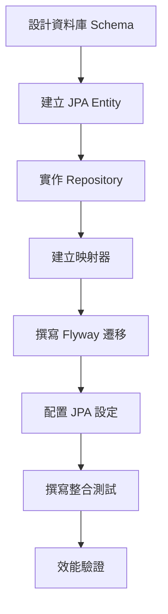

# 06 - 實作資料庫持久層

## 任務核取方塊
- [ ] 建立 JPA Entity 類別
- [ ] 實作 UrlRepository JPA 實作
- [ ] 建立 Domain ↔ Entity 映射器
- [ ] 撰寫 Flyway 資料庫遷移腳本
- [ ] 配置 JPA 與 Hibernate 設定
- [ ] 撰寫持久層整合測試
- [ ] 驗證資料庫約束與索引

## 任務描述

實作 TinyURL 服務的資料庫持久層，包含 JPA Entity、Repository 實作與資料庫遷移腳本。這個層級負責將領域對象持久化到 PostgreSQL 資料庫，並確保資料一致性與查詢效能。

設計考量：
- Domain Model 與 JPA Entity 分離，避免 ORM 污染領域邏輯
- 使用 Flyway 管理資料庫 Schema 版本
- 建立適當索引提升查詢效能
- 實作 Repository 介面，隱藏 JPA 實作細節

## 驗收標準

1. JPA Entity 正確映射到資料庫表格
2. Repository 實作所有領域介面方法
3. Domain ↔ Entity 映射器雙向轉換正確
4. Flyway 遷移腳本可正常執行
5. 資料庫約束與索引正確建立
6. 整合測試使用 Testcontainers 驗證
7. 查詢效能符合預期（無 N+1 問題）

## 執行步驟



### 詳細步驟

1. **設計資料庫 Schema**
   - urls 主表：儲存 URL 映射
   - 主鍵：short_code (VARCHAR)
   - 索引：long_url_hash, created_at, access_count

2. **建立 JPA Entity**
   - UrlEntity 類別
   - JPA 註解配置
   - 審計欄位（created_at, updated_at）

3. **實作 Repository**
   - UrlJpaRepository 介面
   - UrlRepositoryImpl 實作類別
   - 自訂查詢方法

4. **建立映射器**
   - UrlEntityMapper
   - Domain ↔ Entity 雙向轉換
   - MapStruct 或手動實作

5. **撰寫 Flyway 遷移**
   - V1__Create_urls_table.sql
   - 表格結構與約束
   - 索引建立

6. **JPA 配置調整**
   - Hibernate 設定
   - 連線池參數
   - 查詢優化

## 預期輸入

- 領域模型與 Repository 介面
- PostgreSQL Docker 環境
- Spring Boot JPA 依賴已配置

## 預期輸出

### 1. JPA Entity

**infrastructure/persistence/jpa/UrlEntity.java**
```java
@Entity
@Table(name = "urls")
public class UrlEntity {
    @Id
    @Column(name = "short_code", length = 8)
    private String shortCode;

    @Column(name = "long_url", length = 2048, nullable = false)
    private String longUrl;

    @Column(name = "long_url_hash", length = 64, nullable = false)
    private String longUrlHash;

    @Column(name = "created_at", nullable = false)
    private LocalDateTime createdAt;

    @Column(name = "accessed_at")
    private LocalDateTime accessedAt;

    @Column(name = "access_count", nullable = false)
    private Integer accessCount = 0;

    // Constructors, getters, setters
}
```

### 2. Repository 實作

**infrastructure/persistence/jpa/UrlJpaRepository.java**
```java
@Repository
public interface UrlJpaRepository extends JpaRepository<UrlEntity, String> {

    Optional<UrlEntity> findByLongUrlHash(String longUrlHash);

    @Query("SELECT u FROM UrlEntity u WHERE u.createdAt > :since")
    long countByCreatedAtAfter(@Param("since") LocalDateTime since);

    @Query("SELECT u FROM UrlEntity u ORDER BY u.accessCount DESC LIMIT :limit")
    List<UrlEntity> findTopAccessedUrls(@Param("limit") int limit);

    boolean existsByShortCode(String shortCode);
}
```

**infrastructure/persistence/jpa/UrlRepositoryImpl.java**
```java
@Repository
@RequiredArgsConstructor
public class UrlRepositoryImpl implements UrlRepository {

    private final UrlJpaRepository jpaRepository;
    private final UrlEntityMapper mapper;

    @Override
    public Optional<Url> findByShortCode(ShortCode shortCode) {
        return jpaRepository.findById(shortCode.value())
            .map(mapper::toDomain);
    }

    @Override
    public void save(Url url) {
        UrlEntity entity = mapper.toEntity(url);
        jpaRepository.save(entity);
    }

    // 其他方法實作...
}
```

### 3. 映射器

**infrastructure/persistence/mapper/UrlEntityMapper.java**
```java
@Component
public class UrlEntityMapper {

    public Url toDomain(UrlEntity entity) {
        return Url.builder()
            .shortCode(new ShortCode(entity.getShortCode()))
            .longUrl(new LongUrl(entity.getLongUrl()))
            .createdAt(entity.getCreatedAt())
            .accessedAt(entity.getAccessedAt())
            .accessCount(entity.getAccessCount())
            .build();
    }

    public UrlEntity toEntity(Url domain) {
        UrlEntity entity = new UrlEntity();
        entity.setShortCode(domain.getShortCode().value());
        entity.setLongUrl(domain.getLongUrl().value());
        entity.setLongUrlHash(hashUrl(domain.getLongUrl()));
        entity.setCreatedAt(domain.getCreatedAt());
        entity.setAccessedAt(domain.getAccessedAt());
        entity.setAccessCount(domain.getAccessCount());
        return entity;
    }

    private String hashUrl(LongUrl longUrl) {
        // SHA-256 雜湊實作
    }
}
```

### 4. Flyway 遷移腳本

**src/main/resources/db/migration/V1__Create_urls_table.sql**
```sql
CREATE TABLE urls (
    short_code VARCHAR(8) NOT NULL PRIMARY KEY,
    long_url VARCHAR(2048) NOT NULL,
    long_url_hash VARCHAR(64) NOT NULL,
    created_at TIMESTAMP NOT NULL DEFAULT CURRENT_TIMESTAMP,
    accessed_at TIMESTAMP,
    access_count INTEGER NOT NULL DEFAULT 0
);

-- 索引建立
CREATE INDEX idx_urls_long_url_hash ON urls(long_url_hash);
CREATE INDEX idx_urls_created_at ON urls(created_at);
CREATE INDEX idx_urls_access_count ON urls(access_count DESC);

-- 約束建立
ALTER TABLE urls ADD CONSTRAINT chk_short_code_format
    CHECK (short_code ~ '^[a-zA-Z0-9]{6,8}$');

ALTER TABLE urls ADD CONSTRAINT chk_access_count_positive
    CHECK (access_count >= 0);
```

### 5. JPA 配置更新

**application.yml** 新增：
```yaml
spring:
  jpa:
    hibernate:
      ddl-auto: validate
      naming:
        physical-strategy: org.hibernate.boot.model.naming.SnakeCasePhysicalNamingStrategy
    properties:
      hibernate:
        dialect: org.hibernate.dialect.PostgreSQLDialect
        format_sql: true
        jdbc:
          batch_size: 20
        order_inserts: true
        order_updates: true
    show-sql: false

  datasource:
    hikari:
      maximum-pool-size: 20
      minimum-idle: 5
      idle-timeout: 300000
      max-lifetime: 1200000
      connection-timeout: 20000
```

### 6. 整合測試

**infrastructure/persistence/UrlRepositoryIntegrationTest.java**
```java
@SpringBootTest
@Testcontainers
class UrlRepositoryIntegrationTest {

    @Container
    static PostgreSQLContainer<?> postgres = new PostgreSQLContainer<>("postgres:15")
            .withDatabaseName("testdb")
            .withUsername("test")
            .withPassword("test");

    @Autowired
    private UrlRepository urlRepository;

    @Test
    @DisplayName("應該能正確儲存與查詢 URL")
    void shouldSaveAndFindUrl() {
        // Given
        ShortCode shortCode = new ShortCode("abc123");
        LongUrl longUrl = new LongUrl("https://example.com");
        Url url = Url.create(longUrl, shortCode);

        // When
        urlRepository.save(url);
        Optional<Url> found = urlRepository.findByShortCode(shortCode);

        // Then
        assertThat(found).isPresent();
        assertThat(found.get().getLongUrl()).isEqualTo(longUrl);
    }
}
```

### 7. 資料庫 Schema 驗證

| 檢查項目   | 驗證方式                 |
| ---------- | ------------------------ |
| 表格建立   | Flyway 遷移成功          |
| 約束檢查   | 插入無效資料失敗         |
| 索引效能   | EXPLAIN ANALYZE 查詢計劃 |
| 唯一性約束 | 重複 short_code 插入失敗 |
| 資料型別   | 各欄位型別正確           |

### 8. 效能指標

- 單一 URL 查詢：< 1ms
- 批次插入 1000 筆：< 100ms
- 熱門 URL 查詢：< 5ms
- 統計查詢：< 10ms
