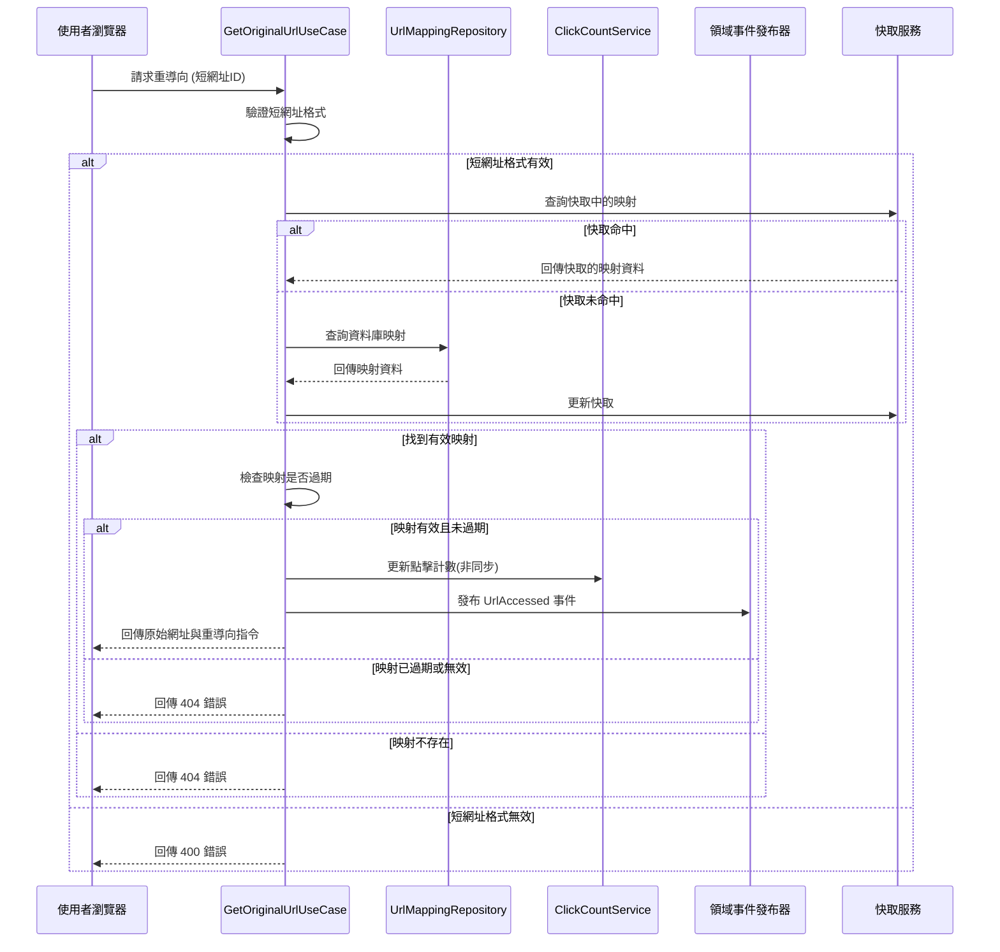

# 重導向服務實作

## 任務狀態
❌ 未完成

## 任務描述

實作 URL 重導向的應用層邏輯，包含 GetOriginalUrlUseCase 的完整實作與單元測試。這個服務負責根據短網址識別碼查找對應的長網址，處理點擊計數、過期檢查、存取記錄等業務邏輯，並提供高效能的查詢機制支援大量的重導向請求。

本任務將實作核心的重導向業務流程，包含短網址有效性驗證、存取統計更新、領域事件發布等功能，確保重導向服務的穩定性與效能表現。

## 需求來源

此任務基於以下需求文件：
- [重導向服務功能](../requirements/02-url-redirection.md) - 實作核心的 URL 重導向業務流程

## 執行步驟

### URL 重導向流程圖



### 具體執行步驟

1. **建立查詢輸入輸出介面**
   - 定義 GetOriginalUrlQuery 查詢物件
   - 建立 RedirectionResponse 回應物件
   - 設計 GetOriginalUrlUseCase 介面契約

2. **實作 Use Case 主要邏輯**
   - 建立 GetOriginalUrlInteractor 實作類別
   - 整合查詢、驗證、統計更新邏輯
   - 實作非同步的點擊計數更新機制

3. **設計快取整合介面**
   - 定義 UrlMappingCachePort 快取介面
   - 建立快取策略與 TTL 設定
   - 實作快取失效與更新機制

4. **撰寫完整的單元測試**
   - 測試各種查詢場景與邊界條件
   - 模擬快取命中與未命中情況
   - 驗證統計更新與事件發布邏輯

## 測試情境

### 正向測試案例
1. **成功重導向 - 快取命中**
   - 提供有效的短網址ID
   - 模擬快取中存在對應映射
   - 驗證直接回傳快取結果
   - 確認統計更新與事件發布

2. **成功重導向 - 資料庫查詢**
   - 提供有效的短網址ID
   - 模擬快取未命中情況
   - 驗證從資料庫查詢映射
   - 確認快取更新邏輯

3. **點擊統計更新**
   - 驗證每次存取都會更新點擊計數
   - 測試非同步更新機制
   - 確認統計資料的準確性

### 反向測試案例
1. **短網址不存在**
   - 提供不存在的短網址ID
   - 驗證回傳適當的 404 錯誤
   - 確認不會更新任何統計資料

2. **短網址已過期**
   - 提供已過期的短網址
   - 驗證過期檢查邏輯
   - 確認回傳過期錯誤訊息

3. **短網址已停用**
   - 提供已停用的短網址
   - 測試啟用狀態檢查
   - 驗證停用處理邏輯

4. **格式錯誤的短網址**
   - 提供格式不正確的短網址ID
   - 測試輸入驗證邏輯
   - 確認回傳格式錯誤訊息

## 預期輸入

- 短網址生成服務已實作完成
- 領域模型與 Repository 介面已定義
- 快取基礎設施已準備就緒

## 預期輸出

### 查詢輸入物件

#### GetOriginalUrlQuery
```java
// src/main/java/com/example/tinyurl/application/port/in/GetOriginalUrlQuery.java
/**
 * 取得原始網址查詢
 * 封裝重導向查詢所需的輸入參數
 */
public record GetOriginalUrlQuery(
    @NotBlank(message = "短網址ID不能為空")
    @Pattern(regexp = "^[a-zA-Z0-9]{6,10}$", message = "短網址ID格式不正確")
    String shortUrlId,

    @Valid
    RequestMetadata requestMetadata
) {

    /**
     * 建立查詢的工廠方法
     */
    public static GetOriginalUrlQuery of(String shortUrlId, String clientIp, String userAgent) {
        return new GetOriginalUrlQuery(
            shortUrlId,
            RequestMetadata.of(clientIp, userAgent)
        );
    }
}
```

#### GetOriginalUrlUseCase 介面
```java
// src/main/java/com/example/tinyurl/application/port/in/GetOriginalUrlUseCase.java
/**
 * 取得原始網址使用案例介面
 * 定義 URL 重導向的主要業務契約
 */
public interface GetOriginalUrlUseCase {

    /**
     * 根據短網址ID取得原始網址
     *
     * @param query 取得原始網址的查詢
     * @return 重導向回應，包含原始網址與元資料
     * @throws ShortUrlNotFoundException 當短網址不存在時
     * @throws ExpiredUrlException 當短網址已過期時
     * @throws InactiveUrlException 當短網址已停用時
     */
    RedirectionResponse getOriginalUrl(GetOriginalUrlQuery query);
}
```

### 輸出資料模型

#### RedirectionResponse
```java
// src/main/java/com/example/tinyurl/application/dto/RedirectionResponse.java
/**
 * 重導向回應資料傳輸物件
 * 包含重導向所需的原始網址與相關資訊
 */
public record RedirectionResponse(
    String originalUrl,
    String shortUrlId,
    LocalDateTime createdAt,
    Optional<LocalDateTime> expiresAt,
    long clickCount,
    RedirectionMetadata metadata
) {

    /**
     * 從領域實體建立重導向回應
     */
    public static RedirectionResponse from(UrlMapping urlMapping) {
        return new RedirectionResponse(
            urlMapping.getOriginalUrl().value(),
            urlMapping.getShortUrlId().value(),
            urlMapping.getCreatedAt(),
            Optional.ofNullable(urlMapping.getExpiresAt()),
            urlMapping.getClickCount().value(),
            RedirectionMetadata.builder()
                .shouldCache(true)
                .cacheTtlSeconds(3600)
                .redirectType(RedirectType.TEMPORARY)
                .build()
        );
    }

    /**
     * 檢查是否應該執行重導向
     */
    public boolean isRedirectable() {
        return expiresAt.map(expiry -> expiry.isAfter(LocalDateTime.now()))
                       .orElse(true);
    }
}
```

### 快取輸出 Port

#### UrlMappingCachePort
```java
// src/main/java/com/example/tinyurl/application/port/out/UrlMappingCachePort.java
/**
 * URL 映射快取 Port
 * 定義快取操作的抽象介面
 */
public interface UrlMappingCachePort {

    /**
     * 從快取中取得 URL 映射
     */
    Optional<UrlMapping> getUrlMapping(ShortUrlId shortUrlId);

    /**
     * 將 URL 映射存入快取
     */
    void cacheUrlMapping(ShortUrlId shortUrlId, UrlMapping urlMapping, Duration ttl);

    /**
     * 移除快取中的 URL 映射
     */
    void evictUrlMapping(ShortUrlId shortUrlId);

    /**
     * 檢查快取中是否存在指定的映射
     */
    boolean existsInCache(ShortUrlId shortUrlId);

    /**
     * 更新快取中的點擊計數
     */
    void updateClickCount(ShortUrlId shortUrlId, ClickCount newClickCount);
}
```

### 統計服務介面

#### ClickCountService
```java
// src/main/java/com/example/tinyurl/application/port/out/ClickCountService.java
/**
 * 點擊計數服務介面
 * 處理非同步的點擊統計更新
 */
public interface ClickCountService {

    /**
     * 非同步更新點擊計數
     */
    @Async
    CompletableFuture<Void> incrementClickCountAsync(ShortUrlId shortUrlId);

    /**
     * 批次更新點擊計數
     */
    @Async
    CompletableFuture<Void> batchUpdateClickCounts(Map<ShortUrlId, Long> clickUpdates);

    /**
     * 取得指定時間範圍的點擊統計
     */
    ClickStatistics getClickStatistics(ShortUrlId shortUrlId, LocalDateTime from, LocalDateTime to);
}
```

### Use Case 實作

#### GetOriginalUrlInteractor
```java
// src/main/java/com/example/tinyurl/application/usecase/GetOriginalUrlInteractor.java
/**
 * 取得原始網址互動器
 * 實作 URL 重導向的完整業務流程
 */
@Service
@Transactional(readOnly = true)
@Slf4j
public class GetOriginalUrlInteractor implements GetOriginalUrlUseCase {

    private final UrlMappingOutputPort urlMappingOutputPort;
    private final UrlMappingCachePort urlMappingCachePort;
    private final ClickCountService clickCountService;
    private final DomainEventPublisher domainEventPublisher;

    @Value("${app.cache.url-mapping.ttl-seconds:3600}")
    private long cacheTtlSeconds;

    public GetOriginalUrlInteractor(
            UrlMappingOutputPort urlMappingOutputPort,
            UrlMappingCachePort urlMappingCachePort,
            ClickCountService clickCountService,
            DomainEventPublisher domainEventPublisher) {
        this.urlMappingOutputPort = urlMappingOutputPort;
        this.urlMappingCachePort = urlMappingCachePort;
        this.clickCountService = clickCountService;
        this.domainEventPublisher = domainEventPublisher;
    }

    @Override
    public RedirectionResponse getOriginalUrl(GetOriginalUrlQuery query) {
        log.info("開始處理重導向請求: {}", query.shortUrlId());

        ShortUrlId shortUrlId = ShortUrlId.of(query.shortUrlId());

        // 1. 嘗試從快取取得 URL 映射
        UrlMapping urlMapping = getUrlMappingWithCache(shortUrlId);

        // 2. 驗證 URL 映射的有效性
        validateUrlMapping(urlMapping);

        // 3. 非同步更新點擊計數
        updateClickCountAsync(shortUrlId);

        // 4. 發布存取事件
        publishUrlAccessedEvent(urlMapping, query.requestMetadata());

        log.info("重導向處理完成: {} -> {}", shortUrlId.value(), urlMapping.getOriginalUrl().value());
        return RedirectionResponse.from(urlMapping);
    }

    private UrlMapping getUrlMappingWithCache(ShortUrlId shortUrlId) {
        // 先嘗試從快取取得
        Optional<UrlMapping> cachedMapping = urlMappingCachePort.getUrlMapping(shortUrlId);
        if (cachedMapping.isPresent()) {
            log.debug("快取命中: {}", shortUrlId.value());
            return cachedMapping.get();
        }

        // 快取未命中，從資料庫查詢
        log.debug("快取未命中，查詢資料庫: {}", shortUrlId.value());
        UrlMapping urlMapping = urlMappingOutputPort.findByShortUrlId(shortUrlId)
            .orElseThrow(() -> new ShortUrlNotFoundException("短網址不存在: " + shortUrlId.value()));

        // 將查詢結果存入快取
        urlMappingCachePort.cacheUrlMapping(
            shortUrlId,
            urlMapping,
            Duration.ofSeconds(cacheTtlSeconds)
        );

        return urlMapping;
    }

    private void validateUrlMapping(UrlMapping urlMapping) {
        if (!urlMapping.isActive()) {
            throw new InactiveUrlException("短網址已停用: " + urlMapping.getShortUrlId().value());
        }

        if (urlMapping.isExpired()) {
            throw new ExpiredUrlException("短網址已過期: " + urlMapping.getShortUrlId().value());
        }
    }

    private void updateClickCountAsync(ShortUrlId shortUrlId) {
        try {
            clickCountService.incrementClickCountAsync(shortUrlId)
                .exceptionally(throwable -> {
                    log.warn("點擊計數更新失敗: {} - {}", shortUrlId.value(), throwable.getMessage());
                    return null;
                });
        } catch (Exception e) {
            log.warn("點擊計數更新發生例外: {} - {}", shortUrlId.value(), e.getMessage());
        }
    }

    private void publishUrlAccessedEvent(UrlMapping urlMapping, RequestMetadata requestMetadata) {
        UrlAccessed event = new UrlAccessed(
            urlMapping.getShortUrlId(),
            IpAddress.from(requestMetadata.clientIp()),
            UserAgent.from(requestMetadata.userAgent()),
            LocalDateTime.now()
        );

        try {
            domainEventPublisher.publish(event);
            log.debug("已發布 UrlAccessed 事件: {}", event);
        } catch (Exception e) {
            log.warn("領域事件發布失敗: {} - {}", event, e.getMessage());
        }
    }
}
```

### 單元測試

#### GetOriginalUrlInteractorTest
```java
// src/test/java/com/example/tinyurl/application/usecase/GetOriginalUrlInteractorTest.java
/**
 * GetOriginalUrlInteractor 單元測試
 * 涵蓋所有重導向場景與邊界條件
 */
@ExtendWith(MockitoExtension.class)
@DisplayName("取得原始網址互動器測試")
class GetOriginalUrlInteractorTest {

    @Mock private UrlMappingOutputPort urlMappingOutputPort;
    @Mock private UrlMappingCachePort urlMappingCachePort;
    @Mock private ClickCountService clickCountService;
    @Mock private DomainEventPublisher domainEventPublisher;

    @InjectMocks private GetOriginalUrlInteractor useCase;

    private static final String SHORT_URL_ID = "abc123";
    private static final String ORIGINAL_URL = "https://www.example.com";

    @BeforeEach
    void setUp() {
        ReflectionTestUtils.setField(useCase, "cacheTtlSeconds", 3600L);
        when(clickCountService.incrementClickCountAsync(any())).thenReturn(CompletableFuture.completedFuture(null));
    }

    @Test
    @DisplayName("成功重導向 - 快取命中")
    void getOriginalUrl_CacheHit_Success() {
        // Given
        GetOriginalUrlQuery query = GetOriginalUrlQuery.of(SHORT_URL_ID, "192.168.1.1", "Mozilla/5.0");
        UrlMapping urlMapping = createActiveUrlMapping();

        when(urlMappingCachePort.getUrlMapping(any())).thenReturn(Optional.of(urlMapping));

        // When
        RedirectionResponse response = useCase.getOriginalUrl(query);

        // Then
        assertThat(response.originalUrl()).isEqualTo(ORIGINAL_URL);
        assertThat(response.shortUrlId()).isEqualTo(SHORT_URL_ID);
        assertThat(response.isRedirectable()).isTrue();

        verify(urlMappingOutputPort, never()).findByShortUrlId(any());
        verify(clickCountService).incrementClickCountAsync(any());
        verify(domainEventPublisher).publish(any(UrlAccessed.class));
    }

    @Test
    @DisplayName("成功重導向 - 快取未命中")
    void getOriginalUrl_CacheMiss_Success() {
        // Given
        GetOriginalUrlQuery query = GetOriginalUrlQuery.of(SHORT_URL_ID, "192.168.1.1", "Mozilla/5.0");
        UrlMapping urlMapping = createActiveUrlMapping();

        when(urlMappingCachePort.getUrlMapping(any())).thenReturn(Optional.empty());
        when(urlMappingOutputPort.findByShortUrlId(any())).thenReturn(Optional.of(urlMapping));

        // When
        RedirectionResponse response = useCase.getOriginalUrl(query);

        // Then
        assertThat(response.originalUrl()).isEqualTo(ORIGINAL_URL);
        verify(urlMappingCachePort).cacheUrlMapping(any(), eq(urlMapping), any(Duration.class));
    }

    @Test
    @DisplayName("短網址不存在 - 拋出例外")
    void getOriginalUrl_NotFound_ThrowsException() {
        // Given
        GetOriginalUrlQuery query = GetOriginalUrlQuery.of(SHORT_URL_ID, "192.168.1.1", "Mozilla/5.0");

        when(urlMappingCachePort.getUrlMapping(any())).thenReturn(Optional.empty());
        when(urlMappingOutputPort.findByShortUrlId(any())).thenReturn(Optional.empty());

        // When & Then
        assertThatThrownBy(() -> useCase.getOriginalUrl(query))
            .isInstanceOf(ShortUrlNotFoundException.class)
            .hasMessageContaining("短網址不存在");

        verify(clickCountService, never()).incrementClickCountAsync(any());
        verify(domainEventPublisher, never()).publish(any());
    }

    @Test
    @DisplayName("短網址已過期 - 拋出例外")
    void getOriginalUrl_Expired_ThrowsException() {
        // Given
        GetOriginalUrlQuery query = GetOriginalUrlQuery.of(SHORT_URL_ID, "192.168.1.1", "Mozilla/5.0");
        UrlMapping expiredMapping = createExpiredUrlMapping();

        when(urlMappingCachePort.getUrlMapping(any())).thenReturn(Optional.of(expiredMapping));

        // When & Then
        assertThatThrownBy(() -> useCase.getOriginalUrl(query))
            .isInstanceOf(ExpiredUrlException.class)
            .hasMessageContaining("短網址已過期");
    }

    @Test
    @DisplayName("短網址已停用 - 拋出例外")
    void getOriginalUrl_Inactive_ThrowsException() {
        // Given
        GetOriginalUrlQuery query = GetOriginalUrlQuery.of(SHORT_URL_ID, "192.168.1.1", "Mozilla/5.0");
        UrlMapping inactiveMapping = createInactiveUrlMapping();

        when(urlMappingCachePort.getUrlMapping(any())).thenReturn(Optional.of(inactiveMapping));

        // When & Then
        assertThatThrownBy(() -> useCase.getOriginalUrl(query))
            .isInstanceOf(InactiveUrlException.class)
            .hasMessageContaining("短網址已停用");
    }

    private UrlMapping createActiveUrlMapping() {
        return UrlMapping.builder()
            .id(UrlMappingId.generate())
            .shortUrlId(ShortUrlId.of(SHORT_URL_ID))
            .originalUrl(OriginalUrl.of(ORIGINAL_URL))
            .createdAt(LocalDateTime.now().minusDays(1))
            .expiresAt(null) // 永不過期
            .clickCount(ClickCount.of(5))
            .active(true)
            .build();
    }

    private UrlMapping createExpiredUrlMapping() {
        return UrlMapping.builder()
            .id(UrlMappingId.generate())
            .shortUrlId(ShortUrlId.of(SHORT_URL_ID))
            .originalUrl(OriginalUrl.of(ORIGINAL_URL))
            .createdAt(LocalDateTime.now().minusDays(2))
            .expiresAt(LocalDateTime.now().minusDays(1)) // 已過期
            .clickCount(ClickCount.zero())
            .active(true)
            .build();
    }

    private UrlMapping createInactiveUrlMapping() {
        return UrlMapping.builder()
            .id(UrlMappingId.generate())
            .shortUrlId(ShortUrlId.of(SHORT_URL_ID))
            .originalUrl(OriginalUrl.of(ORIGINAL_URL))
            .createdAt(LocalDateTime.now().minusDays(1))
            .expiresAt(null)
            .clickCount(ClickCount.zero())
            .active(false) // 已停用
            .build();
    }
}
```

完成這個任務後，重導向服務將具備完整的查詢邏輯、快取整合、統計更新與事件發布功能，並通過全面的測試驗證其正確性與效能表現。