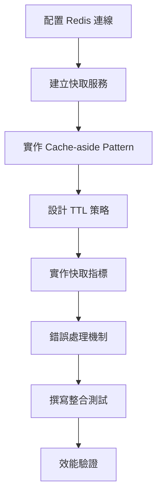

# 07 - 實作 Redis 快取層

## 任務核取方塊
- [ ] 配置 Redis 連線與序列化
- [ ] 實作 URL 快取服務
- [ ] 建立快取鍵值策略
- [ ] 實作 Cache-aside Pattern
- [ ] 設定 TTL 與快取逐出策略
- [ ] 建立快取指標監控
- [ ] 撰寫快取層整合測試

## 任務描述

實作基於 Redis 的快取層，提升 URL 查詢效能並減少資料庫負載。採用 Cache-aside Pattern，支援熱門 URL 的快速存取，並提供靈活的 TTL 管理機制。

快取設計考量：
- 熱門短網址快取命中率 > 80%
- Cache-aside Pattern 確保資料一致性
- 分層 TTL 策略（熱門 URL 長期快取）
- Redis 故障不影響核心功能
- 提供快取統計與監控指標

## 驗收標準

1. Redis 連線配置正確且支援連線池
2. URL 快取服務實作 Cache-aside Pattern
3. 快取鍵值命名規範一致
4. TTL 策略支援動態調整
5. 快取指標可透過 Actuator 端點查詢
6. Redis 故障時應用程式正常運作
7. 整合測試使用 Testcontainers 驗證

## 執行步驟



### 詳細步驟

1. **配置 Redis 連線**
   - Jedis 連線池設定
   - JSON 序列化配置
   - 連線逾時與重試

2. **建立快取服務**
   - UrlCacheService 介面
   - RedisUrlCacheService 實作
   - 快取操作封裝

3. **實作 Cache-aside Pattern**
   - 查詢：先查快取，未命中查資料庫
   - 更新：先更新資料庫，再失效快取
   - 錯誤降級：快取失敗不影響主流程

4. **設計 TTL 策略**
   - 預設 TTL：1 小時
   - 熱門 URL：24 小時
   - 動態 TTL 調整機制

5. **實作快取指標**
   - 命中率統計
   - 快取大小監控
   - 錯誤計數

## 預期輸入

- Redis Docker 環境運行中
- Spring Boot Redis 依賴已配置
- 領域模型與 Repository 已實作

## 預期輸出

### 1. Redis 配置

**infrastructure/config/RedisConfig.java**
```java
@Configuration
@EnableCaching
@RequiredArgsConstructor
public class RedisConfig {

    @Value("${spring.data.redis.host}")
    private String redisHost;

    @Value("${spring.data.redis.port}")
    private int redisPort;

    @Bean
    public JedisConnectionFactory jedisConnectionFactory() {
        RedisStandaloneConfiguration config = new RedisStandaloneConfiguration();
        config.setHostName(redisHost);
        config.setPort(redisPort);

        JedisConnectionFactory factory = new JedisConnectionFactory(config);
        factory.getPoolConfig().setMaxTotal(20);
        factory.getPoolConfig().setMaxIdle(10);
        factory.getPoolConfig().setMinIdle(2);
        return factory;
    }

    @Bean
    public RedisTemplate<String, Object> redisTemplate() {
        RedisTemplate<String, Object> template = new RedisTemplate<>();
        template.setConnectionFactory(jedisConnectionFactory());

        // JSON 序列化配置
        Jackson2JsonRedisSerializer<Object> serializer =
            new Jackson2JsonRedisSerializer<>(Object.class);

        template.setKeySerializer(new StringRedisSerializer());
        template.setValueSerializer(serializer);
        template.setHashKeySerializer(new StringRedisSerializer());
        template.setHashValueSerializer(serializer);

        return template;
    }
}
```

### 2. 快取服務介面

**application/port/out/UrlCachePort.java**
```java
public interface UrlCachePort {
    Optional<Url> findByShortCode(ShortCode shortCode);

    void cache(Url url);

    void cache(Url url, Duration ttl);

    void evict(ShortCode shortCode);

    void evictAll();

    CacheStatistics getStatistics();
}
```

### 3. Redis 快取實作

**infrastructure/cache/redis/RedisUrlCacheService.java**
```java
@Component
@RequiredArgsConstructor
@Slf4j
public class RedisUrlCacheService implements UrlCachePort {

    private static final String CACHE_PREFIX = "tinyurl:short:";
    private static final Duration DEFAULT_TTL = Duration.ofHours(1);
    private static final Duration POPULAR_TTL = Duration.ofHours(24);

    private final RedisTemplate<String, Object> redisTemplate;
    private final ObjectMapper objectMapper;
    private final MeterRegistry meterRegistry;

    // Metrics
    private final Counter cacheHits;
    private final Counter cacheMisses;
    private final Counter cacheErrors;

    public RedisUrlCacheService(RedisTemplate<String, Object> redisTemplate,
                               ObjectMapper objectMapper,
                               MeterRegistry meterRegistry) {
        this.redisTemplate = redisTemplate;
        this.objectMapper = objectMapper;
        this.meterRegistry = meterRegistry;

        this.cacheHits = Counter.builder("tinyurl.cache.hits")
            .description("Cache hit count")
            .register(meterRegistry);
        this.cacheMisses = Counter.builder("tinyurl.cache.misses")
            .description("Cache miss count")
            .register(meterRegistry);
        this.cacheErrors = Counter.builder("tinyurl.cache.errors")
            .description("Cache error count")
            .register(meterRegistry);
    }

    @Override
    public Optional<Url> findByShortCode(ShortCode shortCode) {
        try {
            String key = buildKey(shortCode);
            String cached = (String) redisTemplate.opsForValue().get(key);

            if (cached != null) {
                cacheHits.increment();
                UrlCacheDto dto = objectMapper.readValue(cached, UrlCacheDto.class);
                return Optional.of(dto.toDomain());
            } else {
                cacheMisses.increment();
                return Optional.empty();
            }
        } catch (Exception e) {
            log.warn("Cache lookup failed for shortCode: {}", shortCode.value(), e);
            cacheErrors.increment();
            return Optional.empty();
        }
    }

    @Override
    public void cache(Url url) {
        Duration ttl = determineOptimalTtl(url);
        cache(url, ttl);
    }

    @Override
    public void cache(Url url, Duration ttl) {
        try {
            String key = buildKey(url.getShortCode());
            UrlCacheDto dto = UrlCacheDto.fromDomain(url);
            String value = objectMapper.writeValueAsString(dto);

            redisTemplate.opsForValue().set(key, value, ttl);
            log.debug("Cached URL {} with TTL {}", url.getShortCode().value(), ttl);
        } catch (Exception e) {
            log.warn("Failed to cache URL: {}", url.getShortCode().value(), e);
            cacheErrors.increment();
        }
    }

    @Override
    public void evict(ShortCode shortCode) {
        try {
            String key = buildKey(shortCode);
            redisTemplate.delete(key);
        } catch (Exception e) {
            log.warn("Failed to evict cache for: {}", shortCode.value(), e);
            cacheErrors.increment();
        }
    }

    private String buildKey(ShortCode shortCode) {
        return CACHE_PREFIX + shortCode.value();
    }

    private Duration determineOptimalTtl(Url url) {
        // 基於存取次數決定 TTL
        if (url.getAccessCount() > 100) {
            return POPULAR_TTL;
        }
        return DEFAULT_TTL;
    }
}
```

### 4. 快取 DTO

**infrastructure/cache/redis/UrlCacheDto.java**
```java
@Builder
@AllArgsConstructor
@NoArgsConstructor
@Getter
public class UrlCacheDto {
    private String shortCode;
    private String longUrl;
    private LocalDateTime createdAt;
    private LocalDateTime accessedAt;
    private int accessCount;

    public static UrlCacheDto fromDomain(Url url) {
        return UrlCacheDto.builder()
            .shortCode(url.getShortCode().value())
            .longUrl(url.getLongUrl().value())
            .createdAt(url.getCreatedAt())
            .accessedAt(url.getAccessedAt())
            .accessCount(url.getAccessCount())
            .build();
    }

    public Url toDomain() {
        return Url.builder()
            .shortCode(new ShortCode(shortCode))
            .longUrl(new LongUrl(longUrl))
            .createdAt(createdAt)
            .accessedAt(accessedAt)
            .accessCount(accessCount)
            .build();
    }
}
```

### 5. 快取統計

**infrastructure/cache/redis/CacheStatistics.java**
```java
@Builder
@Getter
public class CacheStatistics {
    private final long hitCount;
    private final long missCount;
    private final long errorCount;
    private final double hitRate;
    private final long size;
    private final long memoryUsage;

    public static CacheStatistics calculate(long hits, long misses, long errors) {
        long total = hits + misses;
        double hitRate = total > 0 ? (double) hits / total : 0.0;

        return CacheStatistics.builder()
            .hitCount(hits)
            .missCount(misses)
            .errorCount(errors)
            .hitRate(hitRate)
            .build();
    }
}
```

### 6. Cache-aside 整合

**application/usecase/GetLongUrlUseCase.java** 更新：
```java
@UseCase
@RequiredArgsConstructor
@Slf4j
public class GetLongUrlUseCase implements GetLongUrlQuery {

    private final UrlRepository urlRepository;
    private final UrlCachePort cachePort;

    @Override
    public Optional<GetLongUrlResponse> execute(GetLongUrlCommand command) {
        ShortCode shortCode = new ShortCode(command.shortCode());

        // 1. 先查快取
        Optional<Url> cached = cachePort.findByShortCode(shortCode);
        if (cached.isPresent()) {
            log.debug("Cache hit for shortCode: {}", shortCode.value());
            return cached.map(this::toResponse);
        }

        // 2. 快取未命中，查資料庫
        Optional<Url> fromDb = urlRepository.findByShortCode(shortCode);
        if (fromDb.isPresent()) {
            // 3. 更新快取
            cachePort.cache(fromDb.get());
            log.debug("Cache miss, loaded from DB: {}", shortCode.value());
            return fromDb.map(this::toResponse);
        }

        return Optional.empty();
    }
}
```

### 7. 整合測試

**infrastructure/cache/RedisUrlCacheServiceIntegrationTest.java**
```java
@SpringBootTest
@Testcontainers
class RedisUrlCacheServiceIntegrationTest {

    @Container
    static GenericContainer<?> redis = new GenericContainer<>("redis:7-alpine")
            .withExposedPorts(6379);

    @Autowired
    private UrlCachePort cacheService;

    @Test
    @DisplayName("應該能正確快取與檢索 URL")
    void shouldCacheAndRetrieveUrl() {
        // Given
        Url url = createTestUrl();

        // When
        cacheService.cache(url);
        Optional<Url> cached = cacheService.findByShortCode(url.getShortCode());

        // Then
        assertThat(cached).isPresent();
        assertThat(cached.get().getLongUrl()).isEqualTo(url.getLongUrl());
    }

    @Test
    @DisplayName("TTL 過期後應該無法找到快取")
    void shouldExpireAfterTtl() throws InterruptedException {
        // Given
        Url url = createTestUrl();
        Duration shortTtl = Duration.ofSeconds(1);

        // When
        cacheService.cache(url, shortTtl);
        Thread.sleep(1100); // 等待過期
        Optional<Url> expired = cacheService.findByShortCode(url.getShortCode());

        // Then
        assertThat(expired).isEmpty();
    }
}
```

### 8. 監控端點

```yaml
management:
  endpoints:
    web:
      exposure:
        include: health,prometheus,info,caches
  endpoint:
    health:
      show-details: always
    caches:
      enabled: true
```

### 9. 效能目標

| 指標               | 目標值  |
| ------------------ | ------- |
| 快取命中率         | > 80%   |
| 快取回應時間       | < 1ms   |
| Redis 連線池使用率 | < 80%   |
| 快取大小           | < 100MB |
| 錯誤率             | < 0.1%  |
