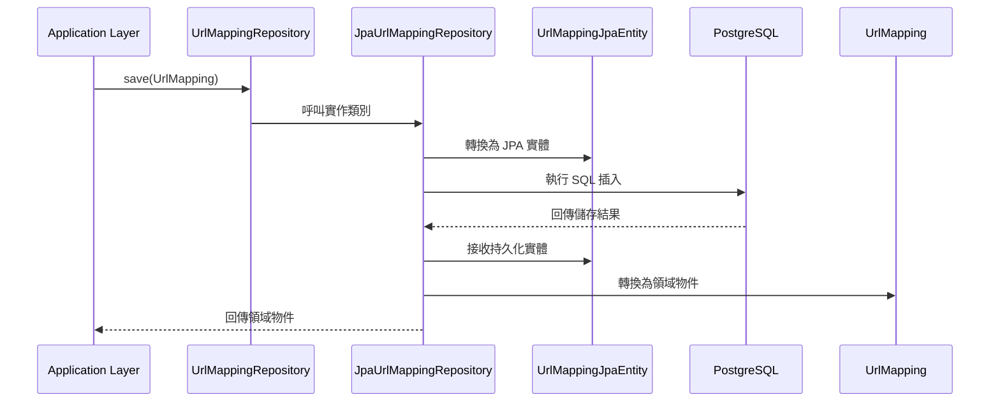

# 資料存取層實作

## 任務狀態
❌ 未完成

## 任務描述

實作基礎設施層的資料存取邏輯，包含 JPA Entity、Repository 實作類別與領域物件的資料映射機制。這個任務將 Clean Architecture 的 infrastructure 層與 domain 層連接，確保資料持久化的正確性與效能最佳化。

本任務專注於建立穩定的資料存取基礎設施，支援高併發的讀寫操作，並提供適當的查詢最佳化與索引策略。

## 執行步驟

### 資料存取架構圖

## 測試情境

### 正向測試案例
1. **儲存 URL 映射成功**
2. **根據短網址ID查詢成功**
3. **根據原始網址查詢成功**

### 反向測試案例
1. **重複短網址處理**
2. **查詢不存在的記錄**
3. **資料庫約束違反處理**

## 預期輸出

### JPA 實體類別
- `UrlMappingJpaEntity` - 對應資料庫表格的 JPA 實體
- `UrlMappingMapper` - 領域物件與 JPA 實體的轉換器

### Repository 實作
- `JpaUrlMappingRepository` - 實作 UrlMappingRepository 介面
- 包含完整的 CRUD 操作與自訂查詢方法

### 測試類別
- `JpaUrlMappingRepositoryTest` - 使用 Testcontainers 的整合測試
- `UrlMappingMapperTest` - 映射邏輯的單元測試