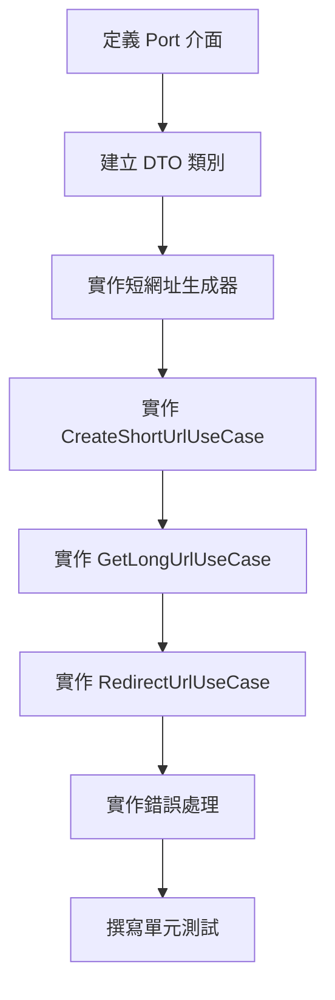

# 08 - 實作核心 Use Cases

## 任務核取方塊
- [ ] 建立 Use Case 介面與 DTO
- [ ] 實作 CreateShortUrlUseCase
- [ ] 實作 GetLongUrlUseCase
- [ ] 實作 RedirectUrlUseCase
- [ ] 建立短網址生成器服務
- [ ] 實作碰撞檢測與重試機制
- [ ] 撰寫 Use Case 單元測試

## 任務描述

實作 TinyURL 服務的核心業務邏輯 Use Cases，包含短網址建立、長網址查詢與重定向功能。這個層級負責編排業務流程，協調領域對象與外部服務，確保業務規則的正確執行。

Use Case 設計原則：
- 單一職責：每個 Use Case 處理一個具體的業務場景
- 無狀態：Use Case 實例不保存狀態，支援並發執行
- 依賴反轉：透過 Port 介面與外部系統互動
- 錯誤處理：明確的異常處理與回復機制

## 驗收標準

1. 所有 Use Case 實作對應的輸入/輸出 Port
2. CreateShortUrlUseCase 支援唯一性檢查與碰撞重試
3. GetLongUrlUseCase 整合快取與資料庫查詢
4. RedirectUrlUseCase 包含存取統計更新
5. 短網址生成器支援 Base62 編碼與長度配置
6. 所有 Use Case 都有完整的單元測試覆蓋
7. 錯誤處理機制健全且一致

## 執行步驟



### 詳細步驟

1. **定義 Port 介面**
   - 輸入 Port：Commands 與 Queries
   - 輸出 Port：Repository、Cache、Generator
   - Request/Response DTO 設計

2. **建立短網址生成器**
   - Base62 編碼實作
   - 長度配置與隨機性
   - 碰撞避免策略

3. **實作 Use Cases**
   - 建立流程：驗證 → 生成 → 檢查唯一性 → 儲存
   - 查詢流程：快取查詢 → 資料庫查詢 → 更新快取
   - 重定向流程：查詢 URL → 更新統計 → 返回重定向

4. **錯誤處理機制**
   - 業務異常映射
   - 重試機制實作
   - 降級處理策略

## 預期輸入

- Clean Architecture 結構已建立
- 領域模型與 Repository 已實作
- 快取層已完成

## 預期輸出

### 1. Port 介面定義

**application/port/in/CreateShortUrlCommand.java**
```java
public record CreateShortUrlCommand(
    @NotBlank String longUrl,
    @Nullable Duration ttl
) {
    public CreateShortUrlCommand {
        if (longUrl != null && longUrl.length() > 2048) {
            throw new IllegalArgumentException("URL too long");
        }
    }
}
```

**application/port/in/CreateShortUrlUseCase.java**
```java
public interface CreateShortUrlUseCase {
    CreateShortUrlResponse execute(CreateShortUrlCommand command);
}
```

**application/port/in/GetLongUrlQuery.java**
```java
public interface GetLongUrlQuery {
    Optional<GetLongUrlResponse> execute(GetLongUrlCommand command);
}
```

**application/port/out/ShortCodeGenerator.java**
```java
public interface ShortCodeGenerator {
    ShortCode generate();

    ShortCode generate(int length);

    List<ShortCode> generateBatch(int count);
}
```

### 2. DTO 類別

**application/dto/CreateShortUrlResponse.java**
```java
@Builder
public record CreateShortUrlResponse(
    String shortCode,
    String longUrl,
    String shortUrl,
    LocalDateTime createdAt,
    Duration ttl
) {
    public static CreateShortUrlResponse from(Url url, String baseUrl) {
        return CreateShortUrlResponse.builder()
            .shortCode(url.getShortCode().value())
            .longUrl(url.getLongUrl().value())
            .shortUrl(baseUrl + "/" + url.getShortCode().value())
            .createdAt(url.getCreatedAt())
            .build();
    }
}
```

**application/dto/GetLongUrlResponse.java**
```java
@Builder
public record GetLongUrlResponse(
    String shortCode,
    String longUrl,
    LocalDateTime createdAt,
    LocalDateTime accessedAt,
    int accessCount
) {
    public static GetLongUrlResponse from(Url url) {
        return GetLongUrlResponse.builder()
            .shortCode(url.getShortCode().value())
            .longUrl(url.getLongUrl().value())
            .createdAt(url.getCreatedAt())
            .accessedAt(url.getAccessedAt())
            .accessCount(url.getAccessCount())
            .build();
    }
}
```

### 3. 短網址生成器

**infrastructure/service/Base62ShortCodeGenerator.java**
```java
@Component
@Slf4j
public class Base62ShortCodeGenerator implements ShortCodeGenerator {

    private static final String BASE62_CHARS =
        "0123456789ABCDEFGHIJKLMNOPQRSTUVWXYZabcdefghijklmnopqrstuvwxyz";
    private static final int DEFAULT_LENGTH = 6;
    private static final SecureRandom RANDOM = new SecureRandom();

    @Override
    public ShortCode generate() {
        return generate(DEFAULT_LENGTH);
    }

    @Override
    public ShortCode generate(int length) {
        if (length < 4 || length > 8) {
            throw new IllegalArgumentException("Length must be between 4 and 8");
        }

        StringBuilder code = new StringBuilder(length);
        for (int i = 0; i < length; i++) {
            int randomIndex = RANDOM.nextInt(BASE62_CHARS.length());
            code.append(BASE62_CHARS.charAt(randomIndex));
        }

        return new ShortCode(code.toString());
    }

    @Override
    public List<ShortCode> generateBatch(int count) {
        return IntStream.range(0, count)
            .mapToObj(i -> generate())
            .collect(Collectors.toList());
    }
}
```

### 4. CreateShortUrlUseCase 實作

**application/usecase/CreateShortUrlUseCaseImpl.java**
```java
@UseCase
@RequiredArgsConstructor
@Slf4j
public class CreateShortUrlUseCaseImpl implements CreateShortUrlUseCase {

    private static final int MAX_RETRY_ATTEMPTS = 5;

    private final UrlRepository urlRepository;
    private final UrlCachePort cachePort;
    private final ShortCodeGenerator shortCodeGenerator;

    @Value("${app.base-url:http://localhost:8080}")
    private String baseUrl;

    @Override
    @Transactional
    public CreateShortUrlResponse execute(CreateShortUrlCommand command) {
        LongUrl longUrl = new LongUrl(command.longUrl());

        // 檢查是否已存在相同的長網址
        Optional<Url> existing = urlRepository.findByLongUrl(longUrl);
        if (existing.isPresent()) {
            log.debug("Found existing URL mapping for: {}", longUrl.value());
            return CreateShortUrlResponse.from(existing.get(), baseUrl);
        }

        // 生成唯一的短網址
        ShortCode shortCode = generateUniqueShortCode();

        // 建立新的 URL 映射
        Url url = Url.create(longUrl, shortCode);
        urlRepository.save(url);

        // 更新快取
        Duration ttl = command.ttl() != null ? command.ttl() : Duration.ofHours(1);
        cachePort.cache(url, ttl);

        log.info("Created short URL: {} -> {}", shortCode.value(), longUrl.value());
        return CreateShortUrlResponse.from(url, baseUrl);
    }

    private ShortCode generateUniqueShortCode() {
        for (int attempt = 0; attempt < MAX_RETRY_ATTEMPTS; attempt++) {
            ShortCode candidate = shortCodeGenerator.generate();

            if (!urlRepository.existsByShortCode(candidate)) {
                return candidate;
            }

            log.debug("Short code collision detected: {}, retrying...", candidate.value());
        }

        throw new ShortCodeGenerationException("Failed to generate unique short code after " + MAX_RETRY_ATTEMPTS + " attempts");
    }
}
```

### 5. GetLongUrlUseCase 實作

**application/usecase/GetLongUrlUseCaseImpl.java**
```java
@UseCase
@RequiredArgsConstructor
@Slf4j
public class GetLongUrlUseCaseImpl implements GetLongUrlQuery {

    private final UrlRepository urlRepository;
    private final UrlCachePort cachePort;

    @Override
    public Optional<GetLongUrlResponse> execute(GetLongUrlCommand command) {
        ShortCode shortCode = new ShortCode(command.shortCode());

        // 1. 先查快取
        Optional<Url> cached = cachePort.findByShortCode(shortCode);
        if (cached.isPresent()) {
            log.debug("Cache hit for shortCode: {}", shortCode.value());
            return cached.map(GetLongUrlResponse::from);
        }

        // 2. 快取未命中，查資料庫
        Optional<Url> fromDb = urlRepository.findByShortCode(shortCode);
        if (fromDb.isPresent()) {
            // 3. 更新快取
            cachePort.cache(fromDb.get());
            log.debug("Cache miss, loaded from DB: {}", shortCode.value());
            return fromDb.map(GetLongUrlResponse::from);
        }

        log.debug("URL not found for shortCode: {}", shortCode.value());
        return Optional.empty();
    }
}
```

### 6. RedirectUrlUseCase 實作

**application/usecase/RedirectUrlUseCaseImpl.java**
```java
@UseCase
@RequiredArgsConstructor
@Slf4j
public class RedirectUrlUseCaseImpl implements RedirectUrlQuery {

    private final GetLongUrlQuery getLongUrlQuery;
    private final UrlRepository urlRepository;
    private final UrlCachePort cachePort;

    @Override
    @Transactional
    public Optional<RedirectUrlResponse> execute(RedirectUrlCommand command) {
        ShortCode shortCode = new ShortCode(command.shortCode());

        // 1. 查詢 URL
        Optional<Url> urlOpt = findUrl(shortCode);
        if (urlOpt.isEmpty()) {
            return Optional.empty();
        }

        // 2. 更新存取統計（異步處理以避免影響重定向效能）
        updateAccessStatistics(urlOpt.get());

        // 3. 返回重定向資訊
        Url url = urlOpt.get();
        RedirectUrlResponse response = RedirectUrlResponse.builder()
            .longUrl(url.getLongUrl().value())
            .redirectType(RedirectType.TEMPORARY) // HTTP 302
            .accessedAt(LocalDateTime.now())
            .build();

        log.info("Redirecting {} to {}", shortCode.value(), url.getLongUrl().value());
        return Optional.of(response);
    }

    private Optional<Url> findUrl(ShortCode shortCode) {
        // 先查快取
        Optional<Url> cached = cachePort.findByShortCode(shortCode);
        if (cached.isPresent()) {
            return cached;
        }

        // 再查資料庫
        Optional<Url> fromDb = urlRepository.findByShortCode(shortCode);
        fromDb.ifPresent(cachePort::cache);
        return fromDb;
    }

    @Async
    private void updateAccessStatistics(Url url) {
        try {
            Url updatedUrl = url.recordAccess();
            urlRepository.save(updatedUrl);

            // 更新快取中的統計資料
            cachePort.cache(updatedUrl);
        } catch (Exception e) {
            log.warn("Failed to update access statistics for: {}", url.getShortCode().value(), e);
        }
    }
}
```

### 7. 單元測試

**application/usecase/CreateShortUrlUseCaseTest.java**
```java
@ExtendWith(MockitoExtension.class)
class CreateShortUrlUseCaseTest {

    @Mock
    private UrlRepository urlRepository;

    @Mock
    private UrlCachePort cachePort;

    @Mock
    private ShortCodeGenerator shortCodeGenerator;

    @InjectMocks
    private CreateShortUrlUseCaseImpl useCase;

    @Test
    @DisplayName("應該成功建立新的短網址")
    void shouldCreateNewShortUrl() {
        // Given
        String longUrlValue = "https://example.com";
        CreateShortUrlCommand command = new CreateShortUrlCommand(longUrlValue, null);
        ShortCode shortCode = new ShortCode("abc123");

        when(urlRepository.findByLongUrl(any())).thenReturn(Optional.empty());
        when(shortCodeGenerator.generate()).thenReturn(shortCode);
        when(urlRepository.existsByShortCode(shortCode)).thenReturn(false);

        // When
        CreateShortUrlResponse response = useCase.execute(command);

        // Then
        assertThat(response.shortCode()).isEqualTo("abc123");
        assertThat(response.longUrl()).isEqualTo(longUrlValue);
        verify(urlRepository).save(any(Url.class));
        verify(cachePort).cache(any(Url.class), any(Duration.class));
    }

    @Test
    @DisplayName("當長網址已存在時應該返回現有的短網址")
    void shouldReturnExistingShortUrlWhenLongUrlExists() {
        // Given
        String longUrlValue = "https://example.com";
        CreateShortUrlCommand command = new CreateShortUrlCommand(longUrlValue, null);

        Url existingUrl = createTestUrl();
        when(urlRepository.findByLongUrl(any())).thenReturn(Optional.of(existingUrl));

        // When
        CreateShortUrlResponse response = useCase.execute(command);

        // Then
        assertThat(response.shortCode()).isEqualTo(existingUrl.getShortCode().value());
        verify(urlRepository, never()).save(any());
    }
}
```

### 8. 異常處理

**domain/exception/ShortCodeGenerationException.java**
```java
public class ShortCodeGenerationException extends DomainException {
    public ShortCodeGenerationException(String message) {
        super(message);
    }
}
```

### 9. Use Case 註解

**application/UseCase.java**
```java
@Target(ElementType.TYPE)
@Retention(RetentionPolicy.RUNTIME)
@Service
@Transactional
public @interface UseCase {
}
```
