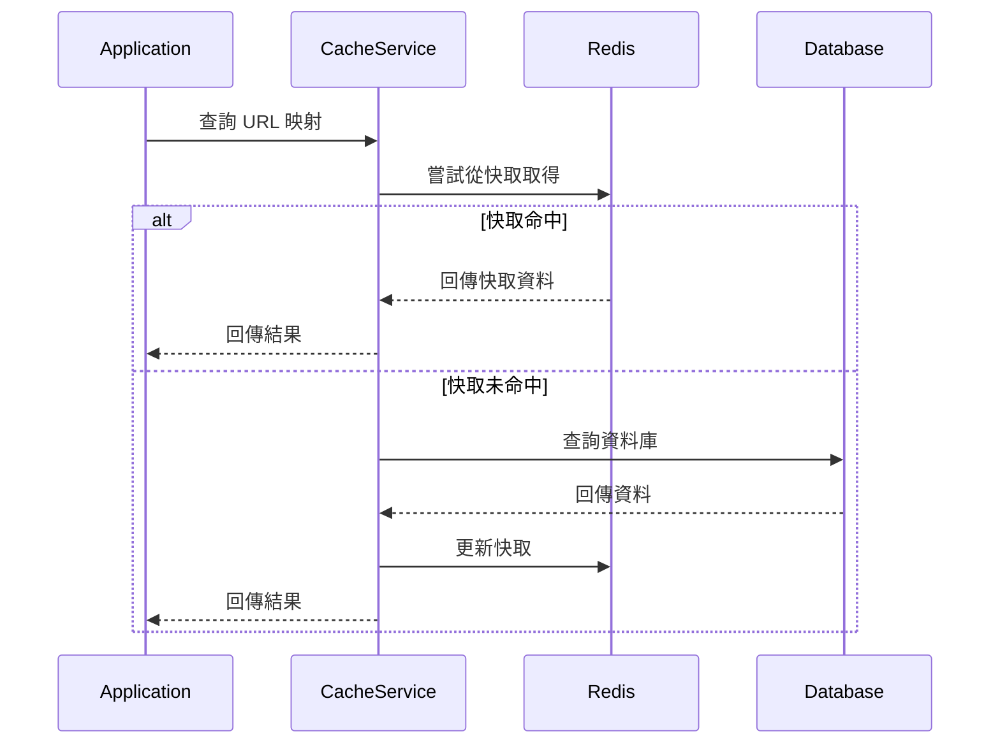

# Redis 快取整合

## 任務狀態
❌ 未完成

## 任務描述

整合 Redis 快取機制到 TinyURL 服務中，實作 UrlMappingCachePort 介面，提升 URL 查詢的效能表現。建立適當的快取策略、TTL 設定與失效機制，確保快取資料的一致性與正確性。

本任務將實作完整的快取解決方案，包含快取預熱、快取更新、快取失效等機制，並提供監控與指標收集功能。

## 執行步驟

### Redis 快取架構圖

## 測試情境

### 正向測試案例
1. **快取命中查詢**
2. **快取未命中更新**
3. **快取過期處理**

### 反向測試案例
1. **Redis 連線失敗降級**
2. **快取序列化錯誤處理**
3. **快取容量限制處理**

## 預期輸出

### 快取實作類別
- `RedisUrlMappingCache` - Redis 快取實作
- `UrlMappingCacheKeyGenerator` - 快取鍵生成器
- `UrlMappingSerializer` - 物件序列化器

### 配置類別
- `RedisCacheConfiguration` - Redis 快取配置
- 快取 TTL 與失效策略設定