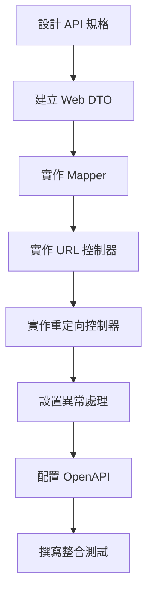

# 09 - 實作 REST API 控制器

## 任務核取方塊
- [ ] 建立 Web DTO 與 Mapper
- [ ] 實作 URL 管理 REST 控制器
- [ ] 實作重定向控制器
- [ ] 配置全域異常處理器
- [ ] 設置 OpenAPI 文件註解
- [ ] 實作輸入驗證與錯誤回應
- [ ] 撰寫控制器整合測試

## 任務描述

實作 TinyURL 服務的 REST API 介面，提供短網址 CRUD 操作與重定向功能。採用 RESTful 設計原則，支援標準 HTTP 狀態碼與內容協商，並提供完整的 OpenAPI 文件。

API 設計原則：
- RESTful URL 設計與 HTTP 動詞正確使用
- 統一的錯誤回應格式
- 輸入驗證與清晰的錯誤訊息
- 支援內容協商（JSON）
- OpenAPI 3.0 完整文件

## 驗收標準

1. URL 管理 API 支援建立與查詢操作
2. 重定向 API 正確處理 HTTP 302 重定向
3. 全域異常處理器提供一致的錯誤回應
4. 輸入驗證涵蓋所有必要欄位與格式檢查
5. OpenAPI 文件完整且可透過 Swagger UI 訪問
6. 所有 API 端點都有對應的整合測試
7. 錯誤回應包含追蹤 ID 與詳細訊息

## 執行步驟



### 詳細步驟

1. **設計 REST API 規格**
   - POST /api/urls - 建立短網址
   - GET /api/urls/{code} - 查詢長網址
   - GET /{code} - 重定向到長網址
   - GET /api/urls/stats/{code} - 查詢統計資料

2. **建立 Web DTO**
   - Request/Response 物件
   - 驗證註解配置
   - JSON 序列化設定

3. **實作控制器**
   - URL 管理控制器
   - 重定向控制器
   - 輸入驗證處理

4. **全域異常處理**
   - 業務異常映射
   - 驗證錯誤處理
   - 統一錯誤回應格式

5. **OpenAPI 文件**
   - Controller 與 Method 註解
   - DTO Schema 描述
   - 錯誤回應文件

## 預期輸入

- Use Cases 已實作完成
- 應用程式配置已設置
- OpenAPI 依賴已配置

## 預期輸出

### 1. Web DTO 設計

**adapters/web/dto/CreateUrlRequest.java**
```java
@Builder
public record CreateUrlRequest(
    @NotBlank(message = "Long URL cannot be blank")
    @Size(max = 2048, message = "URL too long")
    @Pattern(regexp = "^https?://.*", message = "URL must start with http:// or https://")
    String longUrl,

    @Valid
    @PositiveOrZero(message = "TTL seconds must be positive")
    Long ttlSeconds
) {
    public Duration getTtl() {
        return ttlSeconds != null ? Duration.ofSeconds(ttlSeconds) : null;
    }
}
```

**adapters/web/dto/CreateUrlResponse.java**
```java
@Builder
public record CreateUrlResponse(
    String shortCode,
    String longUrl,
    String shortUrl,
    LocalDateTime createdAt,
    Long ttlSeconds
) {
    @JsonProperty("created_at")
    public LocalDateTime createdAt() {
        return createdAt;
    }

    @JsonProperty("short_code")
    public String shortCode() {
        return shortCode;
    }

    @JsonProperty("long_url")
    public String longUrl() {
        return longUrl;
    }

    @JsonProperty("short_url")
    public String shortUrl() {
        return shortUrl;
    }

    @JsonProperty("ttl_seconds")
    public Long ttlSeconds() {
        return ttlSeconds;
    }
}
```

### 2. Web Mapper

**adapters/web/mapper/UrlWebMapper.java**
```java
@Component
public class UrlWebMapper {

    public CreateShortUrlCommand toCommand(CreateUrlRequest request) {
        return new CreateShortUrlCommand(
            request.longUrl(),
            request.getTtl()
        );
    }

    public CreateUrlResponse toResponse(CreateShortUrlResponse useCaseResponse) {
        return CreateUrlResponse.builder()
            .shortCode(useCaseResponse.shortCode())
            .longUrl(useCaseResponse.longUrl())
            .shortUrl(useCaseResponse.shortUrl())
            .createdAt(useCaseResponse.createdAt())
            .ttlSeconds(useCaseResponse.ttl() != null ? useCaseResponse.ttl().getSeconds() : null)
            .build();
    }

    public GetLongUrlCommand toCommand(String shortCode) {
        return new GetLongUrlCommand(shortCode);
    }

    public UrlInfoResponse toResponse(GetLongUrlResponse useCaseResponse) {
        return UrlInfoResponse.builder()
            .shortCode(useCaseResponse.shortCode())
            .longUrl(useCaseResponse.longUrl())
            .createdAt(useCaseResponse.createdAt())
            .accessedAt(useCaseResponse.accessedAt())
            .accessCount(useCaseResponse.accessCount())
            .build();
    }
}
```

### 3. URL 管理控制器

**adapters/web/controller/UrlController.java**
```java
@RestController
@RequestMapping("/api/urls")
@RequiredArgsConstructor
@Validated
@Tag(name = "URL Management", description = "短網址管理 API")
@Slf4j
public class UrlController {

    private final CreateShortUrlUseCase createShortUrlUseCase;
    private final GetLongUrlQuery getLongUrlQuery;
    private final UrlWebMapper mapper;

    @PostMapping
    @Operation(summary = "建立短網址", description = "根據長網址建立對應的短網址")
    @ApiResponses({
        @ApiResponse(responseCode = "201", description = "短網址建立成功"),
        @ApiResponse(responseCode = "400", description = "請求參數錯誤"),
        @ApiResponse(responseCode = "409", description = "短網址已存在")
    })
    public ResponseEntity<CreateUrlResponse> createShortUrl(
        @Valid @RequestBody CreateUrlRequest request,
        HttpServletRequest httpRequest
    ) {
        log.info("Creating short URL for: {}", request.longUrl());

        CreateShortUrlCommand command = mapper.toCommand(request);
        CreateShortUrlResponse useCaseResponse = createShortUrlUseCase.execute(command);
        CreateUrlResponse response = mapper.toResponse(useCaseResponse);

        return ResponseEntity.status(HttpStatus.CREATED)
            .header("Location", response.shortUrl())
            .body(response);
    }

    @GetMapping("/{shortCode}")
    @Operation(summary = "查詢長網址", description = "根據短網址代碼查詢對應的長網址資訊")
    @ApiResponses({
        @ApiResponse(responseCode = "200", description = "查詢成功"),
        @ApiResponse(responseCode = "404", description = "短網址不存在")
    })
    public ResponseEntity<UrlInfoResponse> getUrlInfo(
        @PathVariable
        @Size(min = 4, max = 8, message = "Short code must be 4-8 characters")
        @Pattern(regexp = "^[a-zA-Z0-9]+$", message = "Short code contains invalid characters")
        String shortCode
    ) {
        log.debug("Getting URL info for short code: {}", shortCode);

        GetLongUrlCommand command = mapper.toCommand(shortCode);
        Optional<GetLongUrlResponse> useCaseResponse = getLongUrlQuery.execute(command);

        return useCaseResponse
            .map(mapper::toResponse)
            .map(ResponseEntity::ok)
            .orElse(ResponseEntity.notFound().build());
    }

    @GetMapping("/stats/{shortCode}")
    @Operation(summary = "查詢統計資料", description = "查詢短網址的存取統計資料")
    public ResponseEntity<UrlStatsResponse> getUrlStats(
        @PathVariable String shortCode
    ) {
        // 統計查詢實作
        return ResponseEntity.ok().build();
    }
}
```

### 4. 重定向控制器

**adapters/web/controller/RedirectController.java**
```java
@RestController
@RequiredArgsConstructor
@Tag(name = "URL Redirect", description = "短網址重定向服務")
@Slf4j
public class RedirectController {

    private final RedirectUrlQuery redirectUrlQuery;

    @GetMapping("/{shortCode}")
    @Operation(summary = "重定向到長網址", description = "使用短網址代碼重定向到原始長網址")
    @ApiResponses({
        @ApiResponse(responseCode = "302", description = "重定向成功"),
        @ApiResponse(responseCode = "404", description = "短網址不存在")
    })
    public ResponseEntity<Void> redirect(
        @PathVariable
        @Size(min = 4, max = 8, message = "Short code must be 4-8 characters")
        String shortCode,
        HttpServletRequest request,
        HttpServletResponse response
    ) {
        log.info("Redirect request for: {} from IP: {}",
            shortCode, getClientIpAddress(request));

        RedirectUrlCommand command = new RedirectUrlCommand(shortCode);
        Optional<RedirectUrlResponse> redirectResponse = redirectUrlQuery.execute(command);

        return redirectResponse
            .map(r -> {
                String location = r.longUrl();
                log.info("Redirecting {} to {}", shortCode, location);
                return ResponseEntity.status(HttpStatus.FOUND)
                    .location(URI.create(location))
                    .build();
            })
            .orElseGet(() -> {
                log.warn("Short code not found: {}", shortCode);
                return ResponseEntity.notFound().build();
            });
    }

    private String getClientIpAddress(HttpServletRequest request) {
        String xForwardedFor = request.getHeader("X-Forwarded-For");
        if (xForwardedFor != null && !xForwardedFor.isEmpty()) {
            return xForwardedFor.split(",")[0].trim();
        }
        return request.getRemoteAddr();
    }
}
```

### 5. 全域異常處理

**adapters/web/exception/GlobalExceptionHandler.java**
```java
@RestControllerAdvice
@Slf4j
public class GlobalExceptionHandler {

    @ExceptionHandler(MethodArgumentNotValidException.class)
    @ResponseStatus(HttpStatus.BAD_REQUEST)
    public ErrorResponse handleValidationError(MethodArgumentNotValidException e) {
        String traceId = MDC.get("traceId");

        List<String> errors = e.getBindingResult()
            .getFieldErrors()
            .stream()
            .map(error -> error.getField() + ": " + error.getDefaultMessage())
            .collect(Collectors.toList());

        log.warn("Validation error: {}", errors);

        return ErrorResponse.builder()
            .code("VALIDATION_ERROR")
            .message("請求參數驗證失敗")
            .details(errors)
            .traceId(traceId)
            .timestamp(LocalDateTime.now())
            .build();
    }

    @ExceptionHandler(InvalidUrlException.class)
    @ResponseStatus(HttpStatus.BAD_REQUEST)
    public ErrorResponse handleInvalidUrl(InvalidUrlException e) {
        String traceId = MDC.get("traceId");

        log.warn("Invalid URL: {}", e.getMessage());

        return ErrorResponse.builder()
            .code("INVALID_URL")
            .message("無效的 URL 格式")
            .details(List.of(e.getMessage()))
            .traceId(traceId)
            .timestamp(LocalDateTime.now())
            .build();
    }

    @ExceptionHandler(ShortCodeGenerationException.class)
    @ResponseStatus(HttpStatus.CONFLICT)
    public ErrorResponse handleShortCodeGeneration(ShortCodeGenerationException e) {
        String traceId = MDC.get("traceId");

        log.error("Short code generation failed: {}", e.getMessage());

        return ErrorResponse.builder()
            .code("SHORT_CODE_GENERATION_FAILED")
            .message("短網址生成失敗，請稍後重試")
            .details(List.of(e.getMessage()))
            .traceId(traceId)
            .timestamp(LocalDateTime.now())
            .build();
    }

    @ExceptionHandler(Exception.class)
    @ResponseStatus(HttpStatus.INTERNAL_SERVER_ERROR)
    public ErrorResponse handleGenericError(Exception e) {
        String traceId = MDC.get("traceId");

        log.error("Unexpected error occurred", e);

        return ErrorResponse.builder()
            .code("INTERNAL_SERVER_ERROR")
            .message("伺服器內部錯誤")
            .details(List.of("請聯繫系統管理員"))
            .traceId(traceId)
            .timestamp(LocalDateTime.now())
            .build();
    }
}
```

### 6. 錯誤回應 DTO

**adapters/web/dto/ErrorResponse.java**
```java
@Builder
public record ErrorResponse(
    String code,
    String message,
    List<String> details,
    String traceId,
    LocalDateTime timestamp
) {
    @JsonProperty("trace_id")
    public String traceId() {
        return traceId;
    }
}
```

### 7. OpenAPI 配置

**infrastructure/openapi/OpenApiConfig.java**
```java
@Configuration
@RequiredArgsConstructor
public class OpenApiConfig {

    @Bean
    public OpenAPI customOpenAPI() {
        return new OpenAPI()
            .info(new Info()
                .title("TinyURL API")
                .description("短網址服務 API 文件")
                .version("1.0.0")
                .contact(new Contact()
                    .name("開發團隊")
                    .email("dev@example.com")))
            .servers(List.of(
                new Server()
                    .url("http://localhost:8080")
                    .description("本地開發環境"),
                new Server()
                    .url("https://api.tinyurl.example.com")
                    .description("生產環境")))
            .components(new Components()
                .addSchemas("ErrorResponse", createErrorResponseSchema()));
    }

    private Schema<?> createErrorResponseSchema() {
        return new Schema<>()
            .type("object")
            .addProperty("code", new StringSchema().description("錯誤代碼"))
            .addProperty("message", new StringSchema().description("錯誤訊息"))
            .addProperty("details", new ArraySchema().items(new StringSchema()).description("錯誤詳情"))
            .addProperty("trace_id", new StringSchema().description("追蹤 ID"))
            .addProperty("timestamp", new StringSchema().format("date-time").description("發生時間"));
    }
}
```

### 8. 整合測試

**adapters/web/controller/UrlControllerIntegrationTest.java**
```java
@SpringBootTest(webEnvironment = SpringBootTest.WebEnvironment.RANDOM_PORT)
@Testcontainers
@AutoConfigureTestDatabase(replace = AutoConfigureTestDatabase.Replace.NONE)
class UrlControllerIntegrationTest {

    @Container
    static PostgreSQLContainer<?> postgres = new PostgreSQLContainer<>("postgres:15");

    @Container
    static GenericContainer<?> redis = new GenericContainer<>("redis:7-alpine")
            .withExposedPorts(6379);

    @Autowired
    private TestRestTemplate restTemplate;

    @Test
    @DisplayName("應該能成功建立短網址")
    void shouldCreateShortUrl() {
        // Given
        CreateUrlRequest request = CreateUrlRequest.builder()
            .longUrl("https://example.com")
            .build();

        // When
        ResponseEntity<CreateUrlResponse> response = restTemplate.postForEntity(
            "/api/urls", request, CreateUrlResponse.class);

        // Then
        assertThat(response.getStatusCode()).isEqualTo(HttpStatus.CREATED);
        assertThat(response.getBody()).isNotNull();
        assertThat(response.getBody().longUrl()).isEqualTo("https://example.com");
        assertThat(response.getBody().shortCode()).hasSize(6);
    }

    @Test
    @DisplayName("應該能正確重定向到長網址")
    void shouldRedirectToLongUrl() {
        // Given: 先建立一個短網址
        CreateUrlRequest createRequest = CreateUrlRequest.builder()
            .longUrl("https://example.com")
            .build();

        ResponseEntity<CreateUrlResponse> createResponse = restTemplate.postForEntity(
            "/api/urls", createRequest, CreateUrlResponse.class);

        String shortCode = createResponse.getBody().shortCode();

        // When: 訪問短網址
        ResponseEntity<Void> redirectResponse = restTemplate.getForEntity(
            "/" + shortCode, Void.class);

        // Then: 應該收到重定向回應
        assertThat(redirectResponse.getStatusCode()).isEqualTo(HttpStatus.FOUND);
        assertThat(redirectResponse.getHeaders().getLocation().toString())
            .isEqualTo("https://example.com");
    }
}
```

### 9. API 端點摘要

| HTTP 方法 | 路徑                   | 功能           | 狀態碼        |
| --------- | ---------------------- | -------------- | ------------- |
| POST      | /api/urls              | 建立短網址     | 201, 400, 409 |
| GET       | /api/urls/{code}       | 查詢 URL 資訊  | 200, 404      |
| GET       | /{code}                | 重定向到長網址 | 302, 404      |
| GET       | /api/urls/stats/{code} | 查詢統計資料   | 200, 404      |
| GET       | /swagger-ui.html       | API 文件       | 200           |
