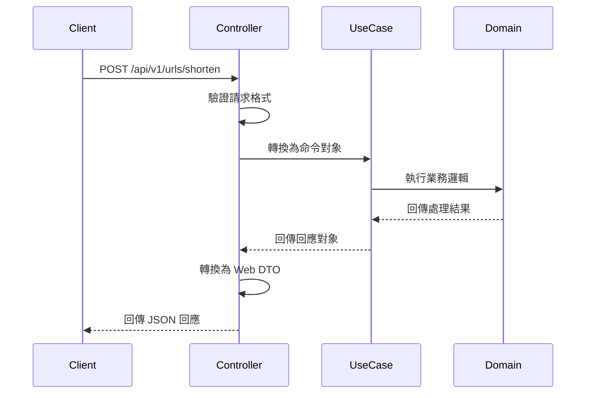

# REST API 控制器

## 任務狀態
❌ 未完成

## 任務描述

實作 TinyURL 服務的 REST API 控制器，包含短網址生成與重導向的 Web 介面。建立完整的 Web DTO、請求驗證、回應格式化與 OpenAPI 文件註解，提供標準化的 RESTful API 服務。

本任務將建立使用者友善的 Web 介面，支援 JSON 格式的 API 互動，並提供完整的 Swagger UI 文件供開發者參考。

## API 文件

### 短網址生成 API

#### Endpoint
- **POST** `/api/v1/urls/shorten`

#### Description
建立新的短網址，將使用者提供的長網址轉換為短網址。

#### Request Parameters
```json
{
  "originalUrl": "https://www.example.com/very/long/url/path",
  "expirationTime": "2024-12-31T23:59:59Z",
  "customAlias": "my-custom-alias"
}
```

#### Request Example
```json
{
  "originalUrl": "https://www.example.com/very/long/url/path"
}
```

#### Response Parameters
```json
{
  "shortUrlId": "abc123",
  "shortUrl": "https://tiny.url/abc123",
  "originalUrl": "https://www.example.com/very/long/url/path",
  "createdAt": "2024-09-15T10:30:00Z",
  "expiresAt": null,
  "isNew": true,
  "clickCount": 0
}
```

#### Response Example
```json
{
  "shortUrlId": "kJ8x9mP2",
  "shortUrl": "https://tiny.url/kJ8x9mP2",
  "originalUrl": "https://www.example.com/very/long/url/path",
  "createdAt": "2024-09-15T10:30:00Z",
  "expiresAt": null,
  "isNew": true,
  "clickCount": 0
}
```

### 重導向 API

#### Endpoint
- **GET** `/{shortUrlId}`

#### Description
根據短網址ID執行重導向到原始網址。

#### Request Parameters
- `shortUrlId` (path): 短網址識別碼

#### Response Parameters
- HTTP 302 重導向到原始網址
- 或 HTTP 404 當短網址不存在時

## 執行步驟

### API 處理流程圖



## 測試情境

### 正向測試案例
1. **成功建立短網址**
2. **成功執行重導向**
3. **OpenAPI 文件正確生成**

### 反向測試案例
1. **無效請求格式處理**
2. **不存在的短網址處理**
3. **請求參數驗證失敗**

## 預期輸出

### 控制器類別
- `UrlShorteningController` - 短網址生成控制器
- `UrlRedirectionController` - 重導向控制器

### Web DTO 類別
- `ShortenUrlRequest` - 短網址生成請求
- `ShortenUrlResponse` - 短網址生成回應

### OpenAPI 配置
- 完整的 Swagger UI 文件
- API 分組與標籤設定