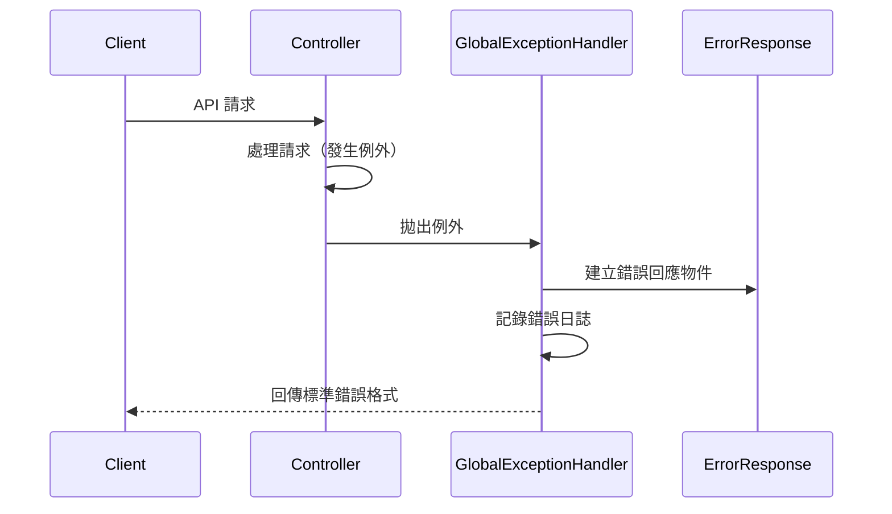

# 全域例外處理

## 任務狀態
❌ 未完成

## 任務描述

建立統一的全域例外處理機制，包含自訂例外類別、錯誤回應格式標準化與適當的 HTTP 狀態碼對應。確保所有 API 錯誤都能提供一致且使用者友善的錯誤訊息格式。

本任務將實作完整的錯誤處理策略，包含業務例外、驗證錯誤、系統錯誤的分類處理，並提供詳細的錯誤碼與訊息供前端應用程式使用。

## 執行步驟

### 例外處理流程圖

## 測試情境

### 正向測試案例
1. **業務例外正確處理**
2. **驗證錯誤格式化**
3. **系統錯誤安全處理**

### 反向測試案例
1. **未預期例外處理**
2. **錯誤訊息本地化**
3. **敏感資訊過濾**

## 預期輸出

### 例外處理類別
- `GlobalExceptionHandler` - 全域例外處理器
- `ErrorResponse` - 標準錯誤回應格式
- 自訂例外類別與錯誤碼定義

### 錯誤處理策略
- HTTP 狀態碼對應規則
- 錯誤訊息國際化支援
- 敏感資訊保護機制