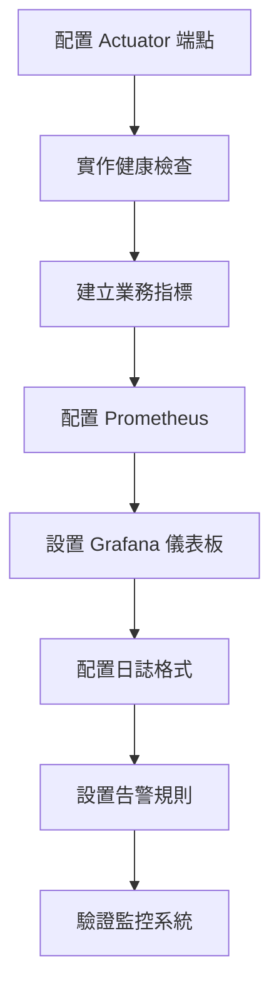

# 10 - 設置監控與觀測性

## 任務核取方塊
- [ ] 配置 Spring Boot Actuator 端點
- [ ] 實作自訂健康檢查指標
- [ ] 建立業務指標收集
- [ ] 配置 Micrometer 與 Prometheus
- [ ] 設置 Grafana 儀表板
- [ ] 實作分散式追蹤（選用）
- [ ] 驗證監控系統運作

## 任務描述

建立完整的觀測性基礎設施，包含健康檢查、業務指標監控與視覺化儀表板。透過 Spring Boot Actuator、Micrometer 與 Prometheus 收集系統與業務指標，並使用 Grafana 提供即時監控儀表板。

觀測性三支柱：
- **Metrics**: 量化系統效能與業務指標
- **Logs**: 結構化日誌記錄與錯誤追蹤
- **Traces**: 分散式追蹤與效能分析（選用）

## 驗收標準

1. Spring Boot Actuator 健康檢查端點正常運作
2. 自訂健康檢查涵蓋資料庫與 Redis 連線
3. 業務指標正確收集並暴露給 Prometheus
4. Grafana 儀表板顯示系統與業務指標
5. 日誌格式支援結構化查詢
6. 監控告警規則配置完成
7. 所有監控組件在 Docker Compose 中正常運行

## 執行步驟



### 詳細步驟

1. **配置 Spring Boot Actuator**
   - 啟用必要的端點
   - 設置安全性與存取控制
   - 配置 management port（選用）

2. **實作自訂健康檢查**
   - 資料庫連線檢查
   - Redis 連線檢查
   - 外部服務依賴檢查

3. **建立業務指標**
   - URL 建立計數器
   - 重定向計數器
   - 快取命中率
   - 回應時間分布

4. **設置 Prometheus 配置**
   - 抓取目標配置
   - 指標保留策略
   - 告警規則設定

5. **建立 Grafana 儀表板**
   - 系統指標儀表板
   - 業務指標儀表板
   - 告警設定

## 預期輸入

- Docker Compose 環境運行中
- Spring Boot 應用程式已完成
- Prometheus 與 Grafana 服務已配置

## 預期輸出

### 1. Actuator 配置更新

**application.yml** 監控配置：
```yaml
management:
  endpoints:
    web:
      exposure:
        include: health,info,prometheus,metrics,loggers
      base-path: /actuator
  endpoint:
    health:
      show-details: always
      show-components: always
    info:
      enabled: true
    prometheus:
      enabled: true
  metrics:
    export:
      prometheus:
        enabled: true
    distribution:
      percentiles-histogram:
        http.server.requests: true
      percentiles:
        http.server.requests: 0.5, 0.95, 0.99
  health:
    redis:
      enabled: true
    db:
      enabled: true
    diskspace:
      enabled: true

# 選用：分離 management port
#  server:
#    port: 8081

info:
  app:
    name: '@project.name@'
    version: '@project.version@'
    description: TinyURL 短網址服務
  build:
    time: '@maven.build.timestamp@'
  java:
    version: '@java.version@'
```

### 2. 自訂健康檢查

**infrastructure/observability/RedisHealthIndicator.java**
```java
@Component
@RequiredArgsConstructor
public class RedisHealthIndicator implements HealthIndicator {

    private final RedisTemplate<String, Object> redisTemplate;

    @Override
    public Health health() {
        try {
            // 測試 Redis 連線
            String testKey = "health:check:" + System.currentTimeMillis();
            redisTemplate.opsForValue().set(testKey, "OK", Duration.ofSeconds(5));
            String result = (String) redisTemplate.opsForValue().get(testKey);
            redisTemplate.delete(testKey);

            if ("OK".equals(result)) {
                return Health.up()
                    .withDetail("redis", "Available")
                    .withDetail("test", "Connection test successful")
                    .build();
            } else {
                return Health.down()
                    .withDetail("redis", "Failed")
                    .withDetail("test", "Connection test failed")
                    .build();
            }
        } catch (Exception e) {
            return Health.down()
                .withDetail("redis", "Unavailable")
                .withDetail("error", e.getMessage())
                .build();
        }
    }
}
```

**infrastructure/observability/DatabaseHealthIndicator.java**
```java
@Component
@RequiredArgsConstructor
public class DatabaseHealthIndicator implements HealthIndicator {

    private final DataSource dataSource;

    @Override
    public Health health() {
        try (Connection connection = dataSource.getConnection()) {
            // 執行簡單查詢測試
            try (PreparedStatement statement = connection.prepareStatement("SELECT 1")) {
                ResultSet resultSet = statement.executeQuery();
                if (resultSet.next() && resultSet.getInt(1) == 1) {
                    return Health.up()
                        .withDetail("database", "Available")
                        .withDetail("connection", "Active")
                        .build();
                }
            }

            return Health.down()
                .withDetail("database", "Query failed")
                .build();

        } catch (Exception e) {
            return Health.down()
                .withDetail("database", "Unavailable")
                .withDetail("error", e.getMessage())
                .build();
        }
    }
}
```

### 3. 業務指標配置

**infrastructure/observability/UrlMetrics.java**
```java
@Component
@RequiredArgsConstructor
public class UrlMetrics {

    private final MeterRegistry meterRegistry;

    // 計數器
    private final Counter urlCreatedCounter;
    private final Counter urlAccessedCounter;
    private final Counter cacheHitCounter;
    private final Counter cacheMissCounter;

    // 計時器
    private final Timer urlCreationTimer;
    private final Timer urlLookupTimer;

    // 計量器
    private final Gauge activeUrlsGauge;

    public UrlMetrics(MeterRegistry meterRegistry, UrlRepository urlRepository) {
        this.meterRegistry = meterRegistry;

        // 建立計數器
        this.urlCreatedCounter = Counter.builder("tinyurl.urls.created.total")
            .description("總建立的短網址數量")
            .register(meterRegistry);

        this.urlAccessedCounter = Counter.builder("tinyurl.urls.accessed.total")
            .description("總存取的短網址數量")
            .register(meterRegistry);

        this.cacheHitCounter = Counter.builder("tinyurl.cache.hits.total")
            .description("快取命中次數")
            .register(meterRegistry);

        this.cacheMissCounter = Counter.builder("tinyurl.cache.misses.total")
            .description("快取未命中次數")
            .register(meterRegistry);

        // 建立計時器
        this.urlCreationTimer = Timer.builder("tinyurl.url.creation.duration")
            .description("建立短網址的處理時間")
            .register(meterRegistry);

        this.urlLookupTimer = Timer.builder("tinyurl.url.lookup.duration")
            .description("查詢短網址的處理時間")
            .register(meterRegistry);

        // 建立計量器
        this.activeUrlsGauge = Gauge.builder("tinyurl.urls.active.count")
            .description("目前有效的短網址數量")
            .register(meterRegistry, urlRepository, this::countActiveUrls);
    }

    public void incrementUrlCreated() {
        urlCreatedCounter.increment();
    }

    public void incrementUrlAccessed() {
        urlAccessedCounter.increment();
    }

    public void incrementCacheHit() {
        cacheHitCounter.increment();
    }

    public void incrementCacheMiss() {
        cacheMissCounter.increment();
    }

    public Timer.Sample startUrlCreationTimer() {
        return Timer.start(meterRegistry);
    }

    public Timer.Sample startUrlLookupTimer() {
        return Timer.start(meterRegistry);
    }

    public void recordUrlCreationTime(Timer.Sample sample) {
        sample.stop(urlCreationTimer);
    }

    public void recordUrlLookupTime(Timer.Sample sample) {
        sample.stop(urlLookupTimer);
    }

    private Number countActiveUrls(UrlRepository repository) {
        try {
            return repository.countByCreatedAtAfter(LocalDateTime.now().minusDays(30));
        } catch (Exception e) {
            return 0;
        }
    }
}
```

### 4. Use Case 指標整合

**application/usecase/CreateShortUrlUseCaseImpl.java** 更新：
```java
@UseCase
@RequiredArgsConstructor
@Slf4j
public class CreateShortUrlUseCaseImpl implements CreateShortUrlUseCase {

    private final UrlRepository urlRepository;
    private final UrlCachePort cachePort;
    private final ShortCodeGenerator shortCodeGenerator;
    private final UrlMetrics urlMetrics;

    @Override
    @Transactional
    public CreateShortUrlResponse execute(CreateShortUrlCommand command) {
        Timer.Sample sample = urlMetrics.startUrlCreationTimer();

        try {
            // ... 原有邏輯

            // 記錄成功指標
            urlMetrics.incrementUrlCreated();
            urlMetrics.recordUrlCreationTime(sample);

            return response;
        } catch (Exception e) {
            // 記錄失敗指標
            meterRegistry.counter("tinyurl.url.creation.errors.total",
                "error", e.getClass().getSimpleName()).increment();
            throw e;
        }
    }
}
```

### 5. Prometheus 配置

**docker/config/prometheus/prometheus.yml**
```yaml
global:
  scrape_interval: 15s
  evaluation_interval: 15s

rule_files:
  - "tinyurl_rules.yml"

scrape_configs:
  - job_name: 'tinyurl-api'
    static_configs:
      - targets: ['tinyurl-api:8080']
    metrics_path: '/actuator/prometheus'
    scrape_interval: 5s
    scrape_timeout: 3s

alerting:
  alertmanagers:
    - static_configs:
        - targets:
          # - alertmanager:9093
```

### 6. 告警規則

**docker/config/prometheus/tinyurl_rules.yml**
```yaml
groups:
  - name: tinyurl.rules
    rules:
      # 高錯誤率告警
      - alert: HighErrorRate
        expr: rate(http_server_requests_total{status=~"5.."}[5m]) > 0.1
        for: 2m
        labels:
          severity: warning
        annotations:
          summary: "TinyURL API 高錯誤率"
          description: "5xx 錯誤率在過去 5 分鐘內超過 10%"

      # 回應時間過長告警
      - alert: HighResponseTime
        expr: histogram_quantile(0.95, rate(http_server_requests_duration_seconds_bucket[5m])) > 1
        for: 5m
        labels:
          severity: warning
        annotations:
          summary: "TinyURL API 回應時間過長"
          description: "95% 的請求回應時間超過 1 秒"

      # 快取命中率過低告警
      - alert: LowCacheHitRate
        expr: (rate(tinyurl_cache_hits_total[5m]) / (rate(tinyurl_cache_hits_total[5m]) + rate(tinyurl_cache_misses_total[5m]))) < 0.7
        for: 10m
        labels:
          severity: warning
        annotations:
          summary: "快取命中率過低"
          description: "快取命中率低於 70%"

      # 服務不可用告警
      - alert: ServiceDown
        expr: up{job="tinyurl-api"} == 0
        for: 1m
        labels:
          severity: critical
        annotations:
          summary: "TinyURL API 服務不可用"
          description: "TinyURL API 服務已停止運行"
```

### 7. Grafana 儀表板

**docker/config/grafana/dashboards/tinyurl-dashboard.json**
```json
{
  "dashboard": {
    "id": null,
    "title": "TinyURL API 監控儀表板",
    "tags": ["tinyurl", "api"],
    "timezone": "browser",
    "panels": [
      {
        "title": "請求速率",
        "type": "stat",
        "targets": [
          {
            "expr": "rate(http_server_requests_total[5m])",
            "legendFormat": "{{method}} {{uri}}"
          }
        ]
      },
      {
        "title": "回應時間分布",
        "type": "heatmap",
        "targets": [
          {
            "expr": "rate(http_server_requests_duration_seconds_bucket[5m])",
            "legendFormat": "{{le}}"
          }
        ]
      },
      {
        "title": "短網址建立數量",
        "type": "graph",
        "targets": [
          {
            "expr": "rate(tinyurl_urls_created_total[5m])",
            "legendFormat": "建立速率"
          }
        ]
      },
      {
        "title": "快取命中率",
        "type": "gauge",
        "targets": [
          {
            "expr": "rate(tinyurl_cache_hits_total[5m]) / (rate(tinyurl_cache_hits_total[5m]) + rate(tinyurl_cache_misses_total[5m]))",
            "legendFormat": "命中率"
          }
        ]
      }
    ]
  }
}
```

### 8. Docker Compose 更新

**docker-compose.yml** 監控服務配置：
```yaml
version: '3.8'
services:
  # ... 其他服務

  prometheus:
    image: prom/prometheus:v2.45.0
    container_name: tinyurl-prometheus
    ports:
      - "9090:9090"
    volumes:
      - ./docker/config/prometheus:/etc/prometheus
      - prometheus_data:/prometheus
    command:
      - '--config.file=/etc/prometheus/prometheus.yml'
      - '--storage.tsdb.path=/prometheus'
      - '--web.console.libraries=/etc/prometheus/console_libraries'
      - '--web.console.templates=/etc/prometheus/consoles'
      - '--storage.tsdb.retention.time=200h'
      - '--web.enable-lifecycle'
    networks:
      - tinyurl-network

  grafana:
    image: grafana/grafana:10.0.0
    container_name: tinyurl-grafana
    ports:
      - "3000:3000"
    environment:
      - GF_SECURITY_ADMIN_USER=${GRAFANA_ADMIN_USER:-admin}
      - GF_SECURITY_ADMIN_PASSWORD=${GRAFANA_ADMIN_PASSWORD:-admin123}
    volumes:
      - grafana_data:/var/lib/grafana
      - ./docker/config/grafana/provisioning:/etc/grafana/provisioning
      - ./docker/config/grafana/dashboards:/var/lib/grafana/dashboards
    networks:
      - tinyurl-network

volumes:
  prometheus_data:
  grafana_data:
```

### 9. 監控驗證清單

| 項目            | 檢查方式                 | 預期結果      |
| --------------- | ------------------------ | ------------- |
| 健康檢查        | GET /actuator/health     | Status: UP    |
| Prometheus 指標 | GET /actuator/prometheus | 指標正常輸出  |
| Grafana 儀表板  | http://localhost:3000    | 圖表顯示正常  |
| 告警規則        | Prometheus UI            | 規則載入成功  |
| 日誌格式        | 應用程式日誌             | JSON 格式輸出 |

### 10. 監控 URL 列表

- **應用程式健康檢查**: http://localhost:8080/actuator/health
- **Prometheus 指標**: http://localhost:8080/actuator/prometheus
- **Prometheus UI**: http://localhost:9090
- **Grafana 儀表板**: http://localhost:3000 (admin/admin123)
- **應用程式資訊**: http://localhost:8080/actuator/info
