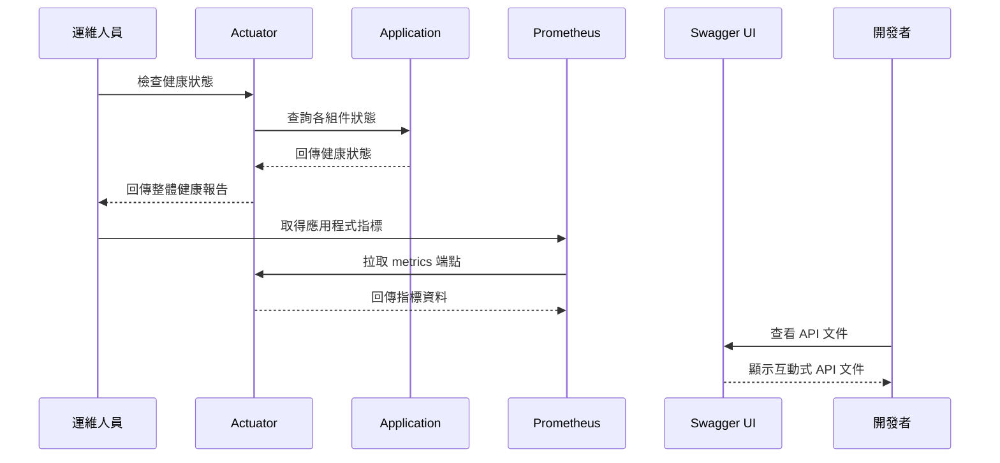

# 監控與文件整合

## 任務狀態
❌ 未完成

## 任務描述

配置 Spring Boot Actuator 監控端點、SpringDoc OpenAPI 文件生成，並完善專案的 README 文件。建立完整的應用程式觀測性與文件化體系，支援生產環境的監控與維運需求。

本任務將整合健康檢查、指標收集、API 文件生成等功能，並提供清晰的專案說明文件供開發團隊與使用者參考。

## 執行步驟

### 監控整合架構圖

## 測試情境

### 正向測試案例
1. **健康檢查端點正常運作**
2. **Prometheus 指標正確產生**
3. **Swagger UI 正常顯示**

### 反向測試案例
1. **資料庫連線失敗時的健康檢查**
2. **Redis 連線失敗時的健康檢查**
3. **API 文件生成錯誤處理**

## 預期輸出

### 監控配置
- 自訂健康指標實作
- Prometheus 指標配置
- Actuator 端點安全設定

### 文件內容
- 完整的 README.md
- 系統架構圖
- 部署與運維指南