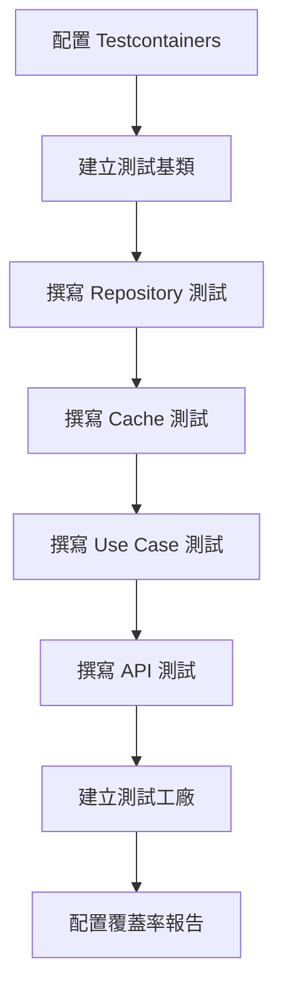

# 11 - 撰寫整合測試

## 任務核取方塊
- [ ] 設置 Testcontainers 測試環境
- [ ] 撰寫 Repository 層整合測試
- [ ] 撰寫 Cache 層整合測試
- [ ] 撰寫 Use Case 整合測試
- [ ] 撰寫 REST API 整合測試
- [ ] 建立測試資料工廠
- [ ] 配置測試覆蓋率報告

## 任務描述

建立完整的整合測試套件，使用 Testcontainers 提供真實的 PostgreSQL 與 Redis 環境，確保各層之間的整合正確性。測試策略涵蓋從資料庫到 API 的完整鏈路，驗證業務流程與錯誤處理機制。

測試策略：
- **單元測試**: 測試單一元件的邏輯（已在各任務中完成）
- **整合測試**: 測試多個元件間的協作
- **端到端測試**: 測試完整的業務流程
- **效能測試**: 驗證系統效能指標

## 驗收標準

1. Testcontainers 環境可正確啟動 PostgreSQL 與 Redis
2. Repository 層測試覆蓋 CRUD 與查詢操作
3. Cache 層測試驗證快取策略與 TTL 機制
4. Use Case 測試覆蓋正常與異常流程
5. REST API 測試包含完整的 HTTP 互動
6. 測試資料工廠提供一致的測試資料
7. 測試覆蓋率報告生成且覆蓋率 > 80%

## 執行步驟



### 詳細步驟

1. **配置 Testcontainers 環境**
   - PostgreSQL 測試容器
   - Redis 測試容器
   - 測試設定檔配置

2. **建立測試基類**
   - 共用測試配置
   - 測試資料清理
   - 測試工具方法

3. **各層整合測試**
   - Repository 層：資料持久化測試
   - Cache 層：快取行為測試
   - Use Case 層：業務邏輯測試
   - API 層：HTTP 介面測試

4. **測試資料管理**
   - 測試資料工廠
   - 測試資料清理策略
   - 測試間隔離保證

## 預期輸入

- 所有應用程式層級已實作完成
- Testcontainers 依賴已配置
- 測試配置檔已準備

## 預期輸出

### 1. Testcontainers 配置

**src/test/resources/application-test.yml**
```yaml
spring:
  datasource:
    # 由 Testcontainers 動態配置
    url: # 動態設定
    username: test
    password: test

  data:
    redis:
      # 由 Testcontainers 動態配置
      host: # 動態設定
      port: # 動態設定

  jpa:
    hibernate:
      ddl-auto: create-drop
    show-sql: true

  flyway:
    enabled: false # 測試環境使用 JPA DDL

logging:
  level:
    com.example.tinyurl: DEBUG
    org.springframework.web: DEBUG
    org.testcontainers: INFO

management:
  endpoints:
    web:
      exposure:
        include: health,metrics
```

### 2. 測試基類

**src/test/java/com/example/tinyurl/AbstractIntegrationTest.java**
```java
@SpringBootTest(webEnvironment = SpringBootTest.WebEnvironment.RANDOM_PORT)
@ActiveProfiles("test")
@Testcontainers
@Transactional
@Rollback
public abstract class AbstractIntegrationTest {

    @Container
    @ServiceConnection
    static PostgreSQLContainer<?> postgres = new PostgreSQLContainer<>("postgres:15")
            .withDatabaseName("testdb")
            .withUsername("test")
            .withPassword("test")
            .withReuse(true);

    @Container
    @ServiceConnection
    static GenericContainer<?> redis = new GenericContainer<>("redis:7-alpine")
            .withExposedPorts(6379)
            .withReuse(true);

    @Autowired
    protected TestRestTemplate restTemplate;

    @Autowired
    protected UrlRepository urlRepository;

    @Autowired
    protected UrlCachePort cachePort;

    @Autowired
    protected TestEntityManager entityManager;

    @BeforeEach
    void setUp() {
        // 清理測試資料
        urlRepository.deleteAll();
        cachePort.evictAll();
        entityManager.flush();
        entityManager.clear();
    }

    protected String getBaseUrl() {
        return "http://localhost:" + restTemplate.getRootUri().getPort();
    }
}
```

### 3. Repository 整合測試

**src/test/java/com/example/tinyurl/infrastructure/persistence/UrlRepositoryIntegrationTest.java**
```java
@DataJpaTest
@Testcontainers
@Import(UrlRepositoryImpl.class)
class UrlRepositoryIntegrationTest {

    @Container
    @ServiceConnection
    static PostgreSQLContainer<?> postgres = new PostgreSQLContainer<>("postgres:15");

    @Autowired
    private UrlRepository urlRepository;

    @Autowired
    private TestEntityManager entityManager;

    @Test
    @DisplayName("應該能儲存並查詢 URL")
    void shouldSaveAndFindUrl() {
        // Given
        Url url = UrlTestFactory.createUrl("https://example.com", "abc123");

        // When
        urlRepository.save(url);
        entityManager.flush();
        entityManager.clear();

        Optional<Url> found = urlRepository.findByShortCode(url.getShortCode());

        // Then
        assertThat(found).isPresent();
        assertThat(found.get().getLongUrl()).isEqualTo(url.getLongUrl());
        assertThat(found.get().getShortCode()).isEqualTo(url.getShortCode());
    }

    @Test
    @DisplayName("應該能透過長網址查詢 URL")
    void shouldFindByLongUrl() {
        // Given
        LongUrl longUrl = new LongUrl("https://example.com");
        Url url = UrlTestFactory.createUrl(longUrl.value(), "abc123");
        urlRepository.save(url);
        entityManager.flush();

        // When
        Optional<Url> found = urlRepository.findByLongUrl(longUrl);

        // Then
        assertThat(found).isPresent();
        assertThat(found.get().getLongUrl()).isEqualTo(longUrl);
    }

    @Test
    @DisplayName("應該能檢查短網址唯一性")
    void shouldCheckShortCodeUniqueness() {
        // Given
        ShortCode shortCode = new ShortCode("abc123");
        Url url = UrlTestFactory.createUrl("https://example.com", shortCode.value());
        urlRepository.save(url);
        entityManager.flush();

        // When
        boolean exists = urlRepository.existsByShortCode(shortCode);

        // Then
        assertThat(exists).isTrue();
    }

    @Test
    @DisplayName("應該能統計指定時間後建立的 URL 數量")
    void shouldCountUrlsCreatedAfter() {
        // Given
        LocalDateTime cutoff = LocalDateTime.now().minusHours(1);

        // 建立舊 URL（測試時需要模擬舊時間）
        Url oldUrl = UrlTestFactory.createUrlWithTime("https://old.com", "old123", cutoff.minusHours(1));
        urlRepository.save(oldUrl);

        // 建立新 URL
        Url newUrl = UrlTestFactory.createUrl("https://new.com", "new123");
        urlRepository.save(newUrl);

        entityManager.flush();

        // When
        long count = urlRepository.countByCreatedAtAfter(cutoff);

        // Then
        assertThat(count).isEqualTo(1);
    }

    @Test
    @DisplayName("應該能查詢最多存取的 URL")
    void shouldFindTopAccessedUrls() {
        // Given
        Url url1 = UrlTestFactory.createUrlWithAccessCount("https://example1.com", "url001", 100);
        Url url2 = UrlTestFactory.createUrlWithAccessCount("https://example2.com", "url002", 50);
        Url url3 = UrlTestFactory.createUrlWithAccessCount("https://example3.com", "url003", 200);

        urlRepository.save(url1);
        urlRepository.save(url2);
        urlRepository.save(url3);
        entityManager.flush();

        // When
        List<Url> topUrls = urlRepository.findTopAccessedUrls(2);

        // Then
        assertThat(topUrls).hasSize(2);
        assertThat(topUrls.get(0).getAccessCount()).isEqualTo(200);
        assertThat(topUrls.get(1).getAccessCount()).isEqualTo(100);
    }
}
```

### 4. Cache 整合測試

**src/test/java/com/example/tinyurl/infrastructure/cache/RedisUrlCacheServiceIntegrationTest.java**
```java
@SpringBootTest
@Testcontainers
class RedisUrlCacheServiceIntegrationTest {

    @Container
    @ServiceConnection
    static GenericContainer<?> redis = new GenericContainer<>("redis:7-alpine")
            .withExposedPorts(6379);

    @Autowired
    private UrlCachePort cacheService;

    @Test
    @DisplayName("應該能快取並檢索 URL")
    void shouldCacheAndRetrieveUrl() {
        // Given
        Url url = UrlTestFactory.createUrl("https://example.com", "abc123");

        // When
        cacheService.cache(url);
        Optional<Url> cached = cacheService.findByShortCode(url.getShortCode());

        // Then
        assertThat(cached).isPresent();
        assertThat(cached.get().getLongUrl()).isEqualTo(url.getLongUrl());
        assertThat(cached.get().getShortCode()).isEqualTo(url.getShortCode());
    }

    @Test
    @DisplayName("應該支援自訂 TTL")
    void shouldSupportCustomTtl() throws InterruptedException {
        // Given
        Url url = UrlTestFactory.createUrl("https://example.com", "ttl123");
        Duration shortTtl = Duration.ofSeconds(1);

        // When
        cacheService.cache(url, shortTtl);

        // 立即查詢應該存在
        Optional<Url> immediate = cacheService.findByShortCode(url.getShortCode());
        assertThat(immediate).isPresent();

        // 等待過期
        Thread.sleep(1100);

        // 過期後應該不存在
        Optional<Url> expired = cacheService.findByShortCode(url.getShortCode());

        // Then
        assertThat(expired).isEmpty();
    }

    @Test
    @DisplayName("應該能清除特定快取")
    void shouldEvictSpecificCache() {
        // Given
        Url url = UrlTestFactory.createUrl("https://example.com", "evict123");
        cacheService.cache(url);

        // 確認快取存在
        assertThat(cacheService.findByShortCode(url.getShortCode())).isPresent();

        // When
        cacheService.evict(url.getShortCode());

        // Then
        Optional<Url> evicted = cacheService.findByShortCode(url.getShortCode());
        assertThat(evicted).isEmpty();
    }

    @Test
    @DisplayName("Redis 錯誤時不應該影響應用程式")
    void shouldHandleRedisFailureGracefully() {
        // Given
        Url url = UrlTestFactory.createUrl("https://example.com", "fail123");

        // 模擬 Redis 故障
        // 這裡可以使用 chaos engineering 或 test containers network policies

        // When & Then
        // 快取操作失敗不應該拋出異常
        assertDoesNotThrow(() -> {
            cacheService.cache(url);
            cacheService.findByShortCode(url.getShortCode());
        });
    }
}
```

### 5. Use Case 整合測試

**src/test/java/com/example/tinyurl/application/usecase/CreateShortUrlUseCaseIntegrationTest.java**
```java
@SpringBootTest
class CreateShortUrlUseCaseIntegrationTest extends AbstractIntegrationTest {

    @Autowired
    private CreateShortUrlUseCase createShortUrlUseCase;

    @Test
    @DisplayName("應該能建立新的短網址")
    void shouldCreateNewShortUrl() {
        // Given
        CreateShortUrlCommand command = new CreateShortUrlCommand(
            "https://example.com",
            Duration.ofHours(1)
        );

        // When
        CreateShortUrlResponse response = createShortUrlUseCase.execute(command);

        // Then
        assertThat(response.shortCode()).isNotBlank();
        assertThat(response.longUrl()).isEqualTo("https://example.com");
        assertThat(response.shortUrl()).contains(response.shortCode());

        // 驗證資料庫中已儲存
        Optional<Url> saved = urlRepository.findByShortCode(new ShortCode(response.shortCode()));
        assertThat(saved).isPresent();

        // 驗證快取中已存在
        Optional<Url> cached = cachePort.findByShortCode(new ShortCode(response.shortCode()));
        assertThat(cached).isPresent();
    }

    @Test
    @DisplayName("當長網址已存在時應該返回現有短網址")
    void shouldReturnExistingShortUrlForDuplicateLongUrl() {
        // Given
        String longUrl = "https://example.com/existing";

        // 先建立一個短網址
        CreateShortUrlCommand command1 = new CreateShortUrlCommand(longUrl, null);
        CreateShortUrlResponse response1 = createShortUrlUseCase.execute(command1);

        // When: 用相同的長網址再次建立
        CreateShortUrlCommand command2 = new CreateShortUrlCommand(longUrl, null);
        CreateShortUrlResponse response2 = createShortUrlUseCase.execute(command2);

        // Then: 應該返回相同的短網址
        assertThat(response2.shortCode()).isEqualTo(response1.shortCode());
        assertThat(response2.longUrl()).isEqualTo(response1.longUrl());
    }

    @Test
    @DisplayName("應該處理短網址碰撞")
    void shouldHandleShortCodeCollision() {
        // Given: 先占用一個短網址
        Url existingUrl = UrlTestFactory.createUrl("https://existing.com", "collision");
        urlRepository.save(existingUrl);

        // Mock 生成器先返回已存在的短網址，再返回新的
        // 這需要使用 @MockBean 或其他方式模擬

        CreateShortUrlCommand command = new CreateShortUrlCommand("https://new.com", null);

        // When & Then: 應該能成功建立，且短網址不同
        CreateShortUrlResponse response = createShortUrlUseCase.execute(command);
        assertThat(response.shortCode()).isNotEqualTo("collision");
    }
}
```

### 6. REST API 整合測試

**src/test/java/com/example/tinyurl/adapters/web/controller/UrlControllerIntegrationTest.java**
```java
@SpringBootTest(webEnvironment = SpringBootTest.WebEnvironment.RANDOM_PORT)
class UrlControllerIntegrationTest extends AbstractIntegrationTest {

    @Test
    @DisplayName("POST /api/urls 應該建立短網址")
    void shouldCreateShortUrl() {
        // Given
        CreateUrlRequest request = CreateUrlRequest.builder()
            .longUrl("https://example.com/test")
            .ttlSeconds(3600L)
            .build();

        // When
        ResponseEntity<CreateUrlResponse> response = restTemplate.postForEntity(
            "/api/urls", request, CreateUrlResponse.class);

        // Then
        assertThat(response.getStatusCode()).isEqualTo(HttpStatus.CREATED);
        assertThat(response.getHeaders().getLocation()).isNotNull();

        CreateUrlResponse body = response.getBody();
        assertThat(body).isNotNull();
        assertThat(body.longUrl()).isEqualTo("https://example.com/test");
        assertThat(body.shortCode()).hasSize(6);
        assertThat(body.shortUrl()).contains(body.shortCode());
        assertThat(body.ttlSeconds()).isEqualTo(3600L);
    }

    @Test
    @DisplayName("GET /api/urls/{code} 應該返回 URL 資訊")
    void shouldGetUrlInfo() {
        // Given: 先建立一個短網址
        CreateUrlRequest createRequest = CreateUrlRequest.builder()
            .longUrl("https://example.com/info")
            .build();

        ResponseEntity<CreateUrlResponse> createResponse = restTemplate.postForEntity(
            "/api/urls", createRequest, CreateUrlResponse.class);

        String shortCode = createResponse.getBody().shortCode();

        // When
        ResponseEntity<UrlInfoResponse> response = restTemplate.getForEntity(
            "/api/urls/" + shortCode, UrlInfoResponse.class);

        // Then
        assertThat(response.getStatusCode()).isEqualTo(HttpStatus.OK);

        UrlInfoResponse body = response.getBody();
        assertThat(body).isNotNull();
        assertThat(body.shortCode()).isEqualTo(shortCode);
        assertThat(body.longUrl()).isEqualTo("https://example.com/info");
        assertThat(body.accessCount()).isEqualTo(0);
    }

    @Test
    @DisplayName("GET /{code} 應該重定向到長網址")
    void shouldRedirectToLongUrl() {
        // Given: 先建立一個短網址
        CreateUrlRequest createRequest = CreateUrlRequest.builder()
            .longUrl("https://example.com/redirect")
            .build();

        ResponseEntity<CreateUrlResponse> createResponse = restTemplate.postForEntity(
            "/api/urls", createRequest, CreateUrlResponse.class);

        String shortCode = createResponse.getBody().shortCode();

        // When: 設定不自動跟隨重定向
        restTemplate.getRestTemplate().setRequestFactory(new SimpleClientHttpRequestFactory());
        ResponseEntity<Void> response = restTemplate.getForEntity(
            "/" + shortCode, Void.class);

        // Then
        assertThat(response.getStatusCode()).isEqualTo(HttpStatus.FOUND);
        assertThat(response.getHeaders().getLocation().toString())
            .isEqualTo("https://example.com/redirect");
    }

    @Test
    @DisplayName("GET /api/urls/{code} 不存在的短網址應該返回 404")
    void shouldReturn404ForNonExistentShortCode() {
        // When
        ResponseEntity<ErrorResponse> response = restTemplate.getForEntity(
            "/api/urls/notexist", ErrorResponse.class);

        // Then
        assertThat(response.getStatusCode()).isEqualTo(HttpStatus.NOT_FOUND);
    }

    @Test
    @DisplayName("POST /api/urls 無效的 URL 應該返回 400")
    void shouldReturn400ForInvalidUrl() {
        // Given
        CreateUrlRequest request = CreateUrlRequest.builder()
            .longUrl("invalid-url")
            .build();

        // When
        ResponseEntity<ErrorResponse> response = restTemplate.postForEntity(
            "/api/urls", request, ErrorResponse.class);

        // Then
        assertThat(response.getStatusCode()).isEqualTo(HttpStatus.BAD_REQUEST);

        ErrorResponse body = response.getBody();
        assertThat(body).isNotNull();
        assertThat(body.code()).isEqualTo("VALIDATION_ERROR");
        assertThat(body.traceId()).isNotBlank();
    }
}
```

### 7. 測試資料工廠

**src/test/java/com/example/tinyurl/test/UrlTestFactory.java**
```java
public class UrlTestFactory {

    private static final AtomicInteger COUNTER = new AtomicInteger(1);

    public static Url createUrl() {
        int num = COUNTER.getAndIncrement();
        return createUrl("https://example" + num + ".com", "url" + String.format("%03d", num));
    }

    public static Url createUrl(String longUrl, String shortCode) {
        return Url.builder()
            .shortCode(new ShortCode(shortCode))
            .longUrl(new LongUrl(longUrl))
            .createdAt(LocalDateTime.now())
            .accessCount(0)
            .build();
    }

    public static Url createUrlWithTime(String longUrl, String shortCode, LocalDateTime createdAt) {
        return Url.builder()
            .shortCode(new ShortCode(shortCode))
            .longUrl(new LongUrl(longUrl))
            .createdAt(createdAt)
            .accessCount(0)
            .build();
    }

    public static Url createUrlWithAccessCount(String longUrl, String shortCode, int accessCount) {
        return Url.builder()
            .shortCode(new ShortCode(shortCode))
            .longUrl(new LongUrl(longUrl))
            .createdAt(LocalDateTime.now())
            .accessCount(accessCount)
            .accessedAt(LocalDateTime.now().minusMinutes(accessCount))
            .build();
    }

    public static CreateShortUrlCommand createCommand() {
        return createCommand("https://example.com");
    }

    public static CreateShortUrlCommand createCommand(String longUrl) {
        return new CreateShortUrlCommand(longUrl, Duration.ofHours(1));
    }

    public static CreateUrlRequest createRequest() {
        return createRequest("https://example.com");
    }

    public static CreateUrlRequest createRequest(String longUrl) {
        return CreateUrlRequest.builder()
            .longUrl(longUrl)
            .ttlSeconds(3600L)
            .build();
    }
}
```

### 8. 測試覆蓋率配置

**pom.xml** JaCoCo 配置：
```xml
<plugin>
    <groupId>org.jacoco</groupId>
    <artifactId>jacoco-maven-plugin</artifactId>
    <version>0.8.8</version>
    <executions>
        <execution>
            <goals>
                <goal>prepare-agent</goal>
            </goals>
        </execution>
        <execution>
            <id>report</id>
            <phase>test</phase>
            <goals>
                <goal>report</goal>
            </goals>
        </execution>
        <execution>
            <id>check</id>
            <goals>
                <goal>check</goal>
            </goals>
            <configuration>
                <rules>
                    <rule>
                        <element>BUNDLE</element>
                        <limits>
                            <limit>
                                <counter>INSTRUCTION</counter>
                                <value>COVEREDRATIO</value>
                                <minimum>0.80</minimum>
                            </limit>
                        </limits>
                    </rule>
                </rules>
            </configuration>
        </execution>
    </executions>
</plugin>
```

### 9. 測試執行指令

```bash
# 執行所有測試
./mvnw test

# 執行整合測試
./mvnw test -Dtest="*IntegrationTest"

# 產生覆蓋率報告
./mvnw jacoco:report

# 檢查覆蓋率門檻
./mvnw jacoco:check
```

### 10. 測試覆蓋率目標

| 層級           | 覆蓋率目標 |
| -------------- | ---------- |
| Domain         | > 95%      |
| Application    | > 90%      |
| Infrastructure | > 80%      |
| Adapters       | > 85%      |
| **整體**       | **> 80%**  |
