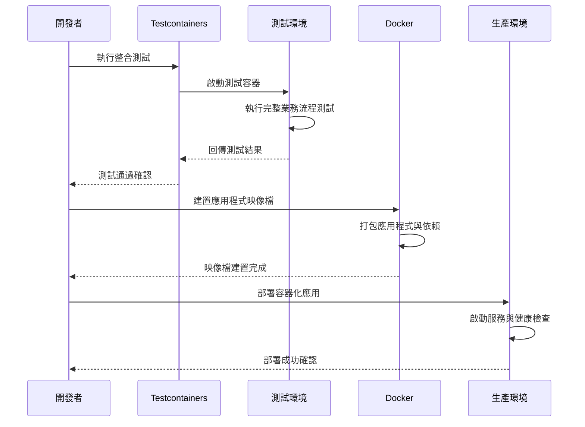

# 整合測試與部署

## 任務狀態
❌ 未完成

## 任務描述

建立完整的整合測試環境，使用 Testcontainers 測試真實的 PostgreSQL 與 Redis 環境，並完善 Docker 容器化部署配置。確保整個 TinyURL 服務在容器環境中能夠正確運行，並通過端到端的測試驗證。

本任務將建立生產就緒的部署配置，包含健康檢查、資源限制、環境變數配置等，並提供完整的部署與維運文件。

## 執行步驟

### 整合測試與部署流程圖

## 測試情境

### 正向測試案例
1. **完整 API 流程測試**
2. **資料庫連線與資料一致性測試**
3. **快取功能整合測試**

### 反向測試案例
1. **容器啟動失敗處理**
2. **網路連線中斷測試**
3. **資源限制壓力測試**

## 預期輸出

### 整合測試
- `TinyUrlApplicationIntegrationTest` - 端到端整合測試
- Testcontainers 配置與測試資料準備
- API 測試案例與驗證邏輯

### 容器化配置
- `Dockerfile` - 應用程式容器化配置
- 更新的 `docker-compose.yml` 包含應用程式服務
- 生產環境部署配置與資源限制

### 部署文件
- 容器部署指南
- 環境變數配置說明
- 監控與維運手冊