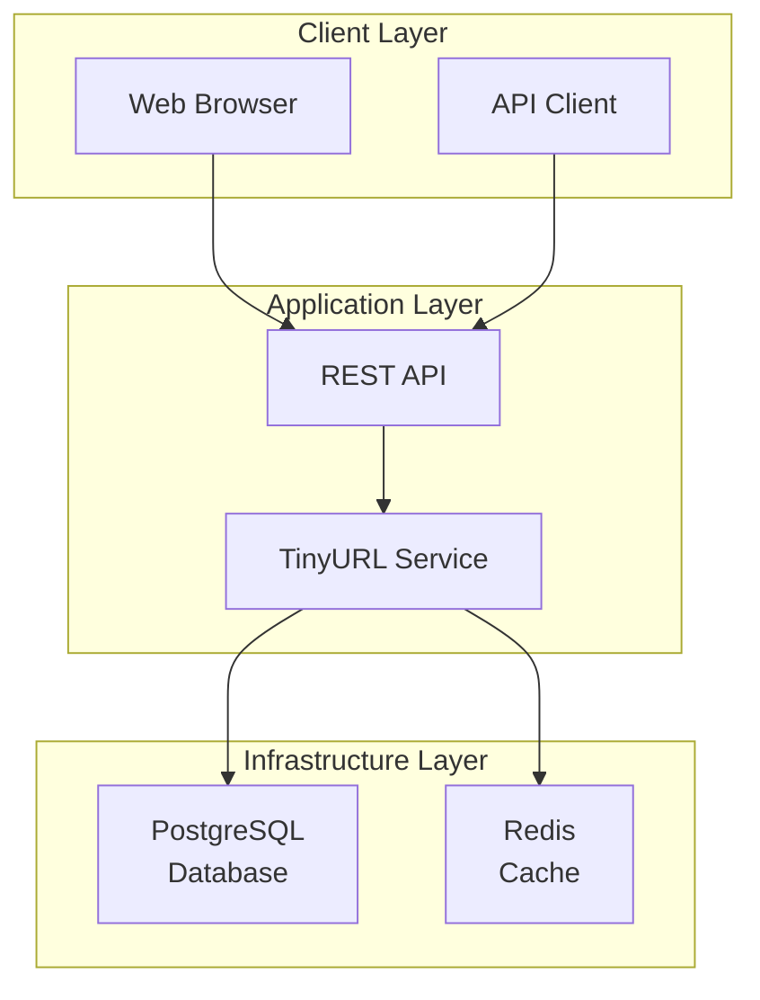

# TinyURL 短網址服務

一個基於 Spring Boot 與 Clean Architecture 的短網址服務專案，用於演示 AI 輔助開發的完整流程。

## 🚀 快速開始

### 環境需求

- Docker & Docker Compose
- Java 17+ (用於應用程式開發)
- Git

### Docker 環境啟動

#### 1. 複製環境變數配置

```bash
cp .env.example .env
```

#### 2. 啟動所有服務

```bash
# 啟動 PostgreSQL 和 Redis 服務
docker compose up -d

# 檢查服務狀態
docker compose ps

# 查看服務日誌
docker compose logs -f
```

#### 3. 驗證服務運行

- PostgreSQL: http://localhost:8080 (Adminer - 可選的資料庫管理工具)
  - 伺服器: `postgres`
  - 使用者名稱: `tinyurl_user`
  - 密碼: `tinyurl_password`
  - 資料庫: `tinyurl`
- Redis: 連接到 `localhost:6379`

#### 4. 停止服務

```bash
# 停止所有服務
docker compose down

# 停止服務並清除資料 (⚠️ 會刪除所有資料)
docker compose down -v
```

### 開發工具啟用

```bash
# 啟動包含 Adminer 的完整開發環境
docker compose --profile dev-tools up -d
```

## 📁 專案結構

```
tinyurl/
├── docker/                    # Docker 配置檔案
│   ├── postgres/
│   │   └── init/              # PostgreSQL 初始化腳本
│   └── redis/
│       └── redis.conf         # Redis 配置檔案
├── data/                      # 資料持久化目錄
│   ├── postgres/              # PostgreSQL 資料
│   └── redis/                 # Redis 資料
├── docs/                      # 專案文件
│   ├── specs/                 # 需求規格
│   ├── requirements/          # 功能需求
│   └── tasks/                 # 開發任務
├── docker-compose.yml         # Docker 編排檔案
├── .env.example              # 環境變數範本
└── README.md                 # 專案說明
```

## 🔧 環境變數配置

主要的環境變數設定（詳細設定請參考 `.env.example`）：

| 變數名稱          | 預設值           | 說明                |
| ----------------- | ---------------- | ------------------- |
| `DB_HOST`         | localhost        | PostgreSQL 主機位址 |
| `DB_PORT`         | 5432             | PostgreSQL 連接埠   |
| `DB_NAME`         | tinyurl          | 資料庫名稱          |
| `DB_USERNAME`     | tinyurl_user     | 資料庫使用者        |
| `DB_PASSWORD`     | tinyurl_password | 資料庫密碼          |
| `REDIS_HOST`      | localhost        | Redis 主機位址      |
| `REDIS_PORT`      | 6379             | Redis 連接埠        |
| `APP_PORT`        | 8080             | 應用程式連接埠      |
| `MANAGEMENT_PORT` | 8081             | 管理端點連接埠      |

## 🏗️ 服務架構



## 🔍 健康檢查

服務啟動後，可以透過以下端點檢查服務健康狀態：

```bash
# PostgreSQL 健康檢查
docker compose exec postgres pg_isready -U tinyurl_user -d tinyurl

# Redis 健康檢查
docker compose exec redis redis-cli ping
```

## 🛠️ 故障排除

### 常見問題

1. **端口衝突**

   ```bash
   # 檢查端口使用情況
   lsof -i :5432  # PostgreSQL
   lsof -i :6379  # Redis
   lsof -i :8080  # Adminer
   ```

2. **資料持久化問題**

   ```bash
   # 檢查資料目錄權限
   ls -la data/

   # 如果需要重設權限
   sudo chown -R $(id -u):$(id -g) data/
   ```

3. **容器啟動失敗**
   ```bash
   # 查看詳細錯誤日誌
   docker compose logs postgres
   docker compose logs redis
   ```

### 資料重置

如果需要重置所有資料：

```bash
# 停止服務並清除資料
docker compose down -v

# 清理資料目錄
rm -rf data/postgres/* data/redis/*

# 重新啟動服務
docker compose up -d
```

---