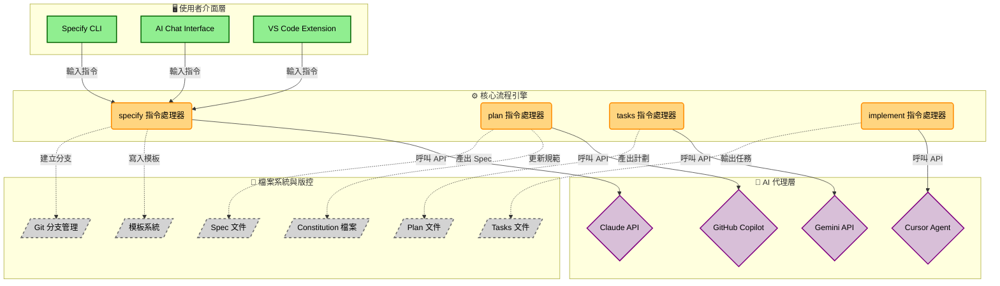
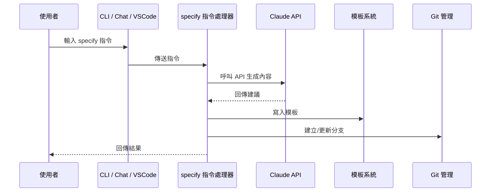

# Spec Kit 規格驅動開發完整指南

## 概述
本文件深入探討 Spec Kit 規格驅動開發 (Spec-Driven Development, SDD) 的核心理念、技術實作細節和企業級應用模式。Spec Kit 是一個創新的開發框架，透過將規格文件轉化為可執行的藍圖，革命性地改變傳統軟體開發流程，讓開發團隊能夠更快速地建構高品質軟體。

## 版本資訊
- 建立日期：2025年9月17日
- 最後更新：2025年9月17日
- 版本：1.0

## 目錄

- [1. 核心概念](#1-核心概念)
  - [1.1 規格驅動開發的基本原理](#11-規格驅動開發的基本原理)
  - [1.2 與傳統開發模式的差異](#12-與傳統開發模式的差異)
  - [1.3 關鍵設計哲學](#13-關鍵設計哲學)
- [2. 主要功能與應用場景](#2-主要功能與應用場景)
  - [2.1 核心功能清單](#21-核心功能清單)
  - [2.2 適用開發階段](#22-適用開發階段)
  - [2.3 企業級應用場景](#23-企業級應用場景)
- [3. 技術實作架構](#3-技術實作架構)
  - [3.1 系統架構設計](#31-系統架構設計)
  - [3.2 核心指令與檔案結構](#32-核心指令與檔案結構)
  - [3.3 Constitution 憲法機制](#33-constitution-憲法機制)
- [4. 使用指南](#4-使用指南)
  - [4.1 環境準備與安裝](#41-環境準備與安裝)
  - [4.2 快速開始流程](#42-快速開始流程)
  - [4.3 進階配置與客製化](#43-進階配置與客製化)
- [5. 實戰案例分析](#5-實戰案例分析)
  - [5.1 Podcast 網站開發流程](#51-podcast-網站開發流程)
  - [5.2 企業級專案迭代案例](#52-企業級專案迭代案例)
- [6. 最佳實務](#6-最佳實務)
- [7. 常見問題](#7-常見問題)
- [8. 參考資料](#8-參考資料)

## 1. 核心概念

### 1.1 規格驅動開發的基本原理

**規格驅動開發 (Spec-Driven Development, SDD)** 是一種顛覆傳統軟體開發流程的創新方法。其核心理念在於**讓規格本身變成可執行的 (executable)**，將規格從靜態參考文件提升為開發流程的核心驅動力。

#### 核心轉變：從靜態文件到執行藍圖

傳統開發模式中，規格文件通常只在專案初期用於溝通需求，一旦進入編碼階段就被拋棄，導致文件與實作逐漸脫節。SDD 徹底改變這種模式：

- **傳統模式**：規格 → 設計 → 編碼 → 測試 → 部署 (規格被遺忘)
- **SDD 模式**：規格 ⇄ 設計 ⇄ 編碼 ⇄ 測試 ⇄ 部署 (規格始終是核心)

#### 意圖優先的開發哲學

SDD 強調在開發初期專注於定義產品的**意圖 (Intent)**：

- **What (要做什麼)**：產品功能、使用者場景
- **Why (為什麼要做)**：問題背景、解決動機
- **How (如何實現)**：延後到開發後期決定

這種方法確保團隊始終聚焦於真正的需求本質，避免陷入技術細節的過早優化。

### 1.2 與傳統開發模式的差異

| 層面         | 傳統開發模式             | 規格驅動開發             |
| ------------ | ------------------------ | ------------------------ |
| **規格角色** | 初期溝通工具，後期被遺忘 | 持續的開發核心與真實來源 |
| **開發順序** | 需求 → 設計 → 編碼       | 意圖 → 規格 → 多方案實驗 |
| **技術決策** | 早期鎖定技術棧           | 延遲技術決策，保持靈活性 |
| **重用性**   | 程式碼重用為主           | 規格重用，支援多技術實現 |
| **品質控制** | 依賴人工 Code Review     | AI 輔助 + 結構化流程     |

### 1.3 關鍵設計哲學

#### 多步驟優化 vs 一次性生成

SDD 採用**多步驟優化 (Multi-step refinement)** 而非追求完美的一次性 prompt：

1. **階段性推進**：將複雜需求拆解為 `/specify` → `/plan` → `/tasks` → `/implement` 等步驟
2. **人機協作**：每階段都保留開發者的監督與修正空間
3. **迭代改善**：允許在每個節點進行調整和優化

#### 規格與實作解耦

透過完全去除技術細節的純需求規格，實現：

- **技術無關性**：同一份規格可用於不同技術棧實現
- **未來適應性**：技術演進時無需重寫需求
- **平行探索**：支援同時試驗多種技術方案

## 2. 主要功能與應用場景

### 2.1 核心功能清單

#### 結構化開發流程
- **需求定義 (`/specify`)**：將自然語言需求轉化為結構化規格
- **技術規劃 (`/plan`)**：基於規格生成技術實作方案
- **任務拆解 (`/tasks`)**：將方案分解為可執行的開發任務
- **程式碼實現 (`/implement`)**：自動產生符合規格的程式碼

#### 企業級約束管理
- **憲法機制 (Constitution)**：定義專案不可妥協的技術與流程原則
- **合規確保**：自動檢查實作是否符合企業標準
- **設計系統整合**：強制使用指定的 UI 元件庫和設計規範

#### AI 輔助開發
- **多 AI 支援**：相容 Claude、GitHub Copilot、Gemini 等主流 AI 代理
- **智能代碼生成**：基於規格和約束自動產生高品質程式碼
- **持續對話**：支援開發者與 AI 的多輪互動優化

### 2.2 適用開發階段

#### 全新專案開發 (Greenfield)
**使用場景**：從零開始建立全新應用程式
**價值**：
- 避免「隨想式開發 (vibe coding)」的混亂狀態
- 確保最終產品緊密符合初始意圖
- 建立可維護的開發流程和文件體系

#### 創意探索與技術選型
**使用場景**：評估不同技術方案的可行性
**價值**：
- 用同一份規格平行實驗多種技術棧
- 快速比較 Next.js、Hugo、Blazor 等方案優劣
- 降低技術選型的試錯成本

#### 既有專案迭代 (Brownfield)
**使用場景**：為現有系統增加新功能或進行現代化改造
**價值**：
- 為新功能建立獨立規格，避免影響既有系統穩定性
- 確保新舊功能的和諧整合
- 支援大型企業系統的漸進式升級

### 2.3 企業級應用場景

#### 大型團隊協作
- **統一流程**：為跨團隊提供一致的開發方法論
- **知識傳承**：透過結構化規格降低人員異動風險
- **品質標準化**：透過憲法機制確保輸出品質一致性

#### 合規與安全管控
- **技術標準強制**：透過憲法檔案確保遵循企業技術標準
- **安全原則內建**：在開發流程中嵌入安全審查機制
- **稽核追蹤**：完整記錄從需求到實作的決策過程

## 3. 技術實作架構

### 3.1 系統架構設計
- 整體架構圖

- 指令生命週期

### 3.2 核心指令與檔案結構

#### 專案目錄結構
```
project-root/
├── .spec-kit/
│   ├── scripts/              # 平台特定腳本 (sh/ps1)
│   └── templates/            # 文件模板
├── memory/
│   ├── constitution.md       # 專案憲法 (技術原則)
│   └── context.md           # 專案上下文資訊
├── specs/
│   ├── 001-feature-name/     # 功能規格目錄
│   │   ├── spec.md          # 需求規格
│   │   ├── plan.md          # 技術方案
│   │   ├── tasks.md         # 任務清單
│   │   ├── data-model.md    # 資料模型
│   │   └── research.md      # 技術研究
│   └── 002-another-feature/
└── src/                     # 實際程式碼
```

#### 核心指令執行流程

**1. `/specify` 指令**
```bash
# 觸發腳本：create-new-feature.sh
# 功能：建立新功能分支與規格文件
/specify 建立一個現代化的 podcast 網站，需要登陸頁、劇集頁面、關於頁面...
```

執行流程：
1. 執行 `create-new-feature.sh` 腳本
2. 建立新的 Git 分支 (例如：`001-podcast-website`)
3. 基於 `spec-template.md` 生成 `spec.md`
4. AI 解析需求並填入結構化內容

**2. `/plan` 指令**
```bash
# 功能：基於規格生成技術實作方案
/plan 使用 Next.js 靜態網站配置，不使用資料庫...
```

執行流程：
1. 讀取 `constitution.md`、`spec.md` 和 `plan-template.md`
2. AI 生成 `plan.md`、`data-model.md`、`research.md`
3. 確保方案符合憲法約束

**3. `/tasks` 指令**
```bash
# 功能：將技術方案拆解為具體任務
/tasks 將這個計畫拆解成可執行的任務
```

執行流程：
1. 基於 `plan.md` 和 `tasks-template.md`
2. 生成詳細的 `tasks.md` 檔案
3. 包含從初始化到部署的完整步驟

### 3.3 Constitution 憲法機制

#### 憲法檔案的設計原理

憲法檔案 (`constitution.md`) 是 Spec Kit 的創新機制，用於定義專案中**不可妥協的原則 (non-negotiable principles)**。這個機制特別適用於企業環境，確保 AI 生成的方案符合組織標準。

#### 憲法條款範例

```markdown
# 專案憲法

## Article 1: Static-First Delivery
所有網站必須優先採用靜態生成模式，僅包含 HTML/CSS/JS 和靜態資源，
不應包含伺服器端執行邏輯。

## Article 2: Simplicity Over Tooling
優先使用原生 HTML、CSS 和 JavaScript，避免過度依賴複雜工具鏈。
當需要框架時，選擇輕量且成熟的解決方案。

## Article 3: Accessibility and SEO Baseline
所有 UI 元件必須符合 WCAG 2.1 AA 標準，確保無障礙存取。
網站必須具備良好的 SEO 基礎設施。

## Article 4: Enterprise Security Standards
所有 API 呼叫必須通過企業 API 閘道器，
使用指定的認證與授權機制。
```

#### 憲法的執行機制

1. **AI 讀取優先級**：在執行 `/plan` 時，AI 首先讀取憲法內容
2. **約束檢查**：生成的技術方案必須通過憲法合規性檢查
3. **衝突解決**：當需求與憲法衝突時，憲法優先，AI 會提出替代方案

## 4. 使用指南

### 4.1 環境準備與安裝

#### 系統需求

**支援作業系統**：
- Linux/macOS (原生支援)
- Windows (透過 WSL2 或原生 PowerShell)

**必要工具**：
- Python 3.11+
- Git 版本控制
- `uv` 套件管理器
- 至少一個 AI 代理工具 (Claude、Copilot、Gemini、Cursor)

#### 安裝步驟

**方法一：使用 CLI 工具 (推薦)**
```bash
# 安裝並初始化新專案
uvx --from git+https://github.com/github/spec-kit.git specify init <PROJECT_NAME>

# 例如：建立 podcast 網站專案
uvx --from git+https://github.com/github/spec-kit.git specify init podcast-site
```

**方法二：手動下載模板**
```bash
# 從 GitHub Releases 下載對應的模板壓縮檔
# 解壓縮到專案目錄
```

#### 互動式設定

安裝過程中會要求選擇：

1. **AI 代理選擇**：
   - `copilot` - GitHub Copilot
   - `claude` - Claude API
   - `gemini` - Google Gemini
   - `cursor` - Cursor Editor

2. **腳本類型選擇**：
   - `sh` - Bash/Zsh (Linux/macOS)
   - `ps` - PowerShell (Windows)

#### 環境驗證

```bash
# 檢查系統相依性
specify check

# 進入專案目錄
cd <PROJECT_NAME>

# 在 VS Code 中驗證指令可用性
# 開啟聊天視窗，輸入 "/" 應該看到 /specify、/plan、/tasks 指令
```

### 4.2 快速開始流程

#### 第一步：建立專案憲法

```bash
# 在 AI 聊天介面中請求協助建立憲法
"請幫我建立一份適用於靜態網站開發的專案憲法，強調簡潔性和效能"
```

AI 會基於 `constitution-template.md` 生成初版憲法，你可以進一步調整。

#### 第二步：定義功能需求

```bash
/specify 我要建立一個現代化的 podcast 網站。它應該看起來很 sleek，
包含登陸頁面、劇集列表頁面、關於我們頁面和 FAQ 頁面。
使用者應該能夠瀏覽不同的劇集，每個劇集都有標題、描述和發布日期。
```

執行結果：
- 建立新的 Git 分支 `001-podcast-website`
- 在 `specs/001-podcast-website/` 目錄下生成 `spec.md`
- 包含使用者故事、功能需求和待澄清項目

#### 第三步：規劃技術實作

```bash
/plan 使用 Next.js 搭配靜態網站生成配置，
不使用資料庫，所有內容都來自 markdown 檔案。
重點關注效能和 SEO 優化。
```

執行結果：
- 生成 `plan.md` - 詳細技術實作方案
- 生成 `data-model.md` - 資料結構設計
- 生成 `research.md` - 技術選型研究

#### 第四步：拆解開發任務

```bash
/tasks 請將這個計畫拆解為具體的開發任務
```

執行結果：
- 生成 `tasks.md` 包含完整任務清單
- 從專案初始化到部署的逐步指引
- 可追蹤的進度檢查點

#### 第五步：實作與預覽

```bash
# 請 AI 實作任務清單中的項目
"請實作 tasks.md 中的任務，從第一個開始"

# 建置與預覽
npm run build
npm run dev
```

### 4.3 進階配置與客製化

#### 自訂模板系統

你可以修改 `.spec-kit/templates/` 下的模板檔案來客製化生成內容：

- `spec-template.md` - 需求規格模板
- `plan-template.md` - 技術方案模板
- `tasks-template.md` - 任務清單模板
- `constitution-template.md` - 憲法模板

#### 企業級配置

**統一憲法管理**：
```bash
# 建立企業級憲法模板
mkdir ~/.spec-kit/enterprise-templates
cp constitution.md ~/.spec-kit/enterprise-templates/
```

**CI/CD 整合**：
```yaml
# .github/workflows/spec-validation.yml
name: Spec Validation
on: [pull_request]
jobs:
  validate:
    runs-on: ubuntu-latest
    steps:
      - uses: actions/checkout@v2
      - name: Validate Spec Compliance
        run: specify validate --constitution
```

## 5. 實戰案例分析

### 5.1 Podcast 網站開發流程

這個案例展示了 Spec Kit 完整的開發週期，從概念到可運行的網站。

#### 專案背景與目標
**需求**：建立一個現代化的 podcast 網站，支援劇集瀏覽、內容管理和良好的使用者體驗。

**挑戰**：
- 避免技術選型的過早限制
- 確保網站效能和 SEO 優化
- 建立可維護的內容管理方式

#### 開發流程詳細分解

**階段 1：憲法建立**
```markdown
# Podcast 網站憲法

## Article 1: Performance First
網站載入時間必須在 3 秒內，優先使用靜態生成和 CDN 快取。

## Article 2: Content Accessibility
所有音訊內容必須提供文字轉錄，符合無障礙標準。

## Article 3: SEO Optimization
每個劇集頁面必須包含結構化資料標記，支援 Google Podcasts 索引。
```

**階段 2：需求規格化 (`/specify`)**

輸入：
```
/specify 我要建立一個現代化的 podcast 網站。使用者可以瀏覽劇集、
閱讀節目資訊、查看主持人介紹。每個劇集需要有播放功能、
分享選項和評論區。
```

AI 生成的 `spec.md` 包含：
- **使用者故事**：「作為聽眾，我希望能快速找到感興趣的劇集」
- **功能需求**：劇集列表、播放器整合、搜尋功能
- **非功能需求**：載入效能、行動裝置支援
- **待澄清項目**：劇集排序方式、評論系統需求

**階段 3：技術規劃 (`/plan`)**

輸入：
```
/plan 使用 Next.js 14 搭配 App Router，採用靜態網站生成 (SSG)。
音訊檔案託管在 CDN，metadata 存放在 JSON 檔案中。
```

AI 基於憲法約束生成：

`plan.md` 技術方案：
- **架構選擇**：Next.js 14 + TypeScript + Tailwind CSS
- **資料管理**：JSON-based content management
- **部署策略**：Vercel 靜態部署 + CDN

`data-model.md` 資料結構：
```typescript
interface Episode {
  id: string;
  title: string;
  description: string;
  audioUrl: string;
  publishDate: string;
  duration: number;
  transcription?: string;
}
```

**階段 4：任務拆解 (`/tasks`)**

生成的 `tasks.md` 包含：
1. **Setup Phase**: Next.js 專案初始化、依賴安裝
2. **Core Implementation**: 首頁、劇集列表、播放器元件
3. **Enhancement**: SEO 優化、無障礙功能
4. **Testing & Deployment**: 測試套件、部署配置

**階段 5：實作與驗證**

AI 逐步實作任務清單，開發者在過程中：
- 審查生成的程式碼品質
- 測試功能是否符合原始需求
- 驗證是否遵循憲法約束

#### 成果與學習

**最終交付物**：
- 完全符合需求的 podcast 網站
- 完整的技術文件和決策記錄
- 可重用的規格，支援未來技術升級

**關鍵學習**：
1. **意圖驅動的價值**：清晰的需求定義避免了開發過程中的方向偏移
2. **憲法約束的重要性**：技術原則確保最終產品符合非功能需求
3. **人機協作的必要性**：AI 提供效率，人類確保品質和策略思考

### 5.2 企業級專案迭代案例

#### 場景：為現有系統增加 Spotify 播放器整合

**背景**：現有的 podcast 網站運行良好，但使用者反饋希望能直接在網站上播放 Spotify 的 podcast 內容。

**挑戰**：
- 必須遵循企業安全政策
- 不能影響現有系統穩定性
- 需要整合企業 API 閘道器

#### 實作流程

**階段 1：更新企業憲法**
```markdown
## Article 5: API Security Standards
所有第三方 API 整合必須：
1. 通過企業 API 閘道器
2. 實作 OAuth 2.0 認證
3. 不得在前端暴露任何 API 金鑰
```

**階段 2：新功能規格**
```bash
/specify 為現有 podcast 網站增加 Spotify 播放器整合。
使用者可以在劇集頁面看到 "在 Spotify 播放" 按鈕，
點擊後在當前頁面內嵌播放器中播放內容。
```

**階段 3：技術方案設計**
```bash
/plan 使用 Spotify Web Playback SDK，
透過後端代理處理認證，確保前端不暴露敏感資訊。
整合現有的企業 SSO 系統。
```

AI 生成的方案自動遵循憲法約束：
- 後端代理模式保護 API 金鑰
- OAuth 流程整合企業認證系統
- 使用企業 API 閘道器統一管理

#### 企業級開發的特殊考量

**1. 合規性自動檢查**
```bash
# 憲法驗證指令
specify validate --constitution --security
```

**2. 多環境部署策略**
```markdown
## Deployment Plan
- Dev: 使用測試用 Spotify 應用
- Staging: 整合企業 API 閘道器沙盒
- Production: 完整企業安全堆疊
```

**3. 回滾策略**
由於功能在獨立分支開發，可以安全地：
- A/B 測試新功能
- 快速回滾問題變更
- 保持主線穩定性

## 6. 最佳實務

### 開發流程最佳實務

#### 憲法設計原則
1. **具體且可執行**：避免模糊的指導原則，使用明確的技術約束
2. **企業標準對齊**：確保憲法反映組織的真實技術標準和合規要求
3. **版本控制**：憲法變更應經過審查流程，避免隨意修改影響專案穩定性

#### 規格撰寫技巧
1. **聚焦使用者價值**：優先描述使用者場景和業務價值，而非技術實作
2. **保持技術無關性**：規格中完全避免提及特定框架或技術選擇
3. **包含非功能需求**：效能、安全、可用性等要求同樣重要

#### 人機協作模式
1. **每階段驗證**：不要讓 AI 連續執行多個步驟，在每個關鍵節點進行人工確認
2. **主動澄清**：當 AI 產出模糊或不完整時，主動要求澄清和補充
3. **保持批判思維**：AI 的建議需要經過人類的策略思考和業務判斷

### 企業級部署最佳實務

#### 團隊協作策略
1. **憲法統一管理**：建立企業級憲法模板庫，確保跨專案一致性
2. **知識共享**：定期分享成功的規格和方案，建立最佳實務資料庫
3. **培訓計畫**：為團隊成員提供 SDD 方法論培訓

#### 品質保證機制
1. **自動化驗證**：在 CI/CD 中整合憲法合規性檢查
2. **同儕審查**：重要的規格和方案應經過同儕評審
3. **追蹤指標**：監控開發速度、程式碼品質和需求符合度

## 7. 常見問題

### Q1: Spec Kit 適合小型團隊使用嗎？
**A**: 是的。雖然 Spec Kit 的企業級功能很強大，但其核心的結構化開發流程對任何規模的團隊都有價值。小型團隊可以：
- 使用簡化的憲法，專注於核心技術原則
- 利用規格重用性快速試驗不同技術方案
- 透過 AI 輔助提升開發效率

### Q2: 如何處理 AI 生成程式碼的品質問題？
**A**: Spec Kit 的多步驟流程設計就是為了解決這個問題：
- **規格層驗證**：確保需求理解正確
- **方案層審查**：檢查技術選擇是否合理
- **任務層確認**：驗證拆解是否完整
- **實作層監督**：逐步實作並測試每個功能

### Q3: 憲法文件應該多詳細？
**A**: 憲法應該**具體且可執行**，但避免過度細節：
- ✅ 好的憲法條款：「所有 API 呼叫必須通過企業閘道器，使用 OAuth 2.0 認證」
- ❌ 避免的條款：「程式碼應該要寫得很好」

### Q4: 如何整合現有的開發工具鏈？
**A**: Spec Kit 設計為工具鏈無關：
- 可與現有的 Git 工作流程無縫整合
- 支援主流 CI/CD 平台 (GitHub Actions、GitLab CI)
- 相容各種專案結構和語言

### Q5: 團隊成員需要多長時間學會使用？
**A**: 基本使用通常 1-2 天，熟練掌握需要 1-2 週：
- **第一天**：理解核心概念，完成環境設定
- **第一週**：熟悉四個核心指令的使用
- **第二週**：掌握憲法設計和企業級配置

### Q6: 與傳統的低程式碼平台有什麼差異？
**A**: 主要差異在於靈活性和控制權：
- **Spec Kit**：生成標準程式碼，完全可客製化和擴展
- **低程式碼平台**：通常有平台鎖定，客製化能力受限
- **Spec Kit** 更適合需要高度客製化的複雜應用

## 8. 參考資料

### 相關文件
- [Spec Kit GitHub Repository](https://github.com/github/spec-kit) - 官方程式碼庫和最新版本
- [Spec Kit CLI Documentation](https://github.com/github/spec-kit/blob/main/README.md) - 指令列工具使用指南
- [Template Reference](https://github.com/github/spec-kit/tree/main/templates) - 官方模板檔案參考

### 外部資源
- [Conventional Commits](https://www.conventionalcommits.org/) - Git 提交訊息規範
- [OpenAPI Specification](https://swagger.io/specification/) - API 文件標準
- [Semantic Versioning](https://semver.org/) - 版本控制最佳實務

### 相關工具
- [GitHub Copilot](https://github.com/features/copilot) - AI 程式碼助手
- [Claude API](https://www.anthropic.com/api) - Anthropic AI 服務
- [Cursor Editor](https://cursor.sh/) - AI 整合程式碼編輯器
- [UV Package Manager](https://github.com/astral-sh/uv) - 快速 Python 套件管理器

### 延伸閱讀
- [The Pragmatic Programmer](https://pragprog.com/titles/tpp20/the-pragmatic-programmer-20th-anniversary-edition/) - 軟體開發最佳實務
- [Domain-Driven Design](https://www.domainlanguage.com/ddd/) - 領域驅動設計方法論
- [Clean Architecture](https://blog.cleancoder.com/uncle-bob/2012/08/13/the-clean-architecture.html) - 軟體架構設計原則
- [AI-Assisted Software Development](https://github.blog/2023-06-15-the-ai-powered-developer-lifecycle/) - AI 在軟體開發中的應用趨勢