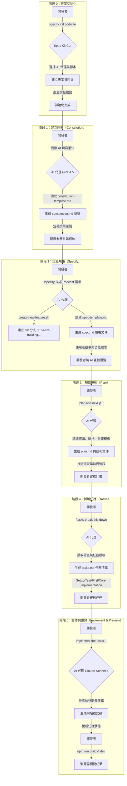
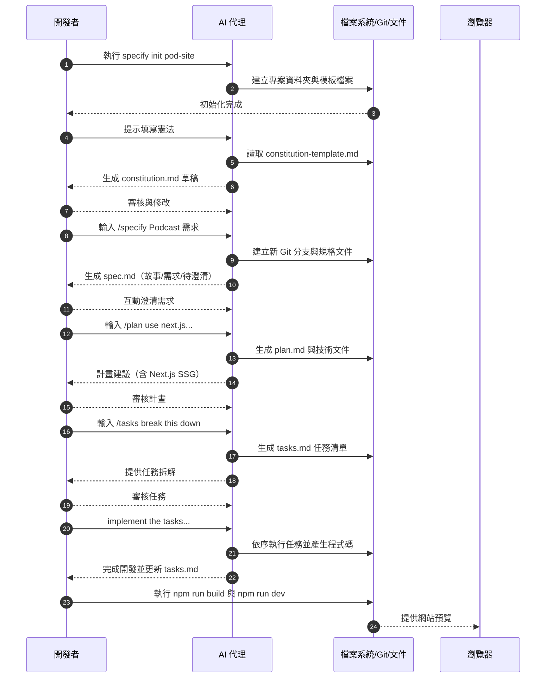

# Podcast 網站開發演練流程圖 (Mermaid)

## 開發流程圖

## 流程圖解說

這個流程圖展示了 Spec Kit 的核心哲學：**多步驟優化 (multi-step refinement)，而非一次性生成**。

### 階段性開發流程

1. **初始化 (階段 0)**：透過 `specify init` 指令建立包含所有必要模板和腳本的專案環境
2. **建立憲法 (階段 1)**：在開發前與 AI 協作建立專案技術原則，對企業級專案尤其重要
3. **定義規格 (階段 2)**：開發者專注定義「What」與「Why」，AI 轉化為結構化的 `spec.md` 文件，在獨立 Git 分支中進行
4. **規劃技術 (階段 3)**：開發者指定「How」技術棧，AI 在遵循「憲法」前提下生成詳細執行計畫 `plan.md`
5. **拆解任務 (階段 4)**：使用 `/tasks` 指令將計畫分解為可管理的任務清單 `tasks.md`
6. **實作與預覽 (階段 5)**：AI 根據任務清單撰寫程式碼，開發者始終扮演「**人機迴圈 (human-in-the-loop)**」監督角色

## Podcast 時序圖

